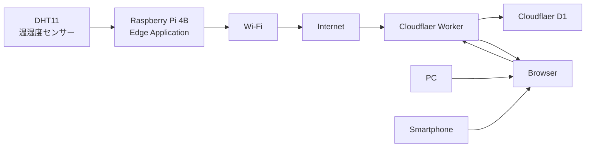

## 1.文書情報
|項目|内容|
|----------|-----------------------|
|文書名称| Raspberry Pi Edge Iot System  Design Document |
|対象システム | Raspberry Pi 4B Edge IoT System |
|対象デバイス|Raspberry Pi 4B / DHT11|
|ネットワーク|Wi-fi|
|クラウド基盤|Cloudflater Worker / Cloudflare D1|
|設計対象|Edge IoT System 全体|
|Raspberry Pi側|C++によるEdge　Application|
|文書形式|Markdown|
|設計状態|確定|
|作成日|2026-09-12|
|版数|1.0|

## 2.システム概要

本システムは、Raspberry Pi 4Bに接続したDHT11温湿度センサーから温度・湿度データを取得し、ネットワーク経由でCloudflare Workerへ送信するEdge IoTシステムである。

Cloudflare WorkerはRaspberry Piから受信したセンサーデータをCloudflare D1へ保存する。

保存されたセンサーデータはBrowserから参照可能とし、現在値および過去のデータを確認できる構成とする。

システム全体の基本的なデータの流れを以下に示す。

## 3.前提条件・制約

### 3.1 ハードウェアに関する前提条件

本システムは、以下のハードウェアを使用する。

|項目|内容|
|---|---|
| Wdge Device | Raspberry Pi 4B|
|センサー|DHT11温湿度センサー|
|ネットワーク|Wi-Fi|

### 3.2 Raspberry Pi に関する前提条件

Raspberry Pi 4Bでは、Raspberry Pi OS (Debian Bookworm)を使用する。

Edge AppkucationはC++を使用して構築する。

### 3.3 Cloudflareに関する前提条件

クラウド側には以下のCloudflares-ビスを使用する。

- Cloudflare Worker
- Cloudflare D1

Cloudflare WorkerとCloudflaer D1を連携し、センサーデータを保存する。

### 3.4 システム構成上の前提条件

本システムでは、Raspberry Pi 4Bを Edge Deviceとして配置する。

DHT11から取得したん温湿度データは、 Raspberry Pi 4B上のEdge Applicationを経由してクラウド側へ送信する。

BrowserはCloudflare Workerを経由してセンサーデータを参照する。

### 3.5 制約事項

現時点で明確になっている制約事項は以下とする。

 - Edge DeviceはRaspberry Pi 4Bを使用する。
 - 温湿度センサーはDHT11を使用する。
 - Raspberry Pi側のEdge aApplicationはC++を使用する
 - ネットワーク接続にはCloudflare WorkerおよびCloudflare D1を使用する
 - システム全体の設計対象には、センサーからBrowserまでのデータフローを含める。

 ## 4. システム要求

 ### 4.1 機能要求

 本システムは、以下の機能を提供する。

 #### FR-001 センサーデータ取得

 Raspberry Pi 4Bは、DHT11から温度および湿度データを取得できること。

 #### FR-002 センサーデータ処理

Raspberry Pi 4B上のEdge Applicationは、DHT11から取得した温度および湿度データを、Cloudflare Workerへ送信可能なデータとして処理できること。

 #### FR-003 センサーデータ送信

Raspberry Pi 4B上のEdge Applicationは、取得したセンサーデータをネットワーク経由でCloudfare Workerへ送信できること。

 #### FR-004 センサーデータ保存

 Cloudflare Workerは、Raspberry Piから受信したセンサーデータをCloudflare D1へ保存できること。

 #### FR-005 センサーデータ参照

 Browserは、Cloudfare Workerを介してCloudflare D1に保存されたセンサーデータを参照できること。

 #### FR-006 現在値表示

 Browserは、温度および湿度の現在値を表示できること。

 #### FR-007 履歴データ表示

 Browserは、保存されたセンサーデータの履歴を表示できること。

 #### FR-008 グラフ表示

 Browserは、保存されたセンサーデータを時系列のグラフとして表示できること。

 ---

 ### 4.2 非機能要求

 #### NFR-001 センサーデータ取得周期

 センサーデータは、一定の周期で継続的に取得できること。

 具体的な取得周期は5秒とする。

 #### NFR-002 データ送信周期

 取得したセンサーデータは、一定の周期でCloudflare Workerへ送信できること。

 通信はQueueからSensorDataを取得した時点で送信を開始する。

 #### NFR-003 通信応答時間

 Cloudflare Workerへの通信に対して、適切はTimeoutを設定できること。

 HTTP Timeoutは5秒とする。

 #### NFR-004 通信障害への対応

Wi-FiまたはCloudflare Workerとの通信に失敗した場合、システムが異常状態を適切に処理できること。

Retryは最大3回、Retry間隔は1秒→2秒→4秒、通信失敗データは永続化しない。

 #### NFR-005 データ欠損への対応

 一時的な通信障害が発生した場合に、センサーデータをどの範囲まで保持するかを定義できること。

 具体的なデータ保持方法およびデータ欠損の許容範囲は、本設計で決定する。

 #### NFR-006 Raspberry Pi再起動後の復旧

  Raspberry Piが再起動した場合、Edge Applicationがシステムとして必要な状態へ復帰し、センサーデータの取得および送信を再開できること。

 #### NFR-007 Application異常終了への対応

 Edge Applicationが異常終了した場合、システムとして必要な復旧方法を定義できること。

 具体的な復旧方式は、Lifecycle / shutdown設計およびsystemd設計で決定する。

 #### NFR-008 正常終了
  Edge
 

