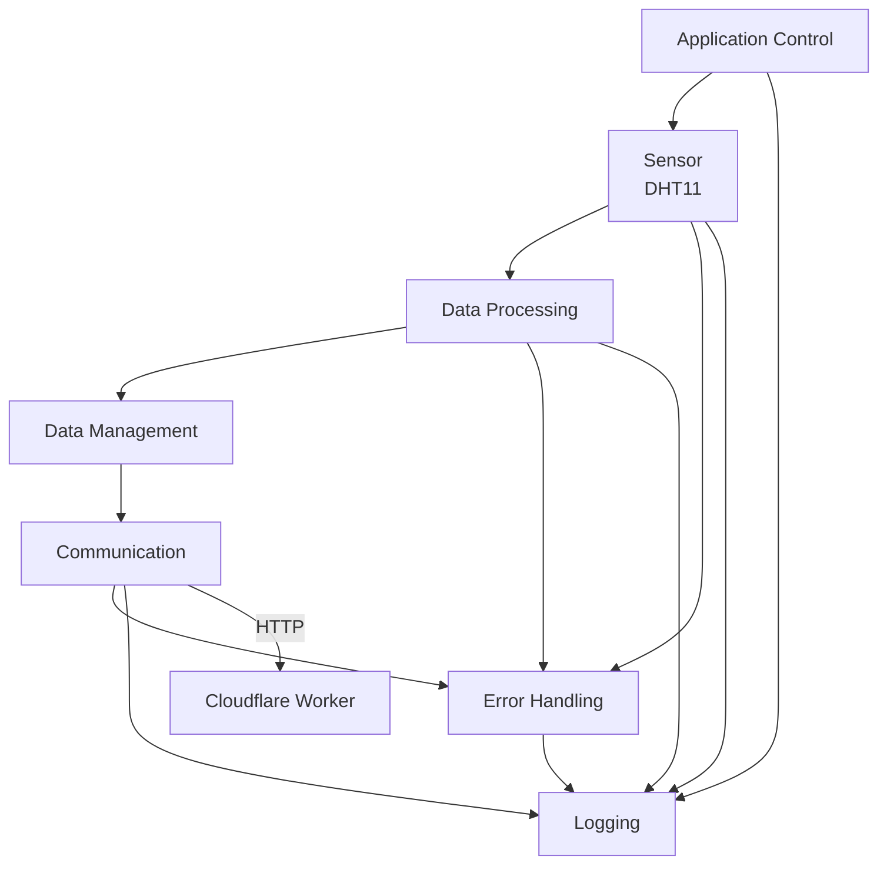
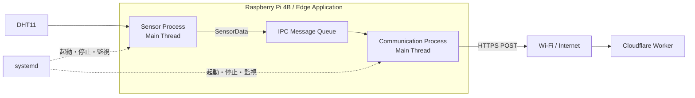

## 8. ソフトウェアアーキテクチャ

### 8.1 概要

Raspberry Pi 4B上で動作するEdge Applicationは、センサーデータの取得、データ処理、通信、異常処理などの責務を分離した構造とする。

各機能の責務を明確にすることで、機能追加や変更の影響範囲を限定し、保守性を確保する。

具体的なProcessおよびThreadへの割り当ては9章で定義する。

### 8.2 ソフトウェア構成

Edge Applicationは、以下の論理的な機能要素から構成する。

| ID | 機能要素 | 主な責務 |
|---|---|---|
| SW-001 | Application Control | アプリケーション全体の初期化、起動、終了を管理する |
| SW-002 | Sensor | DHT11から温度・湿度データを取得する |
| SW-003 | Data Processing | 取得したセンサーデータを処理する |
| SW-004 | Data Management | センサーデータの保持および受け渡しを管理する |
| SW-005 | Communication | Cloudflare Workerとの通信を行う |
| SW-006 | Error Handling | センサー、通信、内部処理などの異常を処理する |
| SW-007 | Logging | 動作状況および異常状況を記録する |

### 8.3 ソフトウェア構成図



## 9. Process / Thread設計

### 9.1 Process / Thread構成の基本方針

Raspberry Pi 4B上のEdge Applicationは、センサー取得と通信処理をProcess単位で分離する。

Process構成は以下の方針とする。

- Sensor Process：DHT11からのセンサーデータ取得を担当する
- Communication Process：IPC Message QueueからSensorDataを取得し、Cloudflare Workerへ送信する
- Process間のデータ受け渡し：IPC Message Queueを使用する
- 各Processは独立して動作し、通信処理の遅延がSensor Processを直接停止させない
- Processの起動・停止・異常終了時の管理はsystemdと連携する

Threadは必要最小限とし、本システムでは各Processの主処理をMain Threadで実行する構成を基本とする。将来、処理の並列化が必要になった場合はThreadを追加できる構造とする。

### 9.2 Process構成

Edge Applicationは、以下の2 Processで構成する。

| Process | 主な責務 |
|---|---|
| Sensor Process | DHT11から温度・湿度を周期取得し、SensorDataを生成してIPC Message Queueへ送信する |
| Communication Process | IPC Message QueueからSensorDataを取得し、Cloudflare WorkerへHTTPS POSTで送信する |



### 9.3 Sensor Process

Sensor Processは、DHT11から温度・湿度を取得する。

主な処理は以下とする。

1. 初期化
2. DHT11取得処理
3. SensorData生成
4. IPC Message Queueへの送信
5. 異常処理
6. 周期待機
7. Shutdown処理

センサーデータ取得周期は5秒とする。Linux環境であるため、周期にはスケジューリング遅延が発生し得るものとする。

### 9.4 Communication Process

Communication Processは、IPC Message QueueからSensorDataを取得し、Cloudflare Workerへ送信する。

主な処理は以下とする。

1. 初期化
2. IPC Message QueueからSensorData取得
3. HTTP POST送信
4. HTTP Response判定
5. Retry / Backoff
6. 送信結果記録
7. Shutdown処理

通信処理はSensor Processと独立して実行する。

### 9.5 Process間の責務分担

| 項目 | Sensor Process | Communication Process |
|---|---|---|
| センサー取得 | ○ | - |
| SensorData生成 | ○ | - |
| Queue送信 | ○ | - |
| Queue受信 | - | ○ |
| HTTP通信 | - | ○ |
| Retry / Backoff | - | ○ |
| Cloudflare連携 | - | ○ |
| センサー異常処理 | ○ | - |
| 通信異常処理 | - | ○ |

### 9.6 ProcessとThreadの関係

各ProcessはMain Threadを基本実行単位とする。

```text
Sensor Process
└── Main Thread

Communication Process
└── Main Thread
```

本システムでは、センサー取得と通信処理をProcess単位で分離することを優先し、不要なThread分割は行わない。

### 9.7 Process障害の分離

Sensor ProcessとCommunication Processを分離することで、一方のProcessに異常が発生した場合でも、もう一方のProcessを独立して再起動できる構成とする。

ただし、Sensor Processが停止している場合は新規SensorDataが生成されず、Communication Processが停止している場合はQueueへデータが蓄積する。この状態をsystemdおよびログで確認できる構成とする。

### 9.8 Process管理

Processの起動、停止、異常終了時の再起動はsystemdで管理する。

systemdの詳細設定は19章で定義する。

### 9.9 Process / Thread設計の決定事項

本章のProcess / Thread構成は以下で確定する。

- Sensor ProcessとCommunication Processを分離する
- Process間通信にはIPC Message Queueを使用する
- 各ProcessはMain Threadを基本とする
- Sensor Processは5秒周期でSensorDataを生成する
- Communication ProcessはQueueからデータを取得して送信する
- Retry / BackoffはCommunication Processで実行する
- Process管理はsystemdで行う
