## 10. データ設計

### 10.1 データ設計の概要

本システムでは、DHT11から取得した温度および湿度データをEdge Applicationで扱い、Cloudflare Workerを介してCloudflare D1へ保存する。

データ設計では、以下のデータを対象とする。

* センサーデータ
* センサーデータの時刻情報
* Edge Application内部で受け渡すデータ
* 通信処理に必要なデータ

具体的な保存方式およびデータ形式は、Edge ApplicationとCloudflare Workerのインターフェースを考慮して定義する。

### 10.2 センサーデータ

センサーデータは、DHT11から取得した温度および湿度を1つのデータ単位として扱う。

| 項目          | 内容             |
| ----------- | -------------- |
| Temperature | 温度             |
| Humidity    | 湿度             |
| Timestamp   | センサーデータを取得した時刻 |

センサーデータは、Sensor Threadから後続の処理へ渡される。

### 10.3 センサーデータ構造

Edge Application内部では、センサーデータを以下のSensorDataとして扱う。

| 項目 | C++型 | 単位 | 内容 |
|---|---|---|---|
| temperature | `double` | ℃ | DHT11から取得した温度。小数第1位までを有効値とする |
| humidity | `double` | %RH | DHT11から取得した湿度。小数第1位までを有効値とする |
| timestamp | `int64_t` | Unix time seconds | Raspberry Piで取得した時刻。UTC基準 |
| data_id | `uint64_t` | - | SensorDataを一意に識別するID |

`data_id`はSensor ProcessでSensorData生成時に付与し、Retry時にも同一値を使用する。

温度・湿度はDHT11の測定能力を超える精度を意味しないものとし、内部値・JSON・D1保存・表示で小数第1位を基本とする。

### 10.4 データフロー

センサーデータは以下の流れで処理する。

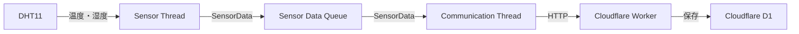

### 10.5 Cloudflare D1保存データ

Cloudflare D1には、センサーデータを履歴として保存する。

保存対象は以下とする。

| 項目 | 内容 |
|---|---|
| data_id | SensorDataを一意に識別するID |
| temperature | DHT11から取得した温度。小数第1位 |
| humidity | DHT11から取得した湿度。小数第1位 |
| timestamp | Raspberry Piでの取得時刻。Unix time seconds、UTC基準 |

`data_id`を重複排除に使用し、同一`data_id`を持つSensorDataは重複保存しない。

D1の物理的なSQL定義およびWorker内部実装は外部システムの実装詳細として扱うが、上記項目は本システムとのインターフェース上の確定データ項目とする。

### 10.6 データ保持方針

Cloudflare D1に保存されたセンサーデータは、Browserから現在値および履歴データを参照できるようにする。

Edge Application内部でのデータ保持については、通信障害時のデータ欠損への対応と合わせて決定する。

特に以下については、Queue / IPC設計および異常系設計で決定する。

* 通信失敗時にデータを保持するか
* 保持するデータ量
* 保持期間
* Queue Full時のデータ処理
* Raspberry Pi再起動時に保持データを復元するか
* 電源断時のデータ損失をどこまで許容するか

### 10.7 データ整合性

センサーデータをCloudflare Workerへ送信する際には、温度と湿度を同一のセンサーデータとして扱う。

また、センサーデータの取得時刻とCloudflare Workerでの受信時刻を区別する必要がある場合は、それぞれを管理できる構造とする。

具体的なTimestampの扱いについては、通信設計およびデータベース設計で決定する。

### 10.8 データ設計上の方針

データ構造は、Sensor Thread、Queue、Communication ThreadおよびCloudflare Workerの間で一貫して扱えるようにする。

また、将来的にセンサー種類や測定項目が増加する可能性を考慮し、特定のセンサー実装に過度に依存しないデータ構造とする。

ただし、現時点ではDHT11による温度・湿度データを対象とし、不要な汎用化は行わない。

## 11. Queue / IPC設計

### 11.1 Queue / IPC設計の概要

本システムでは、センサーデータの取得処理とCloudflare Workerへの通信処理を異なるProcessに分離する。

Sensor ProcessはDHT11からセンサーデータを取得し、IPCを介してCommunication Processへセンサーデータを送信する。

Communication ProcessはIPCからセンサーデータを受け取り、Cloudflare Workerへ送信する。

Process間のデータ受け渡しにはQueue型のIPCを使用する。

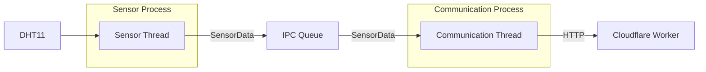

### 11.2 Process構成

Edge Applicationは、以下の2つのProcessを基本構成とする。

| Process               | 主な責務                                    |
| --------------------- | --------------------------------------- |
| Sensor Process        | DHT11からセンサーデータを取得し、IPCへ送信する             |
| Communication Process | IPCからセンサーデータを受信し、Cloudflare Workerへ送信する |

Processを分離することで、センサー処理と通信処理の障害影響範囲を分離する。

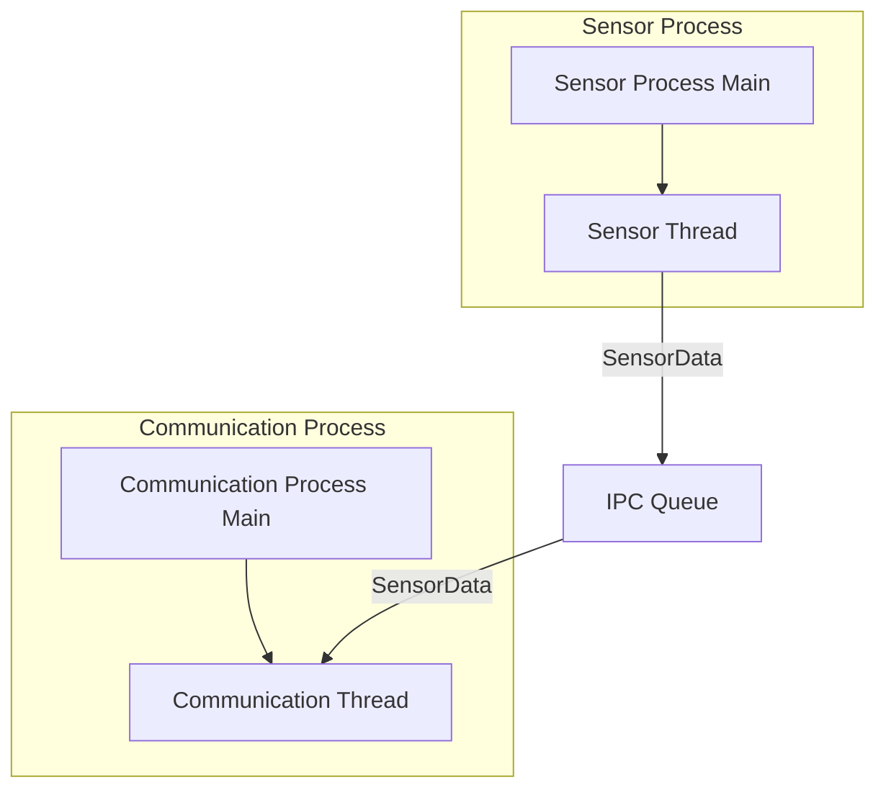

### 11.3 Process分離の理由

Sensor ProcessとCommunication Processを分離する主な理由は、障害分離である。

通信処理では、以下のような処理が発生する可能性がある。

* HTTP Timeout
* DNS名前解決失敗
* Wi-Fi切断
* HTTP 4xx
* HTTP 5xx
* Retry
* Backoff

これらの処理によってCommunication Processが長時間処理を継続している場合でも、Sensor Processは独立してセンサーデータの取得を継続できる構成とする。

また、Communication Processが異常終了した場合でも、Sensor Process自体は独立して動作できる可能性がある。

ただし、Communication Processが停止した場合にはIPC Queueにデータが蓄積するため、Queue Fullへの対応が必要となる。

### 11.4 Sensor Process

Sensor Processは、DHT11とのインターフェースおよびセンサーデータ生成を担当する。

主な責務は以下とする。

* DHT11から温度を取得する
* DHT11から湿度を取得する
* センサーデータの妥当性を確認する
* SensorDataを生成する
* SensorDataをIPCへ送信する
* センサー異常を検出する
* 必要なログを出力する

Sensor Processは、Cloudflare Workerとの通信処理を直接実行しない。

### 11.5 Communication Process

Communication Processは、クラウド側との通信を担当する。

主な責務は以下とする。

* IPCからSensorDataを受信する
* SensorDataをCloudflare Workerへ送信する
* HTTP通信結果を確認する
* Timeoutを検出する
* HTTPエラーを処理する
* Retryを実行する
* Backoffを実行する
* 通信異常を記録する

Communication Processは、DHT11へ直接アクセスしない。

### 11.6 IPC方式

Process間のデータ受け渡しには、Queueとして利用可能なIPC方式を採用する。

IPC方式の候補として、以下を比較する。

| IPC方式              | 特徴                  | 今回の適合性 |
| ------------------ | ------------------- | ------ |
| Pipe               | 単純なProcess間データ通信が可能 | ○      |
| FIFO               | 名前付きPipeとして利用可能     | ○      |
| Unix Domain Socket | 双方向通信が可能            | ○      |
| Shared Memory      | 高速な共有メモリを実現できる      | △      |
| Message Queue      | メッセージ単位の通信が可能       | ◎      |

本システムでは、**Message Queueを使用する。**

SensorDataという明確なデータ単位をProcess間で受け渡すため、Message Queueによるメッセージ単位の通信が適している。

具体的なLinux APIまたはC++での実装方式については、実装設計で決定する。

### 11.7 IPC Queueの構成

IPC Queueは、Sensor ProcessとCommunication Processの間に配置する。


Sensor ProcessはProducerとして動作する。

Communication ProcessはConsumerとして動作する。

### 11.8 IPCに格納するデータ

IPC QueueにはSensorDataを格納する。

```text
SensorData
├── temperature
├── humidity
└── timestamp
```

Process間でデータを受け渡すため、IPCで扱うデータ形式はProcess間で明確に定義する必要がある。

C++オブジェクトをそのままProcess間で共有するのではなく、IPCで送受信可能なデータ表現へ変換することを基本方針とする。

具体的なシリアライズ方式およびデータサイズについては、実装設計で決定する。

### 11.9 IPC Queueの容量

IPC Message Queueの最大容量は100件とする。

Queue容量100件により、通常の通信遅延を吸収しつつ、通信障害が長期化した場合に無制限にデータが蓄積することを防止する。

SensorData取得周期は5秒であるため、Queueが満杯の場合は最大500秒相当の取得データを保持する容量となる。

### 11.10 IPC Queue Full時の処理

IPC Message QueueがFullになった場合、新しく生成したSensorDataを破棄する。

古いデータを削除して新しいデータを格納する方式、Queueが空くまでSensor Processを無期限に待機させる方式、ローカルストレージへ退避する方式は採用しない。

Queue Full発生時はErrorレベルのログを出力し、Sensor Processは次の周期処理へ移行する。

### 11.11 IPC Queue Empty時の処理

Communication ProcessがIPC Queueからデータを取得しようとした際にQueueがEmptyの場合、CPUを消費し続けるBusy Loopは避ける。

Communication Processは、データが到着するまで待機できる方式を基本とする。

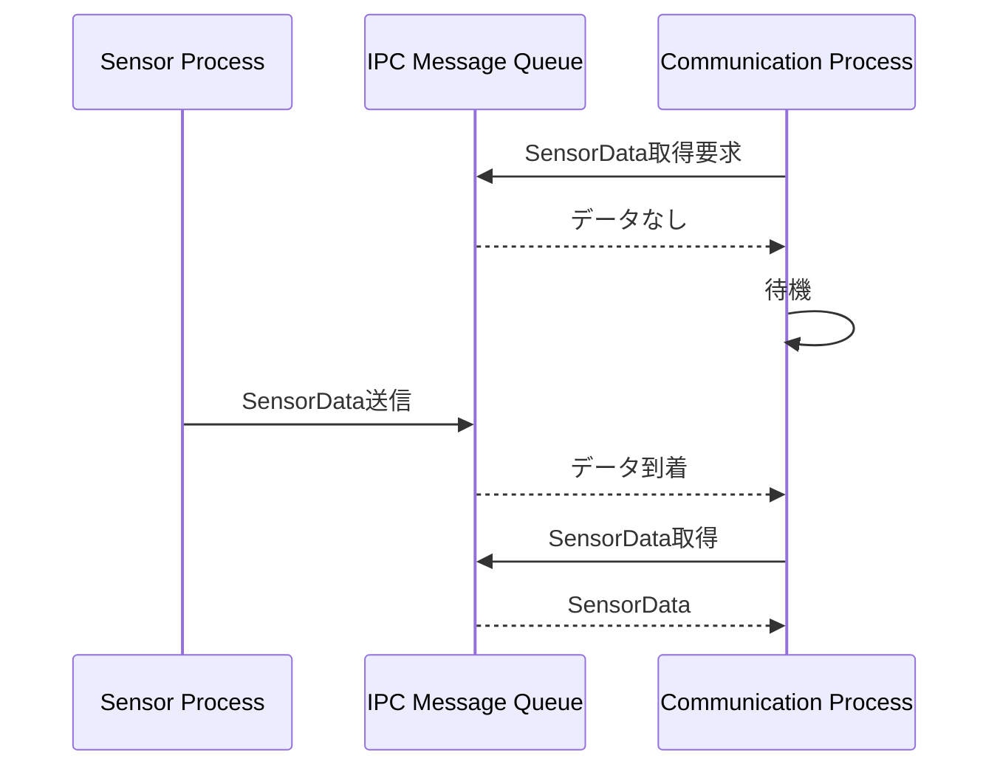

具体的な待機方式は、採用するIPC機構の仕様に合わせて実装設計で決定する。

### 11.12 データ順序

IPC Queueに格納されたSensorDataは、原則としてFIFOで処理する。

```text
SensorData A
SensorData B
SensorData C

        ↓

IPC Queue

        ↓

A → B → C
```

Sensor Processで取得した順序をCommunication Processで維持することを基本とする。

ただし、通信失敗時のRetryや再送が発生した場合、送信完了順序が変化する可能性がある。

Retryおよび再送時の順序については、通信設計および障害復旧設計で決定する。

### 11.13 Process間のメモリ分離

Sensor ProcessとCommunication Processは、それぞれ独立したProcessとして動作する。

そのため、通常のThread間共有メモリのようにSensorDataを直接共有することはできない。

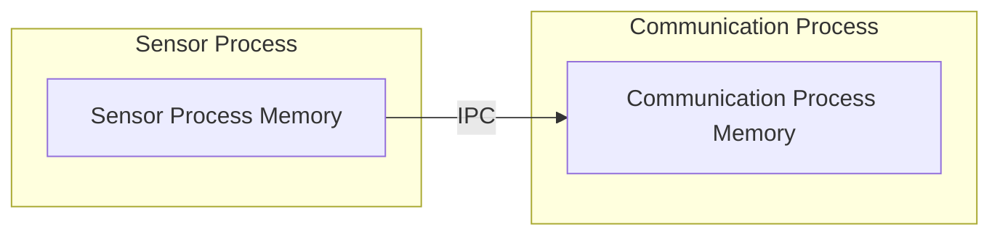

このメモリ分離により、一方のProcessが異常終了した場合でも、もう一方のProcessのメモリ空間へ直接影響を与えない構造とする。

### 11.14 Process異常終了への考慮

Processを分離することで、Process単位で異常終了を検出し、復旧することが可能となる。

例えばCommunication Processが異常終了した場合、Sensor Processは独立して動作を継続できる。

一方、Communication Processが停止している間はIPC Queueにデータが蓄積する。

そのため、Process異常終了時には以下を考慮する必要がある。

* 異常終了の検出
* Process再起動
* IPC Queueの状態
* 未送信データの扱い
* Queue Fullへの対応
* Sensor Processへの影響

具体的な復旧方法は、障害復旧設計およびsystemd設計で決定する。

### 11.15 systemdとの関係

Sensor ProcessとCommunication Processを別Processとして構成する場合、それぞれのProcessをsystemdから管理する方式も候補となる。

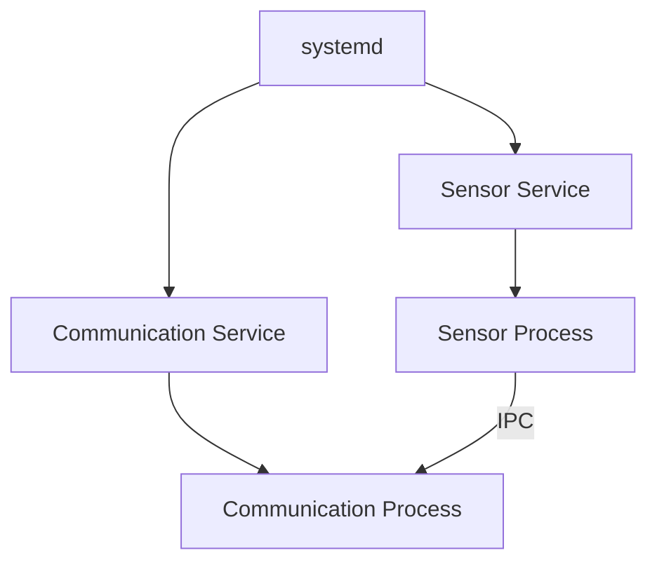

この構成では、Communication Processだけを個別に再起動することが可能になる。

ただし、Process間の起動順序、IPC Queueの生成・削除、停止順序および異常終了時の復旧について、systemdとApplicationの責務を明確にする必要がある。

Process間の起動順序、IPC Queueの生成・削除、停止順序および異常終了時の復旧方式は、19章のsystemd設計および18章のLifecycle設計で定義する。

### 11.16 IPCのメリット

Process間IPCを採用することで、以下のメリットが得られる。

* Process単位で障害を分離できる
* Sensor処理と通信処理を独立させられる
* Communication Processだけを再起動できる構成にできる
* Processごとに責務を明確化できる
* メモリ空間を分離できる
* systemdによるProcess単位の監視と相性がよい

### 11.17 IPCのデメリット

一方で、Thread間Queueと比較して以下のデメリットがある。

* IPCの実装が必要になる
* Process間のデータ形式を定義する必要がある
* シリアライズなどの処理が必要になる
* IPC障害を考慮する必要がある
* Process起動順序を考慮する必要がある
* Process終了時のQueue処理が複雑になる
* systemdとの責務分担が必要になる
* システム全体の構成が複雑になる

### 11.18 Process / IPC構成の基本方針

以下の構成を基本方針とする。

| 項目              | 方針                    |
| --------------- | --------------------- |
| Sensor処理        | Sensor Process        |
| Communication処理 | Communication Process |
| Process間通信      | IPC                   |
| IPC方式           | Message Queueとする |
| Producer        | Sensor Process        |
| Consumer        | Communication Process |
| データ単位           | SensorData            |
| データ順序           | FIFO                  |
| Queue容量         | 有限容量                  |
| Queue Empty     | 待機方式                  |
| Queue Full      | 無期限待機しない              |
| Process間メモリ共有   | 直接共有しない               |
| Process監視       | systemdと連携する   |

### 11.19 Queue / IPC設計の決定事項

- IPC方式はMessage Queueとする
- Queue容量は100件とする
- Queue Full時は新規SensorDataを破棄する
- Queue Full時にSensor Processを無期限待機させない
- Queueへのデータ順序はSensorData生成順を基本とする
- Process間のメモリ共有は行わず、Message Queueをインターフェースとする
- Queueの永続化は行わない

## 12. 周期・タイミング設計

### 12.1 周期・タイミング設計の概要

本システムでは、DHT11からのセンサーデータ取得およびCloudflare Workerへのデータ送信を継続的に実行する。

Sensor ProcessとCommunication Processは、それぞれ異なる処理特性を持つため、処理周期およびタイミングを分離して設計する。

Sensor Processは一定周期でDHT11からセンサーデータを取得する。

Communication ProcessはIPC Queueに格納されたセンサーデータを受信し、Cloudflare Workerへ送信する。

周期値、Timeout、RetryおよびBackoffは、本章で定義する。

### 12.2 センサーデータ取得周期

Sensor Processは5秒周期でDHT11から温度および湿度を取得する。

5秒周期はDHT11の測定間隔を満たし、現在値および履歴表示に必要な更新頻度を確保する値とする。

Linux環境であるため、実際の取得時刻にはスケジューリング遅延が発生し得る。周期の厳密なリアルタイム性は要求しない。

### 12.3 センサーデータ取得処理

Sensor Processでは、以下の処理を1周期の基本単位とする。

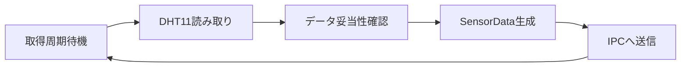

センサー読み取りに失敗した場合は、SensorDataをIPCへ送信せず、異常処理へ移行する。

具体的なセンサー異常時の復旧方法については、異常系設計および障害復旧設計で決定する。

### 12.4 取得周期の基準

周期処理は、単純な「処理完了後に一定時間待つ」方式だけでなく、処理時間による周期ずれを考慮する。

例えば以下のような方式がある。

```text
方式A

[取得] → [処理] → [待機] → [取得] → [処理] → [待機]

方式B

|<------ 一定周期 ------>|<------ 一定周期 ------>|
[取得]                    [取得]
```

本システムでは、センサーデータを5秒周期で取得する。周期処理はLinux上の周期待機を使用し、ハードリアルタイム性は要求しない。

### 12.5 Communication Processの処理方式

Communication ProcessはIPC Message QueueからSensorDataを待ち受けるブロッキング方式を基本とする。

SensorDataを取得した場合は直ちに送信処理を開始し、送信失敗時は13章で定義するRetry / Backoffを実行する。

### 12.6 通信処理とセンサー取得処理の分離

Sensor ProcessとCommunication Processを別Processとすることで、以下の処理を時間的に分離する。

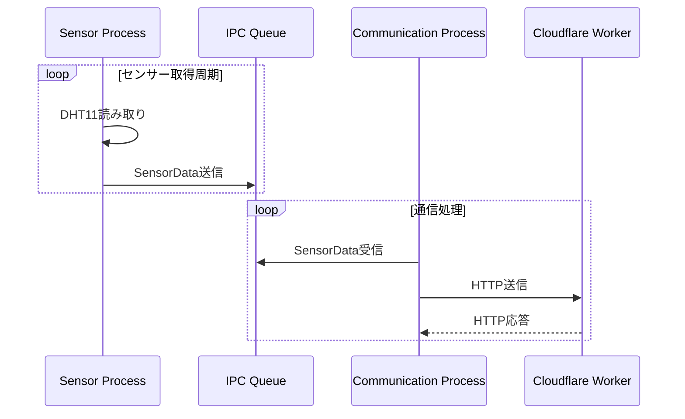

通信処理がTimeoutやRetryによって長時間継続した場合でも、Sensor Processは独立してセンサーデータ取得を継続できる構成とする。

ただし、Communication Processの処理速度がSensor Processの生成速度を下回った場合、IPC Queueにデータが蓄積する。

このため、Queue容量およびQueue Full時の処理については、11章および後続の異常系設計と整合させる。

### 12.7 データ送信タイミング

Communication ProcessはIPC Message QueueからSensorDataを取得した時点で送信処理を開始する。

Sensor ProcessとCommunication Processの周期を同期させる方式は採用しない。

### 12.8 通信処理時間が長い場合

Communication ProcessのHTTP通信に時間がかかる場合、次のSensorDataがIPC Queueに蓄積する。

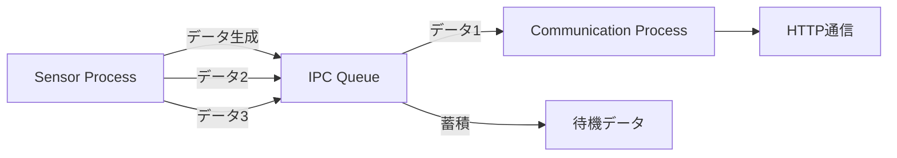

この状態が一時的であれば、Queueによって吸収する。

通信遅延が長期化した場合には、Queue容量を超える可能性があるため、Queue Full処理およびデータ保持方式が必要となる。

### 12.9 RetryおよびBackoffとの関係

通信失敗が発生した場合、Communication ProcessはRetryを実行する可能性がある。

Retry中はCommunication Processの処理時間が増加するため、IPC Queueへのデータ蓄積量が増加する可能性がある。

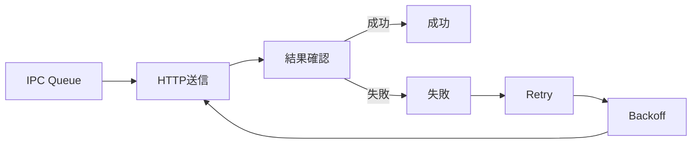

Retry回数、Backoff時間およびRetry対象となるエラーについては、13章「通信設計」で具体的に決定する。

### 12.10 周期とQueue容量の関係

Sensor Processの取得周期をTs、Communication Processの平均処理時間をTcとした場合、長期的に以下の関係となることが望ましい。

```text
Tc < Ts
```

Communication Processの処理能力がSensor Processのデータ生成速度を上回ることで、通常時にQueueへデータが蓄積し続けることを防止する。

ただし、ネットワーク障害やCloudflare側の障害などによって一時的にTcが増加する場合がある。

そのため、通常時の処理能力だけではなく、通信障害発生時のQueue蓄積量についても考慮する。

### 12.11 周期設計における時間精度

本システムは、リアルタイムOSではなくRaspberry Pi OS上のLinux環境で動作する。

そのため、センサー取得周期および通信処理の実行タイミングには、OSスケジューリングやシステム負荷による多少の遅延が発生する可能性がある。

本システムでは、ハードリアルタイム性は要求せず、センサーデータを継続的かつ概ね一定周期で取得・送信できることを基本とする。

### 12.12 Process起動時のタイミング

systemdがSensor ProcessおよびCommunication Processを起動する。

各Processは起動時にIPC Message Queueを利用可能な状態へ初期化する。IPCの共有リソース生成・取得については、競合が発生しないよう共通の名前を使用し、既存Queueがある場合は再利用する。

Sensor Processは初期化完了後に5秒周期の取得処理を開始する。Communication Processは起動後、QueueからSensorDataを待ち受ける。

### 12.13 Process停止時のタイミング

正常Shutdownでは、Sensor Processへの停止要求を先に行い、新規SensorDataの生成を停止する。

その後、Communication Processを停止する。Queueに残っているSensorDataは永続化せず、Shutdown完了時に破棄する。

### 12.14 周期・タイミングに関する基本方針

以下を基本方針とする。

| 項目                       | 方針                       |
| ------------------------ | ------------------------ |
| センサー取得                   | Sensor Processで周期実行      |
| センサー取得周期                 | 5秒  |
| データ生成                    | センサー取得ごとにSensorDataを生成   |
| IPC送信                    | SensorData生成後に実行         |
| 通信処理                     | Communication Processで実行 |
| 通信タイミング                  | IPC Queueからデータを取得した時点で送信 |
| Sensor / Communication周期 | 独立させる                    |
| 通信遅延                     | IPC Queueで一時的に吸収         |
| Retry                    | Communication Processで実行 |
| Backoff                  | Communication Processで実行 |
| リアルタイム性                  | ハードリアルタイム性は要求しない         |
| 周期精度                     | Linux環境でのスケジューリング遅延を許容する |

### 12.15 周期・タイミング設計の決定事項

| 項目 | 決定値 |
|---|---|
| DHT11取得周期 | 5秒 |
| Sensor Process周期方式 | Linuxの周期待機を使用し、ハードリアルタイム性は要求しない |
| Communication Process待機方式 | IPC Message Queueのブロッキング待機 |
| データ送信タイミング | Queueから取得後、直ちに送信開始 |
| HTTP Timeout | 5秒 |
| Retry回数 | 初回送信を除き最大3回 |
| Retry間隔 | 1秒 → 2秒 → 4秒 |
| Backoff | Exponential Backoff、最大4秒 |
| Queue容量 | 100件 |
| Shutdown時の未送信データ | 永続化せず破棄 |

## 13. 通信設計

### 13.1 通信設計の概要

本システムでは、Communication Processがネットワークを介してCloudflare WorkerとHTTP通信を行う。

Raspberry Pi 4BからCloudflare Workerへセンサーデータを送信し、Cloudflare WorkerからHTTPレスポンスを受信する。

通信経路は以下とする。


### 13.2 通信方式

Cloudflare Workerとの通信にはHTTPを使用する。

Communication Processは、SensorDataをHTTP RequestとしてCloudflare Workerへ送信する。

Cloudflare WorkerはRequestを受信し、処理結果をHTTP Responseとして返却する。

センサーデータ送信にはHTTP POSTを使用することを基本方針とする。

### 13.3 通信方向

通信方向は以下とする。

| 通信           | 方向                               | 用途         |
| ------------ | -------------------------------- | ---------- |
| SensorData送信 | Raspberry Pi → Cloudflare Worker | センサーデータの保存 |
| Response受信   | Cloudflare Worker → Raspberry Pi | 送信結果の通知    |

BrowserからCloudflare Workerへのデータ参照については、システムコンテキストおよびシステムアーキテクチャで定義しているが、本章ではRaspberry Pi側の通信を中心に扱う。

### 13.4 HTTP Request

Communication Processは、IPC Message Queueから取得したSensorDataをHTTP POST RequestとしてCloudflare Workerへ送信する。

| 項目 | 決定値 |
|---|---|
| Method | POST |
| Content-Type | application/json |
| Endpoint | Cloudflare WorkerのSensorData受信Endpoint |
| Authentication | 専用HTTP HeaderにShared Secretを設定 |
| Body | data_id、temperature、humidity、timestamp |

### 13.5 HTTP Body

HTTP RequestのBodyには以下のJSON形式を使用する。

```json
{
  "data_id": 1,
  "temperature": 25.4,
  "humidity": 60.0,
  "timestamp": 1750000000
}
```

`data_id`は`uint64_t`に対応する整数値、`temperature`および`humidity`は小数第1位、`timestamp`はUnix time secondsを使用する。

### 13.6 HTTP Response

Cloudflare Workerから返却されるHTTP ResponseをCommunication Processで確認する。

Communication Processでは、少なくとも以下を判定対象とする。

* HTTP通信自体の成功・失敗
* HTTP Status Code
* Response受信の成否

HTTP Status Codeに応じて、センサーデータの送信成功、再送対象、恒久的なエラーなどを判定する。

### 13.7 HTTP Status Codeの扱い

HTTP Status Codeは、以下のように分類する。

| Status Code | 分類         | 基本方針          |
| ----------- | ---------- | ------------- |
| 2xx         | 成功         | データ送信成功として処理  |
| 4xx         | クライアント側エラー | 原則としてRetry対象外 |
| 5xx         | サーバー側エラー   | Retry対象候補     |
| その他         | 想定外        | 異常として処理       |

具体的なStatus Codeごとの処理については、異常系設計で決定する。

### 13.8 Timeout

HTTP通信のTimeoutは5秒とする。

5秒以内に接続または応答が完了しない場合はTimeoutとして扱い、Retry対象とする。

### 13.9 DNS名前解決

DNS名前解決に失敗した場合は通信失敗として扱い、Retry対象とする。

Retryは最大3回とし、1秒、2秒、4秒の間隔で実施する。

### 13.10 Wi-Fi / Network障害

ネットワーク接続が失われた場合、Cloudflare Workerへの通信は失敗する。

Network障害そのものをCommunication Processが直接復旧させるのではなく、Communication Processは通信失敗を検出し、必要なRetry処理を行う。

ネットワーク接続自体の管理および復旧は、Raspberry Pi OSおよびネットワーク管理機構との責務分担を考慮する。

### 13.11 Retry

一時的な通信障害に対してCommunication Processは最大3回のRetryを実行する。初回送信はRetry回数に含めない。

Retry対象は以下とする。

- DNS名前解決失敗
- TCP/TLS接続失敗
- HTTP接続Timeout
- HTTP応答Timeout
- HTTP 5xx

以下は原則としてRetryしない。

- HTTP 400
- HTTP 401
- HTTP 403
- HTTP 404

Retryを3回実施しても送信できない場合は、そのSensorDataを破棄し、異常ログを出力して次のQueueデータ処理へ移行する。

### 13.12 Backoff

Retry間隔にはExponential Backoffを使用する。

```text
初回送信失敗
  ↓ 1秒
Retry 1
  ↓ 2秒
Retry 2
  ↓ 4秒
Retry 3
```

最大Backoff時間は4秒とする。

### 13.13 RetryとIPC Queue

Communication ProcessがRetryを実行している間、Sensor Processは独立して動作する。

そのため、新しく取得されたSensorDataはIPC Queueへ格納される。


Retryが長時間継続した場合、IPC Queueのデータ量が増加する可能性がある。

このため、Retry設計はQueue容量およびQueue Full時の処理と整合させる。

### 13.14 送信成功時の処理

Cloudflare Workerから正常なHTTP Responseを受信した場合、Communication Processは対象SensorDataの送信成功と判断する。

送信成功したSensorDataは、通常のIPC Queueからは削除済みのデータとして扱う。

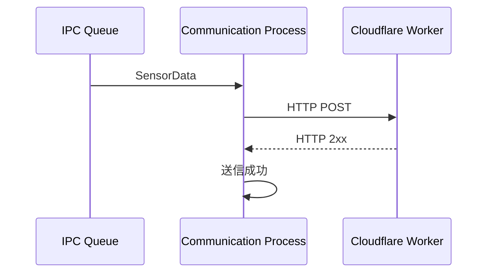

### 13.15 送信失敗時の処理

送信失敗時にはエラー種別を判定する。

- Retry対象：Retry / Backoffを実施する
- Retry対象外の4xx：対象SensorDataを破棄し、異常ログを出力する
- Retry上限到達：対象SensorDataを破棄し、異常ログを出力する
- 想定外エラー：異常ログを出力し、対象SensorDataを破棄する

送信失敗したSensorDataをIPC Queueへ戻す方式は採用しない。

### 13.16 通信の再送と重複データ

HTTP Request送信後にResponseを受信できなかった場合、Cloudflare Worker側では保存処理が完了している可能性がある。そのため、Retry時には同一`data_id`を使用する。

Cloudflare Worker側では`data_id`を重複排除キーとして扱い、同一`data_id`のSensorDataを複数回受信してもD1へ重複保存しない。

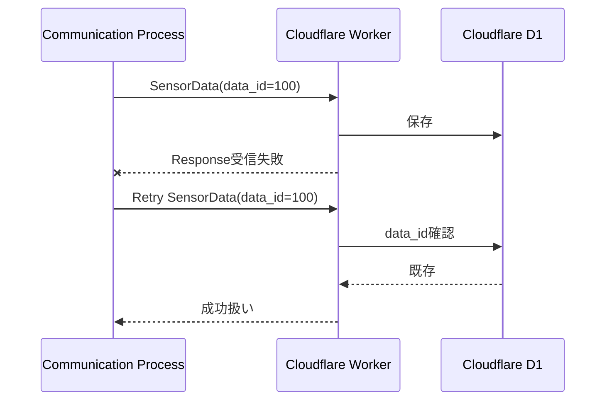

### 13.17 通信状態

Communication Processでは、通信状態を管理できる構造とする。

通信状態は、以下の状態で管理する。

```text
通信可能
   ↓
通信失敗
   ↓
Retry中
   ↓
Backoff
   ↓
通信再開
```

通信状態の詳細な状態遷移については、14章「状態遷移設計」で定義する。

### 13.18 セキュリティ

Raspberry PiからCloudflare Workerへの通信にはHTTPSを使用する。

SensorData送信時には専用HTTP HeaderへShared Secretを設定し、Worker側で認証する。Shared SecretはC++ソースコードへ埋め込まない。

秘密情報の保管方法は20章で定義する。

### 13.19 通信失敗時のデータ保持

通信失敗時のSensorDataは、最大3回のRetry期間中のみCommunication Processが保持する。

Retry失敗後のSensorDataは破棄し、ファイルやSQLite等への永続保存は行わない。

これにより、通信障害による無制限のデータ蓄積を防止する。

### 13.20 通信設計の基本方針

| 項目 | 方針 |
|---|---|
| 通信プロトコル | HTTPS |
| データ送信 | HTTP POST |
| データ形式 | JSON |
| 認証 | 専用HTTP HeaderのShared Secret |
| Timeout | 5秒 |
| HTTP 2xx | 送信成功 |
| HTTP 4xx | 原則Retry対象外 |
| HTTP 5xx | Retry対象 |
| DNS失敗 | Retry対象 |
| 接続失敗 | Retry対象 |
| Timeout | Retry対象 |
| Retry | 最大3回 |
| Retry間隔 | 1秒 → 2秒 → 4秒 |
| Backoff | Exponential Backoff、最大4秒 |
| Retry失敗後 | SensorDataを破棄して次データへ移行 |
| 重複排除 | data_idを使用 |
| 通信障害時の永続保存 | 行わない |

### 13.21 通信設計の決定事項

本章で定義した通信方式、HTTP Request、JSON形式、Timeout、Retry、Backoff、認証、重複排除、通信失敗時のデータ処理を本設計の確定事項とする。

Cloudflare Workerの具体的なURLなど環境固有の値は実装・配置時に設定するが、通信方式およびデータ契約は本章の定義から変更しない。
