## 14. 状態遷移設計

### 14.1 状態遷移設計の目的

本章では、Edge Applicationを構成する各Processおよび通信処理について、状態と状態遷移を定義する。

本システムでは、Sensor ProcessとCommunication Processを独立したProcessとして構成するため、それぞれの状態を分離して管理する。

また、Process自身のライフサイクル状態と、Communication Process内部の通信状態は異なる概念として扱う。

### 14.2 状態の分類

状態は以下の3種類に分類する。

| 分類 | 対象 | 内容 |
|---|---|---|
| Process状態 | Sensor Process / Communication Process | Processの起動、動作、停止などの状態 |
| センサー処理状態 | Sensor Process | DHT11からのデータ取得処理に関する状態 |
| 通信状態 | Communication Process | Cloudflare Workerとの通信およびRetryに関する状態 |

これらを分離することで、例えば「Communication Processは動作中だが、通信はRetry中」という状態を表現できるようにする。

---

### 14.3 Sensor Processの状態

Sensor Processでは、以下の状態を定義する。

| 状態 | 内容 |
|---|---|
| INIT | 初期化中 |
| READY | センサー取得を開始可能な状態 |
| ACQUIRE | DHT11からデータを取得中 |
| QUEUE_SEND | 取得したSensorDataをIPC Message Queueへ送信中 |
| ERROR | センサー取得などの異常を検出した状態 |
| STOPPING | 停止処理中 |
| STOPPED | 停止完了 |

基本的な状態遷移を以下に示す。

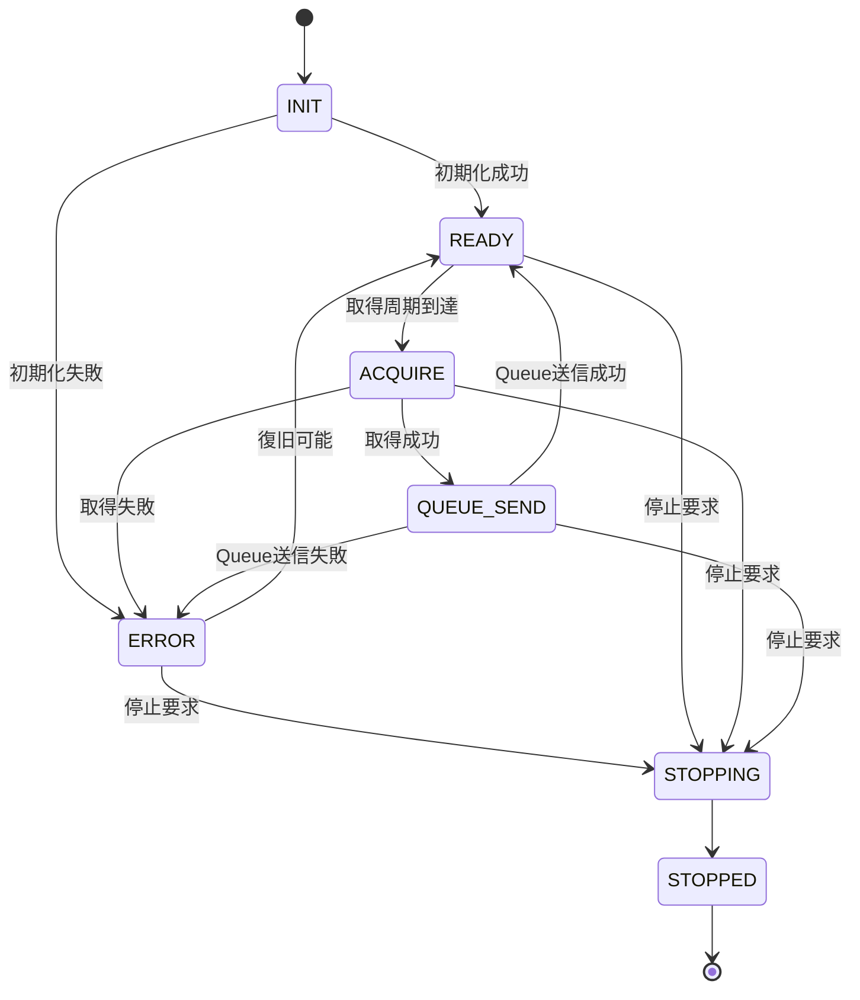
```mermaid
stateDiagram-v2
    [*] --> INIT

    INIT --> READY : 初期化成功
    INIT --> ERROR : 初期化失敗

    READY --> ACQUIRE : 取得周期到達
    ACQUIRE --> QUEUE_SEND : 取得成功
    ACQUIRE --> ERROR : 取得失敗

    QUEUE_SEND --> READY : Queue送信成功
    QUEUE_SEND --> ERROR : Queue送信失敗

    ERROR --> READY : 復旧可能
    ERROR --> STOPPING : 停止要求

    READY --> STOPPING : 停止要求
    ACQUIRE --> STOPPING : 停止要求
    QUEUE_SEND --> STOPPING : 停止要求

    STOPPING --> STOPPED

    STOPPED --> [*]

```

Sensor Processでは、DHT11からの取得に失敗した場合でも、Process全体を直ちに終了させるとは限らない。

異常内容に応じて、再取得などの復旧処理を行う。

具体的なRetry回数、再取得間隔、異常判定条件については、異常系設計で決定する。


### 14.4 Communication Processの状態

Communication Processでは、以下の状態を定義する。

| 状態            | 内容                         |
| ------------- | -------------------------- |
| INIT          | 初期化中                       |
| READY         | 通信処理を開始可能な状態               |
| WAIT_DATA     | IPC Message Queueからデータを待機中 |
| SEND          | Cloudflare Workerへデータ送信中   |
| WAIT_RESPONSE | HTTP Responseを待機中          |
| SUCCESS       | 通信成功                       |
| RETRY         | Retry実行準備中                 |
| BACKOFF       | Retry間隔を待機中                |
| ERROR         | 通信継続が困難な異常状態               |
| STOPPING      | 停止処理中                      |
| STOPPED       | 停止完了                       |


基本的な状態遷移を以下に示す。


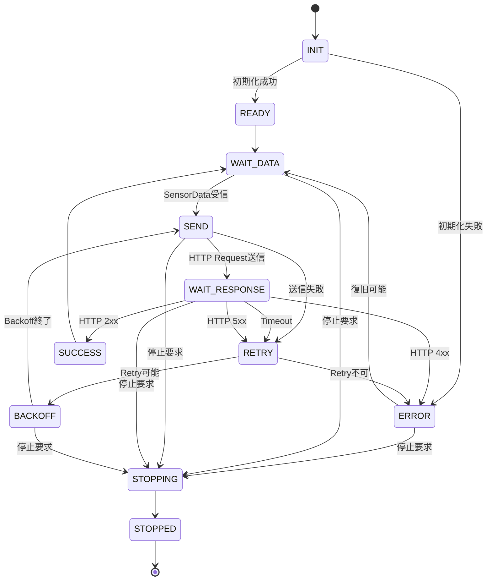
```mermaid

stateDiagram-v2
    [*] --> INIT

    INIT --> READY : 初期化成功
    INIT --> ERROR : 初期化失敗

    READY --> WAIT_DATA
    WAIT_DATA --> SEND : SensorData受信

    SEND --> WAIT_RESPONSE : HTTP Request送信
    SEND --> RETRY : 送信失敗

    WAIT_RESPONSE --> SUCCESS : HTTP 2xx
    WAIT_RESPONSE --> RETRY : Timeout
    WAIT_RESPONSE --> RETRY : HTTP 5xx
    WAIT_RESPONSE --> ERROR : HTTP 4xx

    SUCCESS --> WAIT_DATA

    RETRY --> BACKOFF : Retry可能
    RETRY --> ERROR : Retry不可

    BACKOFF --> SEND : Backoff終了

    ERROR --> WAIT_DATA : 復旧可能
    ERROR --> STOPPING : 停止要求

    WAIT_DATA --> STOPPING : 停止要求
    SEND --> STOPPING : 停止要求
    WAIT_RESPONSE --> STOPPING : 停止要求
    BACKOFF --> STOPPING : 停止要求

    STOPPING --> STOPPED
    STOPPED --> [*]

```


### 14.5 HTTP応答による状態遷移

HTTP通信結果については、以下の基本方針とする。

| 結果       | 基本方針          | 次状態       |
| -------- | ------------- | --------- |
| HTTP 2xx | 成功として処理       | WAIT_DATA |
| HTTP 4xx | 原則としてRetryしない | ERROR     |
| HTTP 5xx | 一時的障害の可能性あり   | RETRY     |
| Timeout  | Retry対象       | RETRY     |
| DNS失敗    | Retry対象       | RETRY     |
| 接続失敗     | Retry対象       | RETRY     |


ただし、HTTP 4xxであっても、将来的に特定のステータスコードをRetry対象とする必要が生じた場合は、通信設計で見直す。

### 14.6 Retry / Backoffの状態遷移

通信失敗時には、直ちに連続してRequestを送信するのではなく、Backoffを設ける。

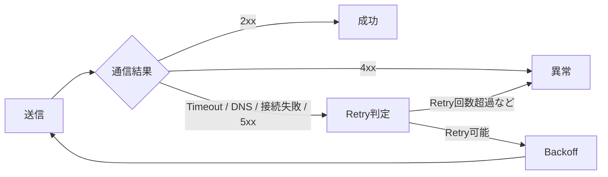
```mermaid

    flowchart LR
        Send["送信"]
        Result{"通信結果"}

        Success["成功"]
        Retry["Retry判定"]
        Backoff["Backoff"]
        Error["異常"]
        
        Send --> Result

        Result -->|2xx| Success
        Result -->|Timeout / DNS / 接続失敗 / 5xx| Retry
        Result -->|4xx| Error

        Retry -->|Retry可能| Backoff
        Retry -->|Retry回数超過など| Error

        Backoff --> Send

```


Retry処理では、以下を考慮する。

Retry回数
Retry間隔
Backoff方式
最大Backoff時間
Retry対象となるエラー
Retry終了条件
Retry中に新しいSensorDataを受信した場合の扱い

具体的な数値およびデータ保持方式は、異常系設計および障害復旧設計で決定する。


### 14.7 IPC状態との関係

Sensor ProcessとCommunication Processは、IPC Message Queueを介してデータを受け渡す。

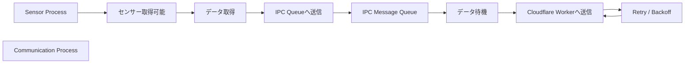
```mermaid

flowchart LR
    Sensor["Sensor Process"]

    SensorReady["センサー取得可能"]
    SensorAcquire["データ取得"]
    QueueSend["IPC Queueへ送信"]

    IPC["IPC Message Queue"]

    Comm["Communication Process"]
    Wait["データ待機"]
    Send["Cloudflare Workerへ送信"]
    Retry["Retry / Backoff"]

    Sensor --> SensorReady
    SensorReady --> SensorAcquire
    SensorAcquire --> QueueSend
    QueueSend --> IPC

    IPC --> Wait
    Wait --> Send
    Send --> Retry
    Retry --> Send

```

Sensor ProcessとCommunication Processは、IPC Message Queueを境界として独立して動作する。

そのため、Communication Processで通信処理に時間がかかった場合でも、Sensor ProcessはSensorDataの取得を継続できる。

ただし、Communication Processの処理時間が長時間継続するとIPC Message Queueにデータが蓄積する可能性がある。

この場合のQueue Fullへの対応については、異常系設計および障害復旧設計で定義する。


### 14.8 Process状態と通信状態の分離

本システムでは、Process状態と通信状態を同一の状態として扱わない。

例えば、以下の状態を許容する。

Communication Process

　　　└─ Process状態：RUNNING　　　

　　　　　└─ 通信状態：BACKOFF

これは、Communication Process自体は正常に動作しているものの、Cloudflare Workerとの通信に失敗し、Retryのため待機している状態を表す。

同様に、Sensor Processについても、センサー取得異常とProcess異常終了を区別する。

この分離により、

- センサー異常
- 通信異常
- IPC異常
- Process異常終了

をそれぞれ異なる事象として扱える構造とする。

### 14.9 起動・停止との関係

システム起動時は、以下の順序を基本とする。

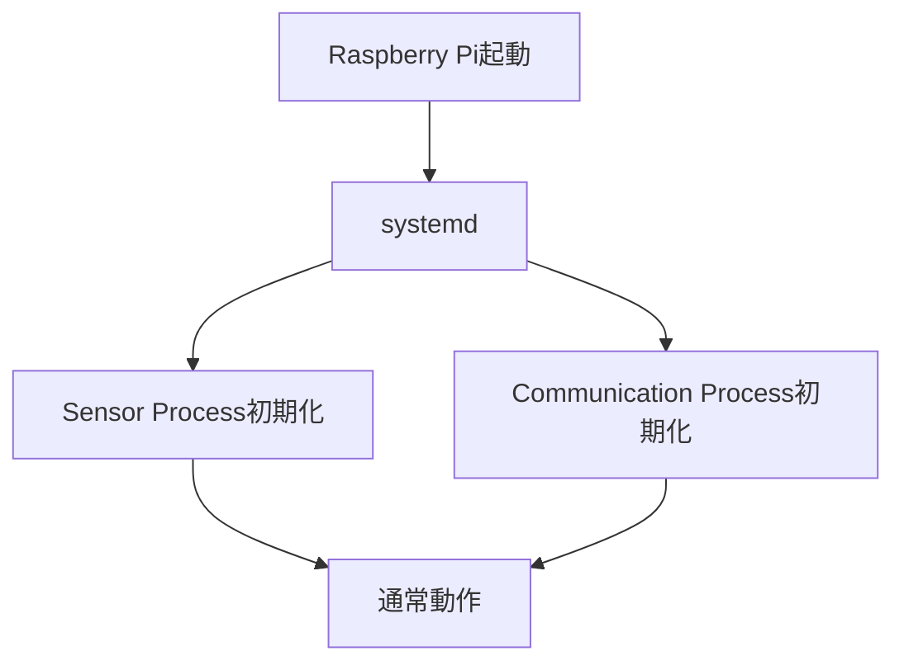
```mermaid
flowchart TD
    Boot["Raspberry Pi起動"]
    Systemd["systemd"]
    SensorInit["Sensor Process初期化"]
    CommInit["Communication Process初期化"]
    Normal["通常動作"]

    Boot --> Systemd
    Systemd --> SensorInit
    Systemd --> CommInit

    SensorInit --> Normal
    CommInit --> Normal

```

実際のProcess起動順序およびIPC Message Queueの生成・利用開始条件については、Lifecycle / Shutdown設計およびsystemd設計で詳細化する。

停止時は、実行中の処理を適切に停止し、IPC Message Queueなどのリソースを解放してProcessを終了する。

停止時にIPC Message Queueへ残っている未送信データをどのように扱うかについては、障害復旧設計で決定する。


### 14.10 状態遷移設計の方針

本システムでは、以下の方針で状態を管理する。

| 項目                    | 方針                      |
| --------------------- | ----------------------- |
| Sensor Process        | センサー取得状態を管理する           |
| Communication Process | 通信状態を管理する               |
| IPC                   | Process間のデータ受け渡し状態として扱う |
| 通信失敗                  | Retry / Backoffを使用する    |
| HTTP 4xx              | 原則Retryしない              |
| HTTP 5xx              | Retry対象とする              |
| Timeout               | Retry対象とする              |
| Process異常終了           | Process自身の状態とは分離して扱う    |
| 停止要求                  | 各Processが停止処理へ遷移する      |
| 詳細な復旧方法               | 異常系・障害復旧設計で定義する         |


状態遷移は、単なるエラー処理のためだけではなく、システムが現在どの処理段階にあるかを明確にし、異常発生時の判断および復旧処理につなげるために使用する。

## 15. 異常系設計

### 15.1 異常系設計の目的

本章では、本システムにおいて発生する可能性のある異常を分類し、異常の検出方法、異常発生時の基本的な処理方針および正常状態への復帰方針を定義する。

本システムでは、Sensor ProcessとCommunication Processを独立したProcessとして構成している。

そのため、センサー異常、通信異常、IPC異常およびProcess異常を区別して扱う。

具体的な障害からの復旧方法については、後続の「16. 障害復旧設計」で定義する。

---

### 15.2 異常系設計の基本方針

異常が発生した場合は、以下の流れを基本とする。


```mermaid
flowchart LR
    Normal["正常動作"]
    Detect["異常検出"]
    Judge["異常判定"]
    Handle["異常処理"]
    Recovery["復旧処理"]
    NormalReturn["正常動作へ復帰"]

    Normal --> Detect
    Detect --> Judge
    Judge --> Handle
    Handle --> Recovery
    Recovery --> NormalReturn
```

異常処理では、以下を基本方針とする。

1. 異常を検出する。
2. 異常の種類を判定する。
3. 影響範囲を限定する。
4. 必要な異常処理を実行する。
5. 復旧可能な場合は復旧を試みる。
6. 復旧できない場合は上位の障害処理へ移行する。
7. 異常内容をログへ記録する。

異常発生時に、正常なProcessまで不要に停止させないことを基本とする。

---

### 15.3 異常の分類

本システムで想定する主な異常を以下に示す。

| ID      | 異常分類      | 異常内容                                  |
| ------- | --------- | ------------------------------------- |
| ABN-001 | センサー異常    | DHT11からデータを取得できない                     |
| ABN-002 | センサー異常    | DHT11から取得したデータが不正                     |
| ABN-003 | IPC異常     | IPC Message Queueへの送信に失敗する            |
| ABN-004 | IPC異常     | IPC Message Queueからデータを受信できない         |
| ABN-005 | Queue異常   | IPC Message QueueがFullになる             |
| ABN-006 | ネットワーク異常  | Wi-Fi接続が失われる                          |
| ABN-007 | 通信異常      | DNS名前解決に失敗する                          |
| ABN-008 | 通信異常      | Cloudflare Workerへ接続できない              |
| ABN-009 | 通信異常      | HTTP通信がTimeoutする                      |
| ABN-010 | 通信異常      | HTTP 4xxを受信する                         |
| ABN-011 | 通信異常      | HTTP 5xxを受信する                         |
| ABN-012 | 通信異常      | Cloudflare Workerから期待しないResponseを受信する |
| ABN-013 | Process異常 | Sensor Processが異常終了する                 |
| ABN-014 | Process異常 | Communication Processが異常終了する          |
| ABN-015 | システム異常    | Raspberry Piが再起動する                    |
| ABN-016 | システム異常    | 電源断が発生する                              |

---

### 15.4 異常処理の責務

異常が発生した場合、原則として異常が発生したProcessが最初の検出および判定を担当する。

| 異常                 | 主な検出・処理担当             |
| ------------------ | --------------------- |
| DHT11取得失敗          | Sensor Process        |
| センサーデータ異常          | Sensor Process        |
| IPC送信失敗            | Sensor Process        |
| IPC受信異常            | Communication Process |
| Queue Full         | Sensor Process        |
| Wi-Fi / DNS / 接続異常 | Communication Process |
| HTTP Timeout       | Communication Process |
| HTTP 4xx           | Communication Process |
| HTTP 5xx           | Communication Process |
| Process異常終了        | systemd等のプロセス管理機構     |
| Raspberry Pi再起動    | systemd / OS          |
| 電源断                | OS / ハードウェア           |

異常処理の責務を明確にすることで、異常発生時に複数のProcessが同一の異常を重複して処理することを避ける。

---

### 15.5 DHT11取得異常

DHT11から温度または湿度を取得できなかった場合、Sensor Processはセンサー取得異常として扱う。

基本的な処理フローを以下に示す。

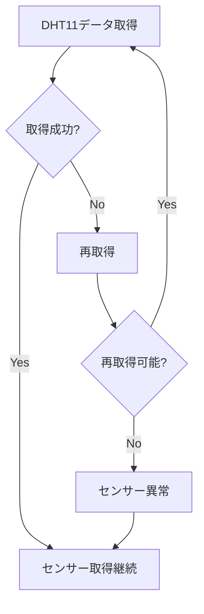
```mermaid
flowchart TD
    Acquire["DHT11データ取得"]
    Result{"取得成功?"}
    Retry["再取得"]
    Count{"再取得可能?"}
    Error["センサー異常"]
    Continue["センサー取得継続"]

    Acquire --> Result

    Result -->|Yes| Continue
    Result -->|No| Retry

    Retry --> Count
    Count -->|Yes| Acquire
    Count -->|No| Error

    Error --> Continue
```

一時的な取得失敗については、一定の条件のもとで再取得を行う。

再取得によって正常にデータを取得できた場合は、通常処理へ復帰する。

再取得しても取得できない場合はセンサー異常として扱い、異常状態をログへ記録する。

具体的な再取得回数および再取得間隔は本設計で決定する。

---

### 15.6 センサーデータ異常

DHT11から取得したデータがシステムで扱える値として妥当でない場合、センサーデータ異常として扱う。

基本的には、以下を確認する。

* 温度データが有効であること
* 湿度データが有効であること
* データ形式が期待する形式であること
* システムで定義した範囲を逸脱していないこと

異常なデータを検出した場合、そのデータをCloudflare Workerへ送信せず、異常として処理する。

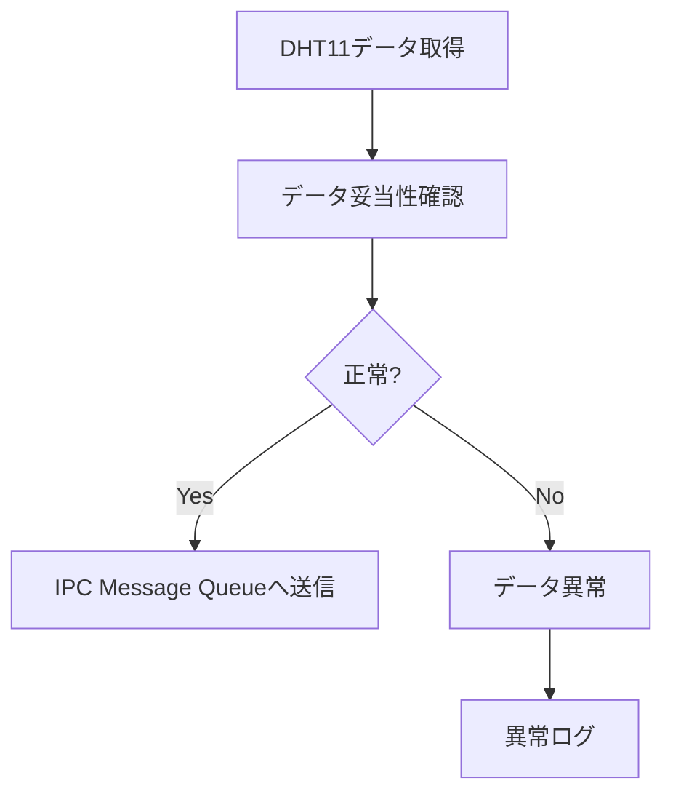
```mermaid
flowchart TD
    Data["DHT11データ取得"]
    Check["データ妥当性確認"]
    Valid{"正常?"}
    Send["IPC Message Queueへ送信"]
    Error["データ異常"]
    Log["異常ログ"]

    Data --> Check
    Check --> Valid

    Valid -->|Yes| Send
    Valid -->|No| Error
    Error --> Log
```

具体的な温度および湿度の許容範囲については、データ設計および実装設計で決定する。

---

### 15.7 IPC Message Queue送信異常

Sensor ProcessからIPC Message QueueへのSensorData送信に失敗した場合、IPC送信異常として扱う。

以下のような異常を想定する。

* Queueが存在しない
* Queueへの送信処理が失敗する
* QueueがFullである
* IPCリソースにアクセスできない

基本的な処理方針を以下とする。

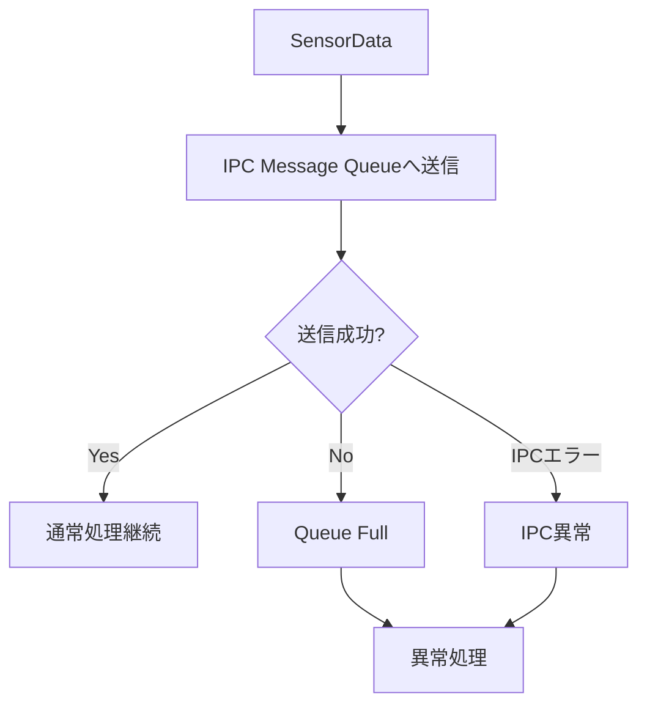
```mermaid
flowchart TD
    SensorData["SensorData"]
    Send["IPC Message Queueへ送信"]
    Result{"送信成功?"}
    Normal["通常処理継続"]
    Full["Queue Full"]
    Error["IPC異常"]
    Handle["異常処理"]

    SensorData --> Send
    Send --> Result

    Result -->|Yes| Normal
    Result -->|No| Full
    Full --> Handle

    Result -->|IPCエラー| Error
    Error --> Handle
```

IPC Message Queueへの送信失敗時に、Sensor Processを無期限に待機させない。

Queue Full時は新規SensorDataを破棄し、Errorレベルのログを出力して次回周期処理へ移行する。ローカル保存は行わない。

---

### 15.8 IPC Message Queue受信異常

Communication ProcessがIPC Message QueueからSensorDataを受信できない場合、IPC受信異常として扱う。

ただし、Queueが空であることとIPCそのものが異常であることは区別する。

| 状況              | 扱い        |
| --------------- | --------- |
| Queueにデータがない    | 待機状態として正常 |
| Queueからデータを正常受信 | 通常処理      |
| Queueへのアクセス失敗   | IPC異常     |
| Queueが不正状態      | IPC異常     |

Queueが空の場合は、CPUを消費し続けるBusy Loopを避け、待機状態とする。

---

### 15.9 Queue Full

Sensor ProcessがSensorDataをIPC Message Queueへ送信しようとした際、Queue容量が上限に達している場合はQueue Fullとして扱う。

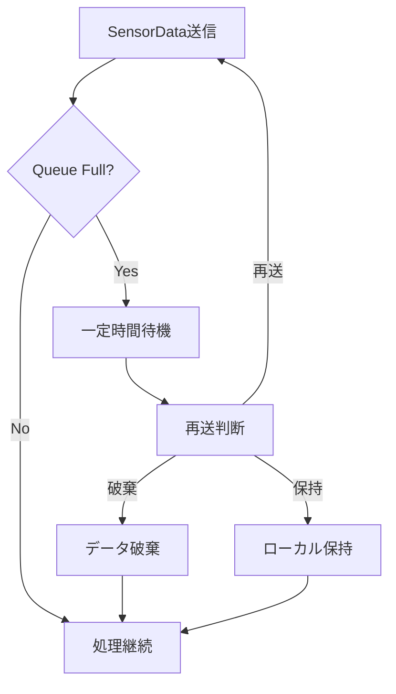
```mermaid
flowchart TD
    Send["SensorData送信"]
    Full{"Queue Full?"}
    Wait["一定時間待機"]
    Retry["再送判断"]
    Discard["データ破棄"]
    Store["ローカル保持"]
    Continue["処理継続"]

    Send --> Full

    Full -->|No| Continue
    Full -->|Yes| Wait
    Wait --> Retry

    Retry -->|再送| Send
    Retry -->|破棄| Discard
    Retry -->|保持| Store

    Discard --> Continue
    Store --> Continue
```

Queue Fullへの対応は以下とする。

* * Queue容量は100件
* Queue Full時の再送待ちは行わない
* 新規SensorDataを破棄する
* ローカル保存は行わない
* 既存Queueデータは削除しない

具体的な方式については、障害復旧設計で決定する。

---

### 15.10 Wi-Fi接続異常

Wi-Fi接続が失われた場合、Communication Processではネットワーク通信異常として扱う。

Sensor Processは、Communication Processのネットワーク状態とは独立してセンサーデータ取得を継続する。


```mermaid
flowchart LR
    Sensor["Sensor Process"]
    IPC["IPC Message Queue"]
    Comm["Communication Process"]
    Network["Wi-Fi / Internet"]
    Worker["Cloudflare Worker"]

    Sensor --> IPC
    IPC --> Comm
    Comm --> Network
    Network --> Worker

    Network -.->|通信異常| Comm
```

通信ができない期間に生成されたSensorDataについては、IPC Message Queueへの蓄積量が増加する可能性がある。

そのため、長時間のネットワーク障害についてはQueue Fullなどの二次的な異常も考慮する。

---

### 15.11 DNS異常

Cloudflare Workerの名前解決に失敗した場合、Communication ProcessはDNS異常として扱う。

DNS異常は一時的なネットワーク障害である可能性があるため、Retry対象とする。

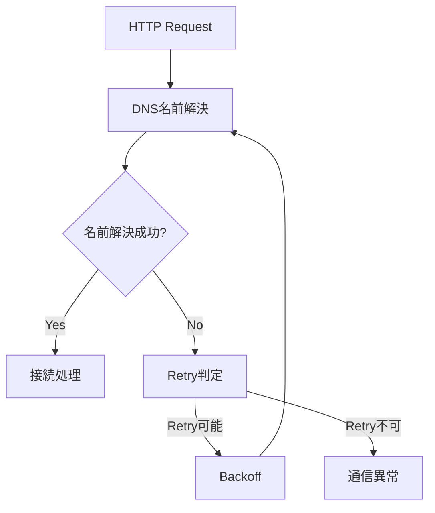
```mermaid
flowchart TD
    Request["HTTP Request"]
    DNS["DNS名前解決"]
    Result{"名前解決成功?"}
    Connect["接続処理"]
    Retry["Retry判定"]
    Backoff["Backoff"]
    Error["通信異常"]

    Request --> DNS
    DNS --> Result

    Result -->|Yes| Connect
    Result -->|No| Retry

    Retry -->|Retry可能| Backoff
    Retry -->|Retry不可| Error

    Backoff --> DNS
```

---

### 15.12 HTTP接続異常

Cloudflare Workerへの接続に失敗した場合、Communication Processは接続異常として扱う。

接続異常については、以下を想定する。

* TCP接続失敗
* TLS接続失敗
* 接続Timeout
* ネットワーク切断

一時的な接続異常についてはRetryおよびBackoffによる復旧を試みる。

---

### 15.13 HTTP Timeout

HTTP Requestの送信またはResponse受信がTimeoutした場合、通信異常として扱う。

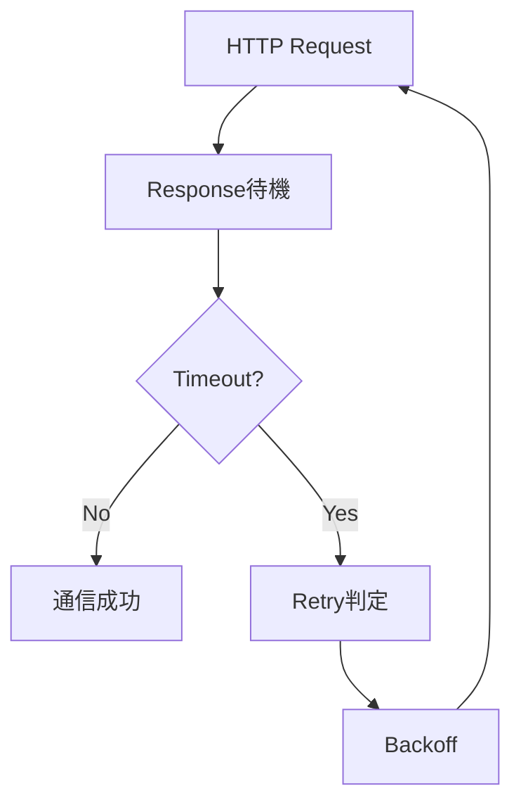
```mermaid
flowchart TD
    Send["HTTP Request"]
    Wait["Response待機"]
    Timeout{"Timeout?"}
    Success["通信成功"]
    Retry["Retry判定"]
    Backoff["Backoff"]

    Send --> Wait
    Wait --> Timeout

    Timeout -->|No| Success
    Timeout -->|Yes| Retry

    Retry --> Backoff
    Backoff --> Send
```

Timeout時間は、通信設計で定義した値を使用する。

Timeout発生時には、RequestがCloudflare Workerへ到達している可能性も考慮する。

そのため、Retryによって同一データが重複して保存される可能性がある。

重複データへの対応については、通信設計およびデータ設計で検討する。

---

### 15.14 HTTP 4xx

Cloudflare WorkerからHTTP 4xxが返された場合、原則としてClient側のRequestに問題があるものとして扱う。

基本方針は以下とする。

```text
HTTP 4xx
    ↓
Retryしない
    ↓
異常記録
    ↓
対象データの扱いを決定
    ↓
次のSensorData処理へ
```

HTTP 4xxを受信した場合、同一Requestを無条件にRetryし続けない。

ただし、特定のHTTPステータスコードについてRetryが適切であると判断した場合は、通信設計を見直す。

---

### 15.15 HTTP 5xx

Cloudflare WorkerからHTTP 5xxが返された場合、一時的なサーバー側障害の可能性があるためRetry対象とする。

基本的な処理は以下とする。

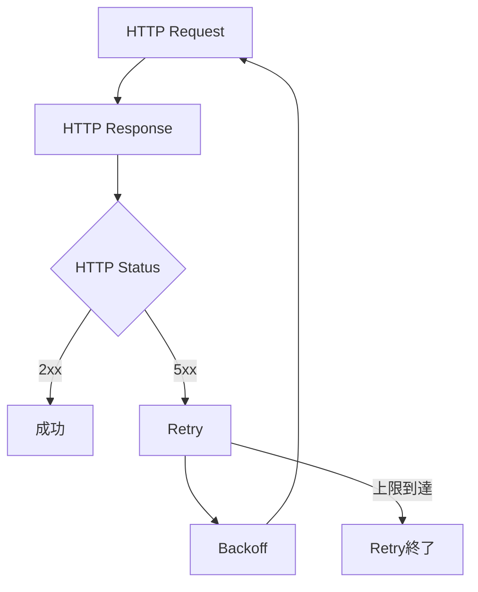
```mermaid
flowchart TD
    Request["HTTP Request"]
    Response["HTTP Response"]
    Check{"HTTP Status"}

    Success["成功"]
    Retry["Retry"]
    Backoff["Backoff"]
    Error["Retry終了"]

    Request --> Response
    Response --> Check

    Check -->|2xx| Success
    Check -->|5xx| Retry

    Retry --> Backoff
    Backoff --> Request

    Retry -->|上限到達| Error
```

Retry回数およびBackoff方式は、通信設計および障害復旧設計で決定する。

---

### 15.16 Cloudflare Worker異常

Cloudflare Worker側で異常が発生し、正常なResponseを受信できない場合、Communication Processでは通信異常として扱う。

Edge Applicationから見た場合、Cloudflare Worker内部の異常原因を直接判定することはできない。

そのため、Edge Applicationでは主に以下の情報を利用して異常を判定する。

* HTTP Status Code
* Response Timeout
* Connection Error
* Response内容
* DNS Error

Cloudflare Worker内部の詳細な障害原因については、Cloudflare側の監視およびログによって確認する。

---

### 15.17 Process異常終了

Sensor ProcessまたはCommunication Processが異常終了した場合、通常の内部状態遷移ではなくProcess異常として扱う。

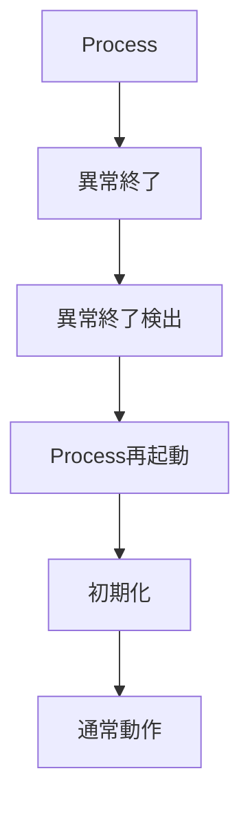
```mermaid
flowchart TD
    Process["Process"]
    Abnormal["異常終了"]
    Detect["異常終了検出"]
    Restart["Process再起動"]
    Init["初期化"]
    Normal["通常動作"]

    Process --> Abnormal
    Abnormal --> Detect
    Detect --> Restart
    Restart --> Init
    Init --> Normal
```

Process異常終了の検出および再起動にはsystemdを使用する。異常終了時は`Restart=on-failure`、再起動待ち時間は5秒とする。

---

### 15.18 Raspberry Pi再起動

Raspberry Piが再起動した場合、Edge ApplicationはLinux起動後に必要なProcessを再起動し、通常動作へ復帰する。

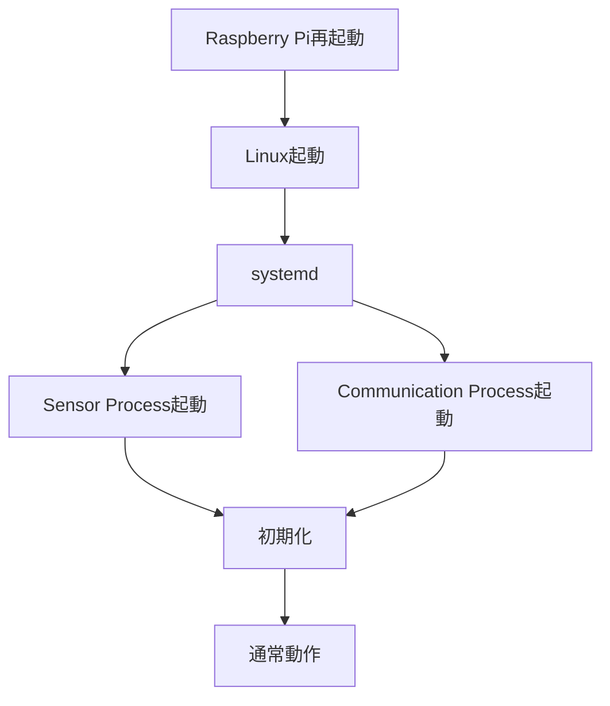
```mermaid
flowchart TD
    Reboot["Raspberry Pi再起動"]
    Linux["Linux起動"]
    Systemd["systemd"]
    Sensor["Sensor Process起動"]
    Comm["Communication Process起動"]
    Init["初期化"]
    Normal["通常動作"]

    Reboot --> Linux
    Linux --> Systemd

    Systemd --> Sensor
    Systemd --> Comm

    Sensor --> Init
    Comm --> Init

    Init --> Normal
```

再起動前にIPC Message Queueに存在していたデータの扱いについては、障害復旧設計で定義する。

---

### 15.19 電源断

Raspberry Piの電源が突然失われた場合、Edge Applicationによる正常なShutdown処理を実行できない可能性がある。

そのため、電源断については以下の影響を考慮する。

* 未送信SensorDataの消失
* IPC Message Queue上のデータ消失
* Process状態の消失
* ファイルへ保存中のデータへの影響
* 次回起動時の復旧

電源断からの復旧については、障害復旧設計で定義する。

---

### 15.20 異常ログ

異常が発生した場合は、原因調査および復旧確認に必要な情報をログへ記録する。

基本的に以下の情報を記録する。

| 項目      | 内容               |
| ------- | ---------------- |
| 発生時刻    | 異常を検出した時刻        |
| Process | 異常を検出したProcess   |
| 異常種別    | センサー、IPC、通信などの分類 |
| エラー内容   | 発生した異常の内容        |
| 状態      | 異常発生時の状態         |
| Retry回数 | Retryを実行した場合の回数  |
| 復旧結果    | 復旧成功 / 失敗        |
| 関連情報    | 必要に応じた追加情報       |

秘密情報や認証情報など、セキュリティ上記録すべきでない情報はログへ出力しない。

詳細なログ項目および出力方式については、ログ・監視設計で定義する。

---

### 15.21 異常処理一覧

本章で定義した主な異常処理を以下にまとめる。

| 異常              | 検出担当                  | 基本処理            | 復旧方針         |
| --------------- | --------------------- | --------------- | ------------ |
| DHT11取得失敗       | Sensor Process        | 再取得             | 再取得成功後に継続    |
| センサーデータ異常       | Sensor Process        | データ破棄・記録        | 次回取得         |
| IPC送信失敗         | Sensor Process        | 異常処理            | 復旧方法を別途定義    |
| IPC受信異常         | Communication Process | 異常処理            | 復旧方法を別途定義    |
| Queue Full      | Sensor Process        | Queue状態を確認      | 再送・破棄・保持を検討  |
| Wi-Fi異常         | Communication Process | 通信Retry         | ネットワーク復旧後に継続 |
| DNS異常           | Communication Process | Retry / Backoff | 名前解決復旧後に継続   |
| 接続失敗            | Communication Process | Retry / Backoff | 接続復旧後に継続     |
| Timeout         | Communication Process | Retry / Backoff | 通信復旧後に継続     |
| HTTP 4xx        | Communication Process | 原則Retryしない      | 異常記録         |
| HTTP 5xx        | Communication Process | Retry / Backoff | サーバー復旧後に継続   |
| Worker異常        | Communication Process | 通信結果に応じて処理      | Retry等       |
| Process異常終了     | systemd等              | Process再起動      | 初期化後に復帰      |
| Raspberry Pi再起動 | systemd / OS          | Process再起動      | 通常動作へ復帰      |
| 電源断             | OS / Hardware         | 次回起動時に復旧        | 障害復旧設計で定義    |

---

### 15.22 異常処理における基本原則

本システムでは、異常発生時に以下の原則を適用する。

#### 15.22.1 異常の局所化

あるProcessで発生した異常が、正常に動作している別のProcessへ不要に波及しない構造とする。

例えば、Communication Processで通信障害が発生しても、Sensor Processは可能な限りセンサーデータの取得を継続する。

#### 15.22.2 一時的な異常と恒久的な異常の区別

一時的なネットワーク障害など、時間経過によって復旧する可能性がある異常については、RetryおよびBackoffを使用する。

一方、Request内容の誤りなど、Retryしても解決しない可能性が高い異常については、無条件にRetryを繰り返さない。

#### 15.22.3 無限Retryの禁止

通信異常などに対して、無期限にRetryを繰り返す構造にはしない。

Retry回数、Retry間隔および終了条件を定義する。

#### 15.22.4 データ消失の扱い

通信障害やQueue FullなどによってSensorDataを送信できない場合、データをどこまで保持するかを明確にする。

保持方法およびデータ消失の許容範囲については、障害復旧設計で定義する。

#### 15.22.5 異常状態の記録

異常発生、Retry、復旧およびProcess再起動など、システムの異常状態を追跡できるようにログへ記録する。

---

## 16. 障害復旧設計

### 16.1 障害復旧設計の目的

本章では、本システムで異常が発生した場合に、システムを可能な限り正常な状態へ復帰させるための障害復旧方式を定義する。

15章「異常系設計」では、発生する可能性のある異常と基本的な異常処理方針を定義した。

本章では、それらの異常に対して、

* どのように復旧を試みるか
* どの範囲まで復旧するか
* 復旧できない場合にどうするか
* データをどこまで保持するか
* Processをどのように復旧するか

を定義する。

---

### 16.2 障害復旧の基本方針

障害復旧は、以下の流れを基本とする。

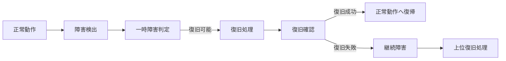
```mermaid
flowchart LR
    Normal["正常動作"]
    Detect["障害検出"]
    Temporary["一時障害判定"]
    Recovery["復旧処理"]
    Check["復旧確認"]
    NormalReturn["正常動作へ復帰"]
    Persistent["継続障害"]
    Escalate["上位復旧処理"]

    Normal --> Detect
    Detect --> Temporary

    Temporary -->|復旧可能| Recovery
    Recovery --> Check

    Check -->|復旧成功| NormalReturn
    Check -->|復旧失敗| Persistent

    Persistent --> Escalate
```

障害復旧では、以下を基本原則とする。

1. 障害を検出する。
2. 一時的な障害か継続的な障害かを判定する。
3. 復旧可能な場合は自動復旧を試みる。
4. 復旧後に正常状態へ戻ったことを確認する。
5. 復旧できない場合は、より上位の復旧手段へ移行する。
6. 復旧処理によるシステムへの影響を最小化する。
7. 障害および復旧結果をログへ記録する。

---

### 16.3 障害レベル

障害の影響範囲に応じて、以下のように復旧レベルを考える。

| レベル     | 対象           | 基本的な復旧方法        |
| ------- | ------------ | --------------- |
| Level 1 | 処理単位の一時異常    | Retry / 再実行     |
| Level 2 | 通信・IPC等の継続異常 | 再初期化 / 再接続      |
| Level 3 | Process異常    | Process再起動      |
| Level 4 | システム異常       | Raspberry Pi再起動 |
| Level 5 | 電源断          | 次回起動時の復旧        |

可能な限り低いレベルで復旧させる。

例えば、HTTP通信の一時的なTimeoutであれば、Raspberry Pi全体を再起動するのではなく、Communication Process内でRetryを行う。

---

### 16.4 DHT11取得失敗からの復旧

DHT11のデータ取得に失敗した場合、Sensor Processは再取得を行う。

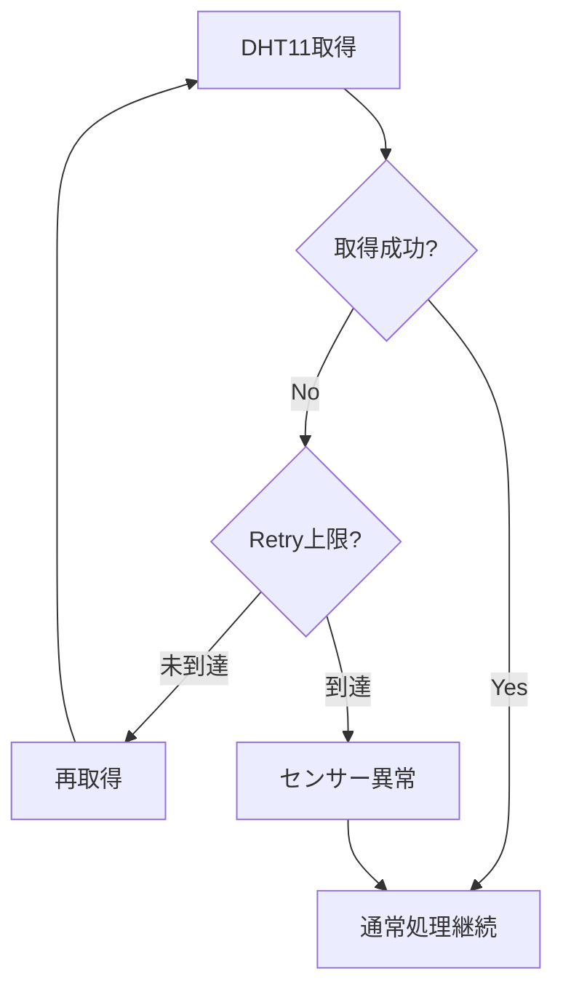
```mermaid
flowchart TD
    Read["DHT11取得"]
    Success{"取得成功?"}
    Retry["再取得"]
    RetryLimit{"Retry上限?"}
    SensorError["センサー異常"]
    Continue["通常処理継続"]

    Read --> Success

    Success -->|Yes| Continue
    Success -->|No| RetryLimit

    RetryLimit -->|未到達| Retry
    Retry --> Read

    RetryLimit -->|到達| SensorError
    SensorError --> Continue
```

一時的な取得失敗であれば、Retryによって正常取得へ復帰する。

一定回数Retryしても取得できない場合は、継続的なセンサー異常として記録する。

ただし、Sensor Process自体は不要に停止させず、次回の取得周期で再度取得を試みる方式を基本とする。

Retry回数は最大3回、Retry間隔は1秒→2秒→4秒とする。

---

### 16.5 センサーデータ異常からの復旧

DHT11から取得したデータが不正であった場合、そのデータを通信対象としない。

基本的な復旧方法は、次回のセンサー取得で正常なデータを取得することである。

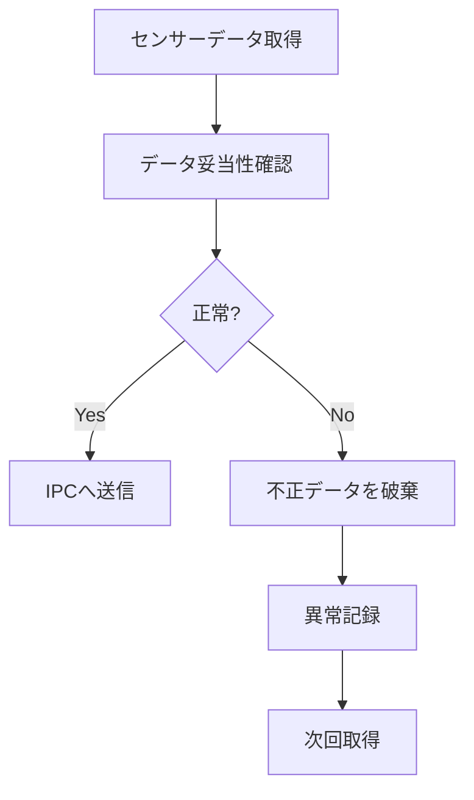
```mermaid
flowchart TD
    Acquire["センサーデータ取得"]
    Validate["データ妥当性確認"]
    Valid{"正常?"}
    Send["IPCへ送信"]
    Discard["不正データを破棄"]
    Log["異常記録"]
    Next["次回取得"]

    Acquire --> Validate
    Validate --> Valid

    Valid -->|Yes| Send
    Valid -->|No| Discard
    Discard --> Log
    Log --> Next
```

不正データをCloudflare Workerへ送信しないことを基本とする。

---

### 16.6 IPC Message Queue障害からの復旧

IPC Message Queueに異常が発生した場合、Sensor ProcessおよびCommunication Processの両方に影響する可能性がある。

そのため、IPC異常発生時には以下を考慮する。

* Queueの存在確認
* Queueへのアクセス状態確認
* Queueの再初期化
* Process再起動
* Queue上に存在していたデータの扱い

IPCの一時的なアクセス異常については、可能な範囲で再初期化を試みる。

再初期化によって復旧できない場合は、systemdによるProcess再起動で復旧する。

---

### 16.7 Queue Fullからの復旧

通信処理がセンサーデータの生成速度に追いつかない場合、IPC Message Queueにデータが蓄積し、最終的にQueue Fullが発生する可能性がある。

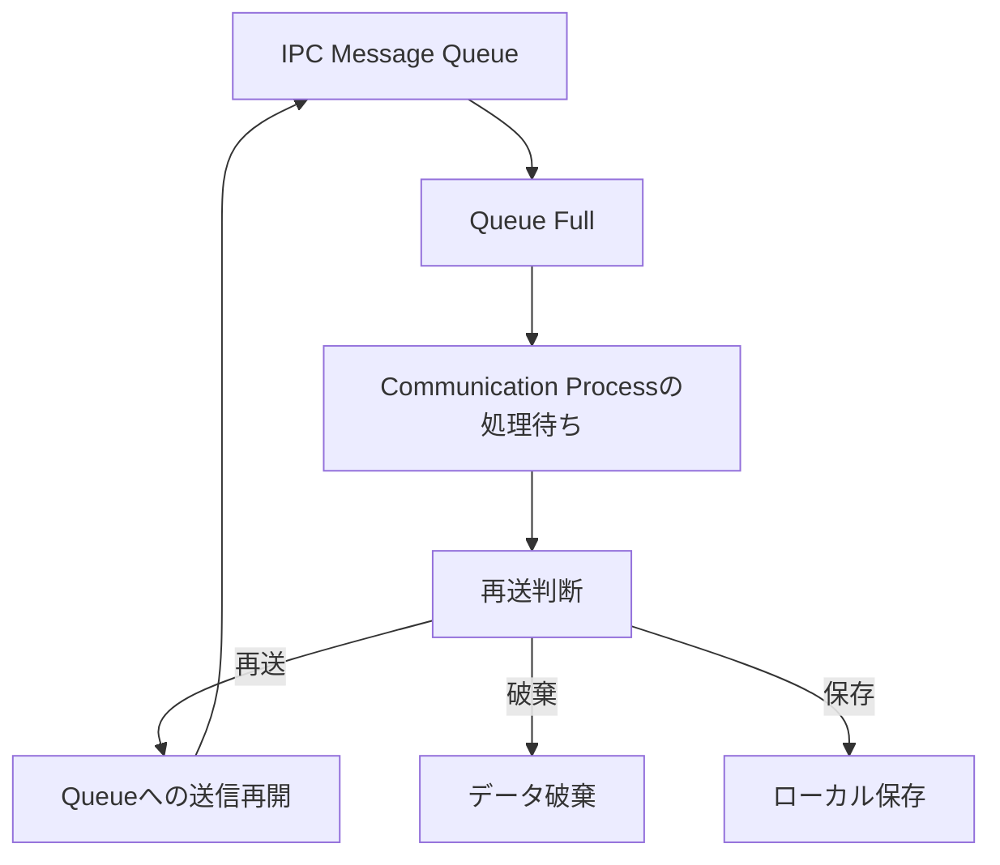
```mermaid
flowchart TD
    Queue["IPC Message Queue"]
    Full["Queue Full"]
    Wait["Communication Processの処理待ち"]
    Retry["再送判断"]
    Discard["データ破棄"]
    Store["ローカル保存"]
    Resume["Queueへの送信再開"]

    Queue --> Full
    Full --> Wait
    Wait --> Retry

    Retry -->|再送| Resume
    Retry -->|破棄| Discard
    Retry -->|保存| Store

    Resume --> Queue
```

Queue Full発生時には、Sensor Processを無期限に停止させない。新規SensorDataを破棄してErrorログを出力し、次回周期処理へ移行する。ローカル永続化は行わない。

---

### 16.8 Wi-Fi障害からの復旧

Wi-Fi接続が失われた場合、Communication Processは通信処理を継続しながらネットワーク復旧を待つ。

基本的には以下の流れとする。

```mermaid
flowchart TD
    Normal["通信正常"]
    Detect["Wi-Fi障害検出"]
    Retry["通信Retry"]
    Backoff["Backoff"]
    Check["通信可能確認"]
    Resume["通信再開"]
    Continue["通常通信"]

    Normal --> Detect
    Detect --> Retry
    Retry --> Backoff
    Backoff --> Check

    Check -->|復旧| Resume
    Resume --> Continue

    Check -->|未復旧| Retry
```

Wi-Fi障害によってSensor Processを停止させない。

Communication Processが復旧するまで、Sensor Processはセンサー取得を継続する。

ただし、通信障害が長時間継続した場合はIPC Message Queueの蓄積量が増加するため、Queue Full対策が必要となる。

---

### 16.9 DNS障害からの復旧

DNS名前解決に失敗した場合は、一時的なネットワーク障害の可能性を考慮し、RetryおよびBackoffを行う。

```mermaid
flowchart TD
    DNS["DNS名前解決"]
    Success{"成功?"}
    Retry["Retry"]
    Backoff["Backoff"]
    Continue["HTTP通信継続"]
    Error["継続障害"]

    DNS --> Success

    Success -->|Yes| Continue
    Success -->|No| Retry

    Retry --> Backoff
    Backoff --> DNS
    Retry -.->|長時間復旧しない| Error
```

無限Retryとならないよう、Retryの上限または長時間障害時の扱いを定義する。

---

### 16.10 HTTP通信障害からの復旧

HTTP通信に失敗した場合は、Communication Process内でRetryを行う。

対象となる主な障害は以下とする。

* 接続失敗
* TLS接続失敗
* DNS失敗
* Timeout
* HTTP 5xx
* ネットワーク切断

基本的な復旧フローを以下に示す。

```mermaid
flowchart TD
    Request["HTTP Request"]
    Result{"通信結果"}
    Success["成功"]
    Retryable["Retry可能"]
    Retry["Retry"]
    Backoff["Backoff"]
    End["Retry終了"]
    DataHandle["未送信データ処理"]

    Request --> Result

    Result -->|2xx| Success
    Result -->|Timeout / 接続失敗 / 5xx| Retryable
    Result -->|4xx| End

    Retryable --> Retry
    Retry --> Backoff
    Backoff --> Request

    Retry -->|上限到達| End
    End --> DataHandle
```

Retry回数、Backoff時間およびRetry終了後のデータ処理は、通信量、Queue容量およびデータ保持要件を考慮して決定する。

---

### 16.11 HTTP 4xxからの復旧

HTTP 4xxは、Request内容や認証などのClient側要因によって発生する可能性がある。

そのため、原則として同一Requestを無条件にRetryしない。

```text
HTTP 4xx
    ↓
異常記録
    ↓
Retryしない
    ↓
対象SensorDataの扱いを決定
    ↓
次のデータ処理
```

ただし、ステータスコードによっては再試行が適切な場合があるため、実装時にはHTTP仕様およびWorker側仕様を確認する。

---

### 16.12 HTTP 5xxからの復旧

HTTP 5xxはサーバー側の一時的な障害である可能性があるため、Retryを行う。

Retry時にはBackoffを使用する。

```mermaid
flowchart LR
    Worker["Cloudflare Worker"]
    Error["HTTP 5xx"]
    Retry["Retry"]
    Backoff["Backoff"]
    Worker

    Worker --> Error
    Error --> Retry
    Retry --> Backoff
    Backoff --> Worker
```

Retryを無期限に繰り返さず、一定の条件でRetryを終了する。

Retry終了後に対象SensorDataをどのように扱うかは、データ保持方針と合わせて決定する。

---

### 16.13 Timeoutからの復旧

HTTP Timeout発生時は、Communication ProcessがRetryを行う。

ただし、Timeoutの場合は以下の状態が考えられる。

```text
Pi
 │
 │ HTTP Request
 ▼
Cloudflare Worker
 │
 │ Request処理
 ▼
D1
```

Worker側ではRequestを受信して処理が完了しているにもかかわらず、Pi側ではResponseを受信できない可能性がある。

その場合、Retryによって同じSensorDataが複数回保存される可能性がある。

したがって、障害復旧設計では「Retryすること」と「重複データをどう扱うか」を分けて考える。

重複データへの対応については、データ設計および通信設計で具体化する。

---

### 16.14 通信障害中のSensor Process

Communication Processで通信障害が発生しても、Sensor Processは原則として独立して動作する。

```mermaid
flowchart LR
    Sensor["Sensor Process"]
    Queue["IPC Message Queue"]
    Comm["Communication Process"]
    Network["Wi-Fi / Internet"]
    Worker["Cloudflare Worker"]

    Sensor --> Queue
    Queue --> Comm
    Comm --> Network
    Network --> Worker

    Network -.->|障害| Comm
    Comm -.->|通信復旧処理| Comm
```

この構成によって、通信障害が発生してもセンサー取得処理を直接停止させない。

一方で、通信障害が長時間継続した場合にはQueueがFullになる可能性がある。

そのため、通信障害復旧とQueue Full対策は関連付けて設計する。

---

### 16.15 Process異常終了からの復旧

Sensor ProcessまたはCommunication Processが異常終了した場合、systemdによって再起動する。

```mermaid
flowchart TD
    Process["Process"]
    Crash["異常終了"]
    Detect["異常終了検出"]
    Restart["Process再起動"]
    Init["初期化"]
    Ready["Ready"]
    Run["通常動作"]

    Process --> Crash
    Crash --> Detect
    Detect --> Restart
    Restart --> Init
    Init --> Ready
    Ready --> Run
```

再起動時には、以下を再初期化する。

* Process内部状態
* Sensor関連リソース
* IPC関連リソース
* 通信関連リソース
* 必要な設定情報

再起動後に正常動作へ移行できたことを確認する。

---

### 16.16 Sensor Process異常時の復旧

Sensor Processが異常終了した場合、Communication Processは独立して動作できる構造とする。

Sensor Process再起動後は、IPC Message Queueを再利用または再初期化し、センサー取得を再開する。

ただし、Sensor Process異常終了によって取得できなかった期間のSensorDataを後から補完することは基本的にはできない。

したがって、Sensor Process停止中のデータについては、データ欠損として扱う可能性がある。

---

### 16.17 Communication Process異常時の復旧

Communication Processが異常終了した場合、Sensor Processは可能な限りセンサー取得を継続する。

その間に生成されたSensorDataはIPC Message Queueへ蓄積される可能性がある。

```mermaid
flowchart LR
    Sensor["Sensor Process"]
    Queue["IPC Message Queue"]
    Comm["Communication Process"]

    Sensor --> Queue
    Queue --> Comm

    Comm -.->|異常終了| Restart["Communication Process再起動"]

    Restart --> Queue
```

Communication Processが再起動した後、Queueに残っているSensorDataを処理することで、通信処理を再開する。

ただし、Queue容量を超えた場合のデータ損失については、Queue Fullの復旧方針に従う。

---

### 16.18 Raspberry Pi再起動からの復旧

Raspberry Piが再起動した場合、Linux起動後に必要なProcessを起動し、システムを通常状態へ戻す。

基本的な復旧フローは以下とする。

```mermaid
flowchart TD
    Reboot["Raspberry Pi再起動"]
    Linux["Linux起動"]
    Systemd["systemd"]
    Sensor["Sensor Process起動"]
    Comm["Communication Process起動"]
    IPC["IPC初期化"]
    Init["各Process初期化"]
    Normal["通常動作"]

    Reboot --> Linux
    Linux --> Systemd

    Systemd --> Sensor
    Systemd --> Comm

    Sensor --> Init
    Comm --> Init

    Init --> IPC
    IPC --> Normal
```

Process起動順序およびIPC初期化順序については、Lifecycle設計およびsystemd設計で具体化する。

---

### 16.19 電源断からの復旧

突然の電源断では、正常なShutdown処理が実行されない可能性がある。

そのため、電源断後の復旧では、次回起動時にシステムが正常状態へ戻れることを重要視する。

考慮する項目は以下とする。

* IPC Message Queueの状態
* 未送信SensorData
* ローカル保存データ
* Process状態
* ログファイル
* ファイルシステムへの書き込み状態

電源断によるデータ損失をどこまで許容するかは、データ保持要件によって決定する。

---

### 16.20 未送信SensorDataの復旧

本システムでは未送信SensorDataを永続化しないため、Process再起動やRaspberry Pi再起動後に過去の未送信データを復旧送信する処理は行わない。

Communication ProcessがRetry中に保持していたSensorDataも、Shutdown時には破棄する。

再起動後は新たに取得したSensorDataから送信を再開する。

### 16.21 データ損失の考え方

障害発生時には、すべてのSensorDataを必ず保持できるとは限らない。

そのため、以下の3つを区別する。

```text
データ保持
    ↓
障害発生中も保持する

データ再送
    ↓
障害復旧後に送信する

データ損失
    ↓
復旧できず破棄される
```

本システムでは、データ保持を強化すると構成が複雑になるため、必要な信頼性とのバランスを考慮して方式を決定する。

---

### 16.22 Retry / Backoff設計

通信障害時はCommunication Processが最大3回Retryする。

Retry間隔は1秒、2秒、4秒とし、Exponential Backoffを使用する。最大Backoff時間は4秒とする。

Retry上限到達後は対象SensorDataを破棄し、次のデータ処理へ移行する。

### 16.23 復旧不能時の扱い

自動復旧を実施しても復旧できない場合は、無限に復旧処理を継続しない。

例えば以下の状態を想定する。

* Sensor Processが繰り返し異常終了する
* Communication Processが繰り返し異常終了する
* 長時間ネットワークが復旧しない
* IPCが正常に初期化できない
* ファイルシステムへ正常にアクセスできない

この場合は、ログへ異常状態を記録し、上位の復旧機構へ処理を移行する。

Process異常についてはsystemdによる再起動、システム全体の異常については必要に応じてRaspberry Piの再起動などを復旧手段とする。

---

### 16.24 復旧後の確認

復旧処理を実施した場合、単に処理を再実行するだけではなく、正常状態へ復帰したことを確認する。

例えばCommunication Processでは、Processが再起動しただけでは復旧完了とはせず、Cloudflare Workerへの通信が成功したことを確認する。

```mermaid
flowchart TD
    Recovery["復旧処理"]
    Check["正常状態確認"]
    Success{"正常?"}
    Normal["通常動作"]
    Continue["追加復旧"]
    
    Recovery --> Check
    Check --> Success

    Success -->|Yes| Normal
    Success -->|No| Continue
    Continue --> Recovery
```

---

### 16.25 復旧処理の記録

障害復旧を実施した場合は、以下の情報をログへ記録する。

| 項目      | 内容                      |
| ------- | ----------------------- |
| 障害発生時刻  | 障害を検出した時刻               |
| 障害種別    | 発生した障害                  |
| 復旧開始時刻  | 復旧処理を開始した時刻             |
| 復旧方法    | Retry、再初期化、Process再起動など |
| Retry回数 | Retryした回数               |
| 復旧完了時刻  | 正常状態へ戻った時刻              |
| 復旧結果    | 成功 / 失敗                 |
| データ損失   | データ損失の有無                |
| 備考      | 必要な追加情報                 |

これにより、障害発生から復旧までの経緯を確認できるようにする。

---

### 16.26 障害復旧方式一覧

| 障害                        | 復旧方法            | 上位復旧       |
| ------------------------- | --------------- | ---------- |
| DHT11取得失敗                 | Retry           | 継続取得       |
| 不正SensorData              | データ破棄・次回取得      | センサー異常記録   |
| IPC送信失敗                   | 再送・再初期化         | Process復旧  |
| IPC受信失敗                   | 再初期化            | Process再起動 |
| Queue Full                | 待機・再送・保持・破棄     | データ保持方式    |
| Wi-Fi障害                   | Retry / Backoff | 継続Retry    |
| DNS障害                     | Retry / Backoff | 継続Retry    |
| 接続失敗                      | Retry / Backoff | 継続Retry    |
| HTTP Timeout              | Retry / Backoff | データ保持処理    |
| HTTP 4xx                  | 原則Retryしない      | 異常記録       |
| HTTP 5xx                  | Retry / Backoff | データ保持処理    |
| Sensor Process異常終了        | Process再起動      | 必要に応じ上位復旧  |
| Communication Process異常終了 | Process再起動      | 必要に応じ上位復旧  |
| Raspberry Pi再起動           | Process再起動      | 通常動作復帰     |
| 電源断                       | 次回起動時復旧         | データ損失確認    |

---

### 16.27 本章で決定した基本方針

本システムの障害復旧について、以下を基本方針とする。

1. 可能な限り障害が発生したProcess内で復旧する。
2. 一時的な障害にはRetryおよびBackoffを使用する。
3. 無限Retryは行わない。
4. Communication Processの通信障害によってSensor Processを停止させない。
5. Queue Fullについてはデータ保持方針と合わせて処理する。
6. Process異常終了時はsystemdによってProcessを再起動する。
7. Raspberry Pi再起動後はsystemd等によってProcessを起動する。
8. 電源断を想定し、次回起動時にシステムが復旧できる構造とする。
9. 復旧後は正常状態へ戻ったことを確認する。
10. 障害および復旧結果をログへ記録する。

---

### 17.1 目的

本章では、本システムの動作状態、異常状態および障害復旧状況を確認するためのログおよび監視方式を定義する。

ログは、以下を目的として使用する。

* システムの動作確認
* 異常発生の確認
* 異常原因の調査
* 障害復旧状況の確認
* Processの状態確認
* 通信状態の確認
* センサーデータ取得状態の確認

本章ではログに記録すべき情報と出力方針を定義する。ログ出力はsystemd journalを使用し、保持期間は7日とする。具体的なライブラリ選択は実装詳細として扱う。

---

### 17.2 ログ設計の基本方針

ログは、単に大量の情報を記録するのではなく、システムの状態を後から追跡できることを重視する。

基本方針を以下とする。

1. 重要な状態変化を記録する。
2. 異常発生を記録する。
3. Retryおよび復旧処理を記録する。
4. Processの起動・終了を記録する。
5. 通信結果を記録する。
6. センサー取得結果を必要な範囲で記録する。
7. ログから障害発生から復旧までの流れを追跡できるようにする。
8. 認証情報や秘密情報をログへ出力しない。
9. 過剰なログ出力によってシステムへ不要な負荷を与えない。

---

### 17.3 ログレベル

ログには重要度を設定する。

基本的には以下のレベルを使用する。

| レベル   | 意味                | 使用例                  |
| ----- | ----------------- | -------------------- |
| DEBUG | 詳細なデバッグ情報         | 内部処理、詳細な状態確認         |
| INFO  | 正常な動作情報           | 起動、停止、通信成功           |
| WARN  | 注意が必要な状態          | Retry、Queue蓄積、通信一時失敗 |
| ERROR | 処理に失敗した異常         | センサー異常、通信失敗          |
| FATAL | Process継続が困難な重大異常 | 初期化失敗など              |

通常運用時にはINFO以上を基本とし、DEBUGは調査時など必要に応じて有効化する。

---

### 17.4 ログ出力対象

本システムでは、以下の処理を主なログ出力対象とする。

```mermaid
flowchart TB
    Sensor["Sensor Process"]
    IPC["IPC Message Queue"]
    Comm["Communication Process"]
    Worker["Cloudflare Worker"]
    Log["Logging"]

    Sensor --> Log
    IPC --> Log
    Comm --> Log

    Sensor --> IPC
    IPC --> Comm
    Comm --> Worker
```

主なログ対象は以下とする。

* Process起動
* Process停止
* 初期化
* DHT11データ取得
* センサーデータ異常
* IPC送信
* IPC受信
* Queue Full
* 通信開始
* 通信成功
* 通信失敗
* Retry
* Backoff
* 復旧
* Process異常終了

---

### 17.5 Sensor Processのログ

Sensor Processでは、センサー取得処理およびIPCへのデータ送信に関する情報を記録する。

#### 17.5.1 起動

Sensor Process起動時には、以下を記録する。

* Process起動
* 初期化開始
* 初期化成功
* 通常処理開始

#### 17.5.2 センサー取得

DHT11からデータを取得した場合、必要な情報を記録する。

正常取得時には、取得処理が正常に完了したことを確認できるログを出力する。

ただし、温度・湿度データを毎回詳細にログへ出力するとログ量が増加するため、通常運用時の出力内容については実装時に調整する。

#### 17.5.3 センサー異常

センサー取得に失敗した場合はERRORまたはWARNとして記録する。

記録対象は以下とする。

* 発生時刻
* Process
* 異常種別
* エラー内容
* Retry回数
* 復旧結果

---

### 17.6 Communication Processのログ

Communication Processでは、IPCから受信したSensorDataの処理およびCloudflare Workerとの通信状態を記録する。

主なログ対象は以下とする。

* Process起動
* IPC受信
* HTTP送信
* HTTP成功
* HTTP失敗
* HTTP Status
* Timeout
* DNS異常
* 接続異常
* Retry
* Backoff
* 通信復旧
* Process停止

---

### 17.7 IPCのログ

IPC Message Queueについては、すべての送受信を詳細にログ出力するのではなく、異常や重要な状態変化を中心に記録する。

例えば以下をログ対象とする。

| 状態          | ログ            |
| ----------- | ------------- |
| 正常送信        | 必要に応じてDEBUG   |
| 正常受信        | 必要に応じてDEBUG   |
| Queue Full  | WARN / ERROR  |
| Queueアクセス失敗 | ERROR         |
| Queue初期化失敗  | ERROR / FATAL |
| Queue復旧     | INFO          |

これにより、正常時のログ量を抑えながら、IPC異常を追跡できるようにする。

---

### 17.8 通信ログ

Communication Processでは、Cloudflare Workerとの通信結果を追跡できるようにする。

基本的には以下の情報を記録する。

| 項目          | 内容                    |
| ----------- | --------------------- |
| 発生時刻        | 通信開始または結果の時刻          |
| Process     | Communication Process |
| 通信種別        | HTTP POST等            |
| 結果          | 成功 / 失敗               |
| HTTP Status | HTTP ResponseのStatus  |
| Retry回数     | Retryした場合の回数          |
| Timeout     | Timeout発生有無           |
| エラー種別       | DNS、接続、HTTP等          |
| 復旧結果        | 復旧成功 / 失敗             |

認証情報、Token、パスワードなどの秘密情報は記録しない。

---

### 17.9 Retryログ

通信異常などによってRetryを実行した場合は、Retryを実行したことを記録する。

```mermaid
flowchart LR
    Error["通信異常"]
    Log1["異常ログ"]
    Retry["Retry"]
    Log2["Retryログ"]
    Success["通信成功"]
    Log3["復旧ログ"]

    Error --> Log1
    Log1 --> Retry
    Retry --> Log2
    Retry --> Success
    Success --> Log3
```

Retryログには、少なくとも以下を含める。

* Retry対象
* Retry回数
* Retry理由
* Backoffの有無
* Retry結果

これにより、通信障害発生時にRetryがどのように実行されたかを確認できる。

---

### 17.10 復旧ログ

異常から正常状態へ復帰した場合、復旧したことをログへ記録する。

例えば以下を記録する。

```text
異常発生
    ↓
Retry
    ↓
Retry
    ↓
通信成功
    ↓
復旧
```

復旧ログには以下を含める。

* 障害種別
* 復旧方法
* Retry回数
* 復旧時刻
* 復旧結果

障害発生ログと復旧ログを確認することで、障害継続時間を把握できるようにする。

---

### 17.11 Process起動・終了ログ

Sensor ProcessおよびCommunication Processでは、起動および終了を記録する。

### 起動時

```text
Process起動
    ↓
初期化
    ↓
初期化成功
    ↓
通常動作開始
```

### 正常終了時

```text
通常動作
    ↓
Shutdown開始
    ↓
リソース解放
    ↓
Process終了
```

### 異常終了時

異常終了した場合は、可能な範囲で異常原因および終了状態を記録する。

Process自体が異常終了してログを出力できない場合は、systemd等のProcess管理機構側から状態を確認できる構成を想定する。

---

### 17.12 ログと状態遷移

14章で定義した状態遷移とログを対応付ける。

```mermaid
flowchart LR
    Init["INIT"]
    Ready["READY"]
    Run["RUNNING"]
    Stop["STOPPING"]
    Stopped["STOPPED"]
    Error["ERROR"]

    Log["Logging"]

    Init --> Ready
    Ready --> Run
    Run --> Stop
    Stop --> Stopped
    Run --> Error
    Error --> Run

    Init --> Log
    Ready --> Log
    Run --> Log
    Stop --> Log
    Stopped --> Log
    Error --> Log
```

重要な状態遷移をログへ記録することで、障害発生時にProcessがどの状態にあったかを確認できる。

---

### 17.13 ログフォーマット

ログは、後から検索および解析しやすい形式とする。

最低限、以下の情報を持つことを基本とする。

```text
Timestamp
Log Level
Process
Event
Message
```

概念例：

```text
2026-09-14 21:00:00 INFO  SensorProcess START Application started
2026-09-14 21:00:01 INFO  SensorProcess SENSOR Sensor data acquired
2026-09-14 21:00:01 INFO  SensorProcess IPC SensorData sent
2026-09-14 21:00:01 INFO  CommunicationProcess IPC SensorData received
2026-09-14 21:00:02 INFO  CommunicationProcess HTTP HTTP request success
```

実際の日時形式、ログ出力先およびフォーマットは実装設計で決定する。

---

### 17.14 ログの相関

Sensor ProcessとCommunication Processは別Processで動作するため、障害解析時には両Processのログを関連付ける必要がある。

例えば以下の流れを追跡できることが望ましい。

```mermaid
sequenceDiagram
    participant S as Sensor Process
    participant Q as IPC Queue
    participant C as Communication Process
    participant W as Cloudflare Worker

    S->>S: SensorData取得
    S->>Q: SensorData送信
    C->>Q: SensorData受信
    C->>W: HTTP POST
    W-->>C: HTTP Response
```

SensorDataを識別できる情報をログへ関連付けることで、

```text
SensorData生成
    ↓
IPC送信
    ↓
IPC受信
    ↓
HTTP送信
    ↓
HTTP応答
```

という一連の処理を追跡しやすくなる。

識別子にはSensorDataのdata_idを使用する。

---

### 17.15 ログ出力しない情報

セキュリティおよびプライバシーの観点から、以下の情報をログへ出力しない。

* 認証Token
* API Key
* パスワード
* 秘密鍵
* Cookie等の認証情報
* 不要な個人情報

HTTP通信をログへ記録する場合も、Request Headerなどに含まれる秘密情報をそのまま記録しない。

---

### 17.16 ログ量の管理

ログはsystemd journalへ出力する。

ログ保持期間は7日を基本とし、長期保存は本システムの対象外とする。

高頻度の正常動作ログについては不要な大量出力を避け、異常、Retry、状態変化など解析に必要な情報を記録する。

### 17.17 監視対象

本システムでは、以下を主な監視対象とする。

| 監視対象                  | 確認内容                  |
| --------------------- | --------------------- |
| Sensor Process        | Processが動作しているか       |
| Communication Process | Processが動作しているか       |
| DHT11取得               | センサーデータを取得できているか      |
| IPC Queue             | データが滞留していないか          |
| Wi-Fi                 | ネットワーク接続状態            |
| HTTP通信                | Workerへ通信できているか       |
| Retry                 | Retryが頻発していないか        |
| Queue Full            | Queueが容量上限に達していないか    |
| Process Restart       | Processが繰り返し再起動していないか |

---

### 17.18 監視における重要状態

特に以下の状態については、異常の兆候として確認できるようにする。

### Sensor Process

* センサー取得失敗の増加
* センサー取得停止
* Process異常終了

### Communication Process

* HTTP通信失敗の増加
* Timeoutの増加
* Retryの増加
* Workerへの通信停止
* Process異常終了

### IPC

* Queue滞留
* Queue Full
* IPCアクセス異常

---

### 17.19 障害解析

障害が発生した場合、ログを以下の順序で確認できることを基本とする。

```mermaid
flowchart TD
    Problem["障害発生"]
    Process["Process状態確認"]
    Sensor["Sensor状態確認"]
    IPC["IPC状態確認"]
    Network["Network状態確認"]
    HTTP["HTTP通信状態確認"]
    Recovery["復旧処理確認"]
    Cause["原因特定"]

    Problem --> Process
    Process --> Sensor
    Sensor --> IPC
    IPC --> Network
    Network --> HTTP
    HTTP --> Recovery
    Recovery --> Cause
```

例えば「Cloudflare Workerへデータが保存されない」という問題が発生した場合、

1. Sensor Processが動作しているか
2. DHT11データを取得しているか
3. IPC Queueへ送信しているか
4. Communication Processが受信しているか
5. HTTP Requestを送信しているか
6. HTTP Responseが返っているか
7. Retryが発生しているか

の順に確認できる構造とする。

---

### 17.20 ログと障害復旧の関係

16章で定義した障害復旧処理について、発生および復旧をログで追跡できるようにする。

| 障害              | 発生ログ | 復旧ログ |
| --------------- | ---- | ---- |
| DHT11取得失敗       | ○    | ○    |
| センサーデータ異常       | ○    | ○    |
| IPC異常           | ○    | ○    |
| Queue Full      | ○    | ○    |
| Wi-Fi障害         | ○    | ○    |
| DNS障害           | ○    | ○    |
| HTTP Timeout    | ○    | ○    |
| HTTP 4xx        | ○    | -    |
| HTTP 5xx        | ○    | ○    |
| Process異常終了     | ○    | ○    |
| Raspberry Pi再起動 | ○    | ○    |

これにより、障害が発生しただけでなく、その後に正常復帰したかを確認できる。

---

### 17.21 ログ・監視設計の基本構成

ログおよび監視の概念構成を以下に示す。

```mermaid
flowchart TB
    Sensor["Sensor Process"]
    IPC["IPC Message Queue"]
    Comm["Communication Process"]
    Systemd["systemd / OS"]

    Log["Log"]

    Sensor --> Log
    IPC --> Log
    Comm --> Log
    Systemd --> Log

    Monitor["監視・障害解析"]
    Log --> Monitor
```

Sensor Process、Communication Process、IPCおよびsystemdなどの状態をログから確認できる構成とする。

---

### 17.22 本章で決定した基本方針

本システムのログ・監視について、以下を基本方針とする。

1. システムの状態を後から追跡できるログを出力する。
2. Sensor ProcessとCommunication Processの状態を区別して記録する。
3. Processの起動・終了を記録する。
4. センサー異常を記録する。
5. IPC異常を記録する。
6. 通信異常、Retryおよび復旧を記録する。
7. 重要な状態遷移を記録する。
8. 異常発生から復旧までの流れを追跡可能とする。
9. 認証情報や秘密情報をログへ出力しない。
10. 長時間運用を考慮してログ量を管理する。
11. Process異常についてはsystemd等の管理機構からも確認できる構成とする。
12. ログを利用して障害原因を追跡できるようにする。

---

### 18.1 目的

本章では、本システムの起動から通常運転、ShutdownおよびProcess終了までのLifecycleを定義する。

対象とするLifecycleは以下とする。

* Raspberry Pi起動
* Edge Application Process起動
* Process初期化
* IPC Message Queue初期化
* Sensor Process起動
* Communication Process起動
* 通常運転
* Shutdown開始
* Sensor Process停止
* Communication Process停止
* IPC解放
* Process終了

また、Process異常終了時やRaspberry Pi再起動時の基本的なLifecycleについても定義する。

---

### 18.2 Lifecycleの基本方針

本システムでは、以下のLifecycleを基本とする。

```mermaid id="6w4r8p"
flowchart LR
    Boot["Raspberry Pi起動"]
    Systemd["systemd"]
    Init["Process初期化"]
    Ready["Ready"]
    Run["通常運転"]
    Shutdown["Shutdown"]
    Stop["Process停止"]
    Release["リソース解放"]
    End["終了"]

    Boot --> Systemd
    Systemd --> Init
    Init --> Ready
    Ready --> Run
    Run --> Shutdown
    Shutdown --> Stop
    Stop --> Release
    Release --> End
```

Lifecycleでは、各状態において必要なリソースを適切に初期化および解放する。

---

### 18.3 Process Lifecycle

Sensor ProcessおよびCommunication Processは、以下の状態を基本とする。

```mermaid id="e8a1c9"
stateDiagram-v2
    [*] --> INIT
    INIT --> READY
    READY --> RUNNING
    RUNNING --> STOPPING
    STOPPING --> STOPPED
    STOPPED --> [*]

    INIT --> ERROR
    RUNNING --> ERROR
    ERROR --> STOPPING
```

### 状態の意味

| 状態       | 内容                   |
| -------- | -------------------- |
| INIT     | Process起動後の初期化中      |
| READY    | 初期化完了し、通常処理開始可能      |
| RUNNING  | 通常処理中                |
| STOPPING | Shutdown処理中          |
| STOPPED  | Process停止完了          |
| ERROR    | Processとして継続が困難な異常状態 |

---

### 18.4 起動処理

Raspberry Pi起動後、systemdによって必要なProcessを起動する。

基本的な流れを以下に示す。

```mermaid id="7k4v9m"
sequenceDiagram
    participant OS as Raspberry Pi OS
    participant SD as systemd
    participant S as Sensor Process
    participant C as Communication Process
    participant Q as IPC Message Queue

    OS->>SD: Linux起動完了
    SD->>S: Sensor Process起動
    SD->>C: Communication Process起動

    S->>S: 初期化
    C->>C: 初期化

    S->>Q: IPC利用開始
    C->>Q: IPC利用開始

    S->>S: 通常処理開始
    C->>C: 通常処理開始
```

具体的なsystemd Unit設定および起動順序については、19章「systemd設計」で定義する。

---

### 18.5 Sensor Process起動

Sensor Process起動時には、以下の処理を行う。

```text
Process起動
    ↓
設定初期化
    ↓
Sensor関連リソース初期化
    ↓
IPC初期化・利用準備
    ↓
状態をREADYへ変更
    ↓
通常処理開始
```

Sensor Processは、初期化が完了するまでセンサーデータ取得を開始しない。

初期化に失敗した場合は、ERROR状態として扱う。

---

### 18.6 Communication Process起動

Communication Process起動時には、以下の処理を行う。

```text
Process起動
    ↓
設定初期化
    ↓
IPC初期化・利用準備
    ↓
通信関連リソース初期化
    ↓
状態をREADYへ変更
    ↓
通常処理開始
```

Communication Processは、IPCからSensorDataを受信できる状態になってから通常処理へ移行する。

Cloudflare Workerへの実際の通信は、送信対象データを受信した時点で開始する。

---

### 18.7 IPC Message Queue初期化

Sensor ProcessとCommunication Processは、IPC Message Queueを介してSensorDataを受け渡す。

```mermaid id="k0q7zj"
flowchart LR
    Sensor["Sensor Process"]
    Queue["IPC Message Queue"]
    Comm["Communication Process"]

    Sensor --> Queue
    Queue --> Comm

    Sensor -->|初期化| Queue
    Comm -->|初期化| Queue
```

IPC Message Queueは、両Processが利用可能な状態となってから通常運転へ移行する。

IPCが利用できない場合は、通常運転へ移行せず、IPC異常として処理する。

具体的なQueue生成、取得、削除および所有方法については、Queue / IPC設計および実装設計で決定する。

---

### 18.8 通常運転開始

Sensor ProcessおよびCommunication Processの初期化が完了すると、通常運転へ移行する。

```mermaid id="x8z2hs"
flowchart LR
    SensorReady["Sensor Process<br/>READY"]
    CommReady["Communication Process<br/>READY"]
    IPCReady["IPC利用可能"]
    Run["通常運転"]

    SensorReady --> IPCReady
    CommReady --> IPCReady
    IPCReady --> Run
```

通常運転中は、

```text
DHT11
  ↓
Sensor Process
  ↓
IPC Message Queue
  ↓
Communication Process
  ↓
HTTP
  ↓
Cloudflare Worker
```

の処理を継続する。

---

### 18.9 通常運転中の状態

通常運転中、Sensor ProcessとCommunication Processはそれぞれ独立して処理を実行する。

```mermaid id="flow0k"
flowchart LR
    Sensor["Sensor Process"]
    Queue["IPC Message Queue"]
    Comm["Communication Process"]
    Worker["Cloudflare Worker"]

    Sensor -->|SensorData| Queue
    Queue -->|SensorData| Comm
    Comm -->|HTTP| Worker
```

Sensor Processはセンサー取得周期に従って処理を実行する。

Communication ProcessはIPC Message Queueにデータが存在する場合に通信処理を実行する。

両Processの処理周期は独立している。

---

### 18.10 Shutdown開始

Shutdown要求を受けた場合、通常運転からShutdown状態へ移行する。

Shutdown要求の発生源として以下を想定する。

* ユーザーによる停止操作
* systemdによる停止
* Raspberry Piの正常Shutdown
* 保守作業

基本的な流れを以下に示す。

```mermaid id="a3c7n2"
flowchart TD
    Run["通常運転"]
    Request["Shutdown要求"]
    StopAcquire["新規センサー取得停止"]
    QueueHandle["Queue処理"]
    CommStop["通信処理停止"]
    Release["リソース解放"]
    End["Process終了"]

    Run --> Request
    Request --> StopAcquire
    StopAcquire --> QueueHandle
    QueueHandle --> CommStop
    CommStop --> Release
    Release --> End
```

Shutdown開始後は、新規の通常処理を開始しない。

---

### 18.11 Sensor ProcessのShutdown

Sensor Processでは、Shutdown要求を受けた場合、新規センサー取得を停止する。

基本的な処理を以下とする。

```text
RUNNING
    ↓
Shutdown要求
    ↓
新規DHT11取得停止
    ↓
実行中処理の終了待ち
    ↓
IPC関連処理終了
    ↓
Sensor関連リソース解放
    ↓
STOPPED
```

Shutdown中に新しいSensorDataを生成し続けないことを基本とする。

---

### 18.12 Communication ProcessのShutdown

Communication Processでは、Shutdown要求を受けた場合、新規通信処理を開始しない。

Shutdown時点でIPC Message Queueに未処理SensorDataが存在する場合、そのデータは永続化せず、Shutdown完了時に破棄する。

基本的には以下の考え方とする。

```mermaid id="r2j7mn"
flowchart TD
    Shutdown["Shutdown要求"]
    StopNew["新規通信停止"]
    Queue["Queue確認"]
    Data{"未処理データあり?"}
    Process["処理可能なデータを処理"]
    Discard["残データを終了処理"]
    Release["通信リソース解放"]
    End["Process終了"]

    Shutdown --> StopNew
    StopNew --> Queue
    Queue --> Data

    Data -->|Yes| Process
    Process --> Queue

    Data -->|No| Release
    Queue --> Discard
    Discard --> Release

    Release --> End
```

Queueに残ったデータをShutdown時にすべて送信するか、一定時間のみ処理するか、破棄するかについては、障害復旧およびデータ保持方針と合わせて決定する。

---

### 18.13 Shutdown時のIPC処理

Shutdown時には、Sensor Processが新規データを生成しない状態になった後、Communication Process側でQueueの残データを扱う。

基本的には以下の順序を考慮する。

```text
Sensor Process
    ↓
新規取得停止
    ↓
Queueへの新規送信停止
    ↓
Communication Process
    ↓
Queue残データ処理
    ↓
通信終了
    ↓
IPC解放
```

Sensor Processが動作したままCommunication Processを先に停止すると、新しいSensorDataをQueueへ送信できなくなる可能性がある。

そのため、Shutdown順序はProcess間のデータフローを考慮して決定する。

---

### 18.14 Shutdown時のデータ扱い

正常Shutdownでは新規SensorDataの生成を停止する。

IPC Message QueueおよびCommunication Processが保持している未送信SensorDataは永続化せず、Shutdown完了時に破棄する。

### 18.15 正常終了

正常なShutdownでは、以下の状態を満たしてからProcessを終了することを基本とする。

### Sensor Process

* 新規センサー取得停止
* 実行中の処理終了
* IPC処理終了
* センサー関連リソース解放
* STOPPED

### Communication Process

* 新規通信停止
* 必要なQueue残データ処理
* 通信処理終了
* IPC関連リソース解放
* STOPPED

---

### 18.16 異常終了

Processが正常なShutdown処理を実行できずに終了した場合、異常終了として扱う。

```mermaid id="xq5n7v"
flowchart TD
    Run["RUNNING"]
    Abnormal["異常終了"]
    Systemd["systemd"]
    Restart["Process再起動"]
    Init["初期化"]
    RunAgain["通常運転"]

    Run --> Abnormal
    Abnormal --> Systemd
    Systemd --> Restart
    Restart --> Init
    Init --> RunAgain
```

Process異常終了時のRestart条件およびRestart回数については、19章「systemd設計」および障害復旧設計で具体化する。

---

### 18.17 Raspberry Pi Shutdown

Raspberry Piを正常にShutdownする場合、OSからProcessへ停止要求が通知される。

基本的な流れを以下とする。

```mermaid id="t4r8yq"
sequenceDiagram
    participant User as 操作者
    participant OS as Raspberry Pi OS
    participant SD as systemd
    participant S as Sensor Process
    participant C as Communication Process

    User->>OS: Shutdown要求
    OS->>SD: Process停止
    SD->>S: Stop要求
    SD->>C: Stop要求

    S->>S: Sensor取得停止
    C->>C: 通信停止

    S-->>SD: Process終了
    C-->>SD: Process終了

    SD-->>OS: Process停止完了
    OS->>OS: Shutdown
```

具体的なsystemdの停止順序については19章で定義する。

---

### 18.18 起動と停止の関係

起動時と停止時では、データフローを考慮して処理順序を設計する。

### 起動

```text
Raspberry Pi起動
    ↓
systemd
    ↓
Process起動
    ↓
IPC初期化
    ↓
Sensor / Communication準備完了
    ↓
通常運転
```

### 停止

```text
Shutdown要求
    ↓
Sensor取得停止
    ↓
新規データ生成停止
    ↓
Queue残データ処理
    ↓
通信終了
    ↓
IPC解放
    ↓
Process終了
    ↓
Raspberry Pi Shutdown
```

---

### 18.19 Lifecycleと状態遷移

14章で定義した状態遷移とLifecycleを対応付ける。

```mermaid id="b4j9qk"
stateDiagram-v2
    [*] --> INIT
    INIT --> READY
    READY --> RUNNING

    RUNNING --> STOPPING
    STOPPING --> STOPPED
    STOPPED --> [*]

    RUNNING --> ERROR
    ERROR --> STOPPING

    note right of INIT
        Process起動・初期化
    end note

    note right of READY
        通常処理開始可能
    end note

    note right of RUNNING
        Sensor / Communication処理
    end note

    note right of STOPPING
        Shutdown処理
    end note
```

Lifecycleでは、Processの状態と内部処理状態を分離して扱う。

---

### 18.20 Lifecycle中のログ

Lifecycle上の重要な状態変化はログへ記録する。

主なログ対象を以下に示す。

| Lifecycle  | ログ           |
| ---------- | ------------ |
| Process起動  | INFO         |
| 初期化開始      | INFO         |
| 初期化失敗      | ERROR        |
| READY到達    | INFO         |
| RUNNING開始  | INFO         |
| Shutdown要求 | INFO         |
| STOPPING開始 | INFO         |
| リソース解放     | DEBUG / INFO |
| STOPPED    | INFO         |
| 異常終了       | ERROR        |
| Process再起動 | WARN / INFO  |

これにより、ProcessがどのLifecycle状態にあるかをログから確認できるようにする。

---

### 18.21 Lifecycle異常

Lifecycle中にも異常が発生する可能性がある。

| 状況           | 基本処理          |
| ------------ | ------------- |
| 初期化失敗        | ERROR状態       |
| IPC初期化失敗     | ERROR状態       |
| センサー初期化失敗    | ERROR状態       |
| 通信初期化失敗      | 必要に応じ再初期化     |
| Shutdown処理失敗 | 異常終了処理        |
| Process異常終了  | systemd等による復旧 |

Lifecycle異常の具体的な復旧方法は障害復旧設計およびsystemd設計で定義する。

---

### 18.22 Lifecycle設計の基本原則

本システムでは、以下の原則を適用する。

1. Process起動時に必要なリソースを初期化する。
2. 初期化が完了してから通常処理を開始する。
3. Sensor ProcessとCommunication Processを独立して管理する。
4. IPCが利用できる状態で通常運転へ移行する。
5. Shutdown開始後は新規データ生成を停止する。
6. Shutdown時のQueue残データを適切に扱う。
7. 使用したリソースを終了時に解放する。
8. Process異常終了時は上位のProcess管理機構による復旧を可能とする。
9. Raspberry Pi再起動後にProcessを自動起動できる構成とする。
10. Lifecycle上の重要な状態変化をログへ記録する。

---

### 18.23 本章で決定した基本方針

本章では、以下を基本方針として決定する。

* Raspberry Pi起動後、systemdによって必要なProcessを起動する。
* Sensor ProcessとCommunication Processは独立したLifecycleを持つ。
* 各ProcessはINIT → READY → RUNNINGを基本とする。
* Shutdown時はRUNNING → STOPPING → STOPPEDへ移行する。
* Sensor ProcessはShutdown開始後に新規センサー取得を停止する。
* Communication ProcessはShutdown開始後に新規通信を開始しない。
* Shutdown時のQueue残データについては、データ保持方針と合わせて扱う。
* Process異常終了時はProcess再起動を復旧手段とする。
* Raspberry Pi再起動後はProcessを自動起動する。
* リソースはLifecycleに応じて初期化・解放する。

---
