### 19.1 目的

本章では、Raspberry Pi OS上で動作するEdge Applicationの各Processについて、systemdによる起動、停止、異常終了時の再起動、OS起動時の自動起動、およびログ管理の基本方針を定義する。

対象とするProcessは以下の2つとする。

* Sensor Process
* Communication Process

systemdは、これらのProcessをOS上のサービスとして管理する。

---

### 19.2 systemdの役割

systemdは、本システムにおいて以下を担当する。

* Raspberry Pi起動時のProcess自動起動
* Processの起動管理
* Processの停止管理
* Processの異常終了検出
* Process異常終了時の再起動
* Processの終了状態管理
* systemd journalへのログ集約
* Raspberry Pi再起動後のProcess復旧

systemdはアプリケーション内部の処理を管理するものではない。

Sensor Process内部のセンサー取得処理や、Communication Process内部のHTTP通信、Retry、Backoffなどは各Process自身が管理する。

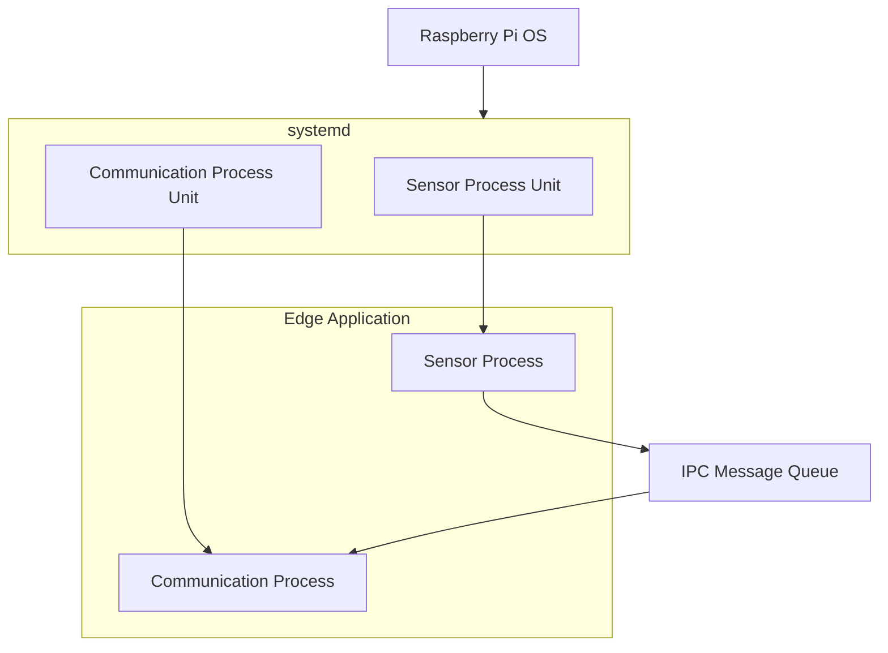

---

### 19.3 Unit構成

Sensor ProcessとCommunication Processは、それぞれ独立したsystemd Unitとして管理する。

想定するUnit構成は以下とする。

| Unit                       | 管理対象                  | 役割                    |
| -------------------------- | --------------------- | --------------------- |
| Sensor Process Unit        | Sensor Process        | DHT11からのデータ取得         |
| Communication Process Unit | Communication Process | IPCからデータを受信しWorkerへ送信 |

Unitを分離することで、片方のProcessに異常が発生した場合でも、もう片方のProcessを独立して管理できる構成とする。

---

### 19.4 OS起動時の自動起動

Raspberry Pi OSの通常起動時には、Sensor ProcessおよびCommunication Processを自動起動する。

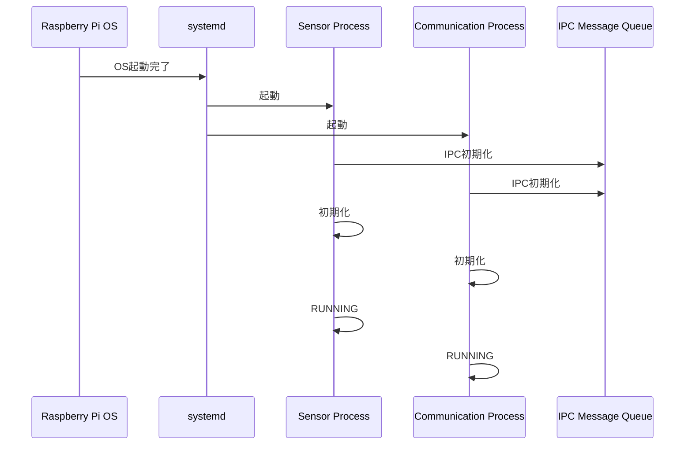

OS起動後にユーザーが手動でProcessを起動する必要がない構成とする。

---

### 19.5 起動順序

Sensor ProcessとCommunication Processは独立したProcessとして起動する。

ただし、IPC Message Queueを利用するため、Process間のIPCが利用可能な状態になった後に通常処理へ移行できる構成とする。

起動順序については、単純に「Sensor Processを先に起動してからCommunication Processを起動する」と固定するのではなく、各ProcessがIPCの初期化状態を確認できる設計とする。

これにより、OS起動時のProcess起動順序が変化しても、アプリケーションとして安定して動作できる構成とする。

### 基本方針

* Sensor ProcessはIPC初期化に失敗した場合、正常動作を開始しない
* Communication ProcessはIPC初期化に失敗した場合、正常動作を開始しない
* IPCが利用可能になった状態で各ProcessがRUNNINGへ遷移する
* Processの起動順序そのものに過度に依存しない

---

### 19.6 systemdの依存関係

systemdでは、Unit間の依存関係を設定できる。

本システムでは、Sensor ProcessとCommunication Processを完全な親子関係にはしない。

Sensor ProcessがCommunication Processを直接起動する構成にはしない。

同様に、Communication ProcessがSensor Processを直接起動する構成にもならない。

両Processはsystemdによって管理され、それぞれが独立して動作する。

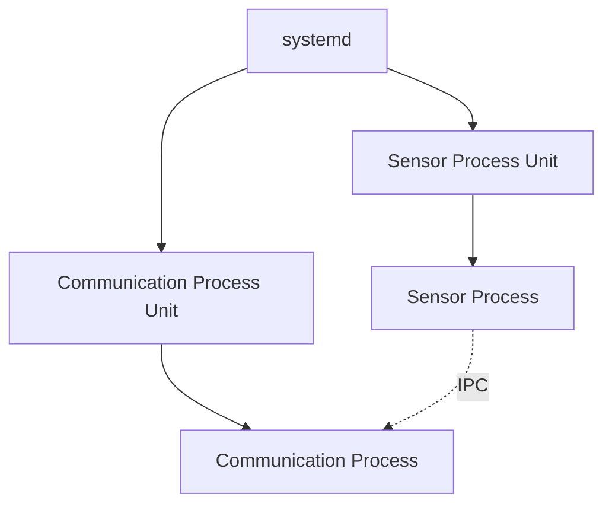

この構成により、アプリケーションProcess同士が相手Processのライフサイクルを直接管理しない構成とする。

---

### 19.7 Network依存

Communication ProcessはCloudflare Workerとの通信にWi-Fi / Internetを使用する。

そのため、Communication Processの起動時にはネットワークが利用可能であることが望ましい。

ただし、OS起動直後にネットワークが利用できない場合でも、Communication Processそのものを必ず終了させる設計にはしない。

Communication Processは起動後、ネットワークが利用可能になるまで通信失敗として扱い、必要に応じてRetry / Backoffを行う。


これにより、Wi-Fi接続完了のタイミングにProcess起動を過度に依存しない構成とする。

---

### 19.8 異常終了時の再起動

Processが異常終了した場合、systemdによる自動再起動を行う。

| 状態 | systemdの動作 |
|---|---|
| 正常終了 | 再起動しない |
| 異常終了 | 再起動する |
| 起動失敗 | 再起動を試みる |
| OS再起動 | OS起動後に自動起動する |

### 19.9 再起動待ち時間

Process異常終了後の再起動待ち時間は5秒とする。

```text
Process異常終了
    ↓
systemd検出
    ↓
5秒待機
    ↓
Process再起動
```

### 19.10 Processの連続異常終了

Processに恒久的な問題が存在する場合、以下のような状態になる可能性がある。

```text
起動
 ↓
異常終了
 ↓
再起動
 ↓
異常終了
 ↓
再起動
 ↓
異常終了
 ↓
・・・
```

このような無制限の再起動ループを避けるため、systemdの起動回数制限機能を利用する。

一定時間内にProcessが繰り返し異常終了した場合には、systemdによる再起動を抑制し、異常状態として扱える構成とする。

起動回数制限および時間条件は、systemdの標準的なStartLimit設定を使用し、Unit設計で定義する。

---

### 19.11 Process異常とシステム異常の分離

Process異常が発生した場合でも、直ちにRaspberry Pi全体を再起動する構成にはしない。

基本的な復旧階層は以下とする。

```text
Process異常
    ↓
Process再起動
    ↓
復旧確認
    ↓
正常動作
```

Process再起動でも復旧できない場合には、異常状態として記録する。

Raspberry Pi全体の再起動は、Process単体では解決できないシステムレベルの問題に対する手段として扱う。

この考え方は、16章「障害復旧設計」と整合させる。

---

### 19.12 Sensor Process再起動時の動作

Sensor Processが異常終了した場合、systemdはSensor Processを再起動する。

再起動後、Sensor Processは初期化処理を再実行する。

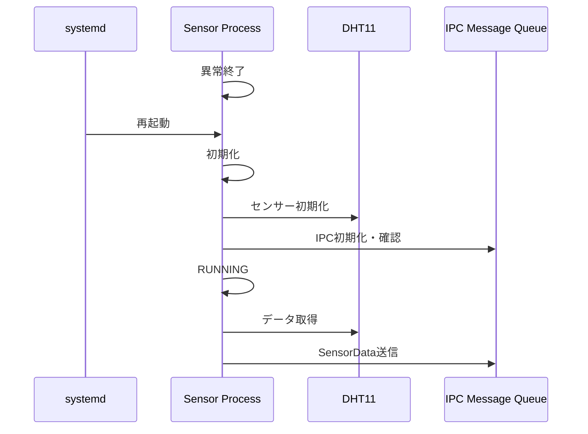

再起動時に、それ以前のSensor Process内部状態をそのまま引き継ぐことは前提としない。

必要な状態は初期化処理によって再構築する。

---

### 19.13 Communication Process再起動時の動作

Communication Processが異常終了した場合、systemdはCommunication Processを再起動する。

再起動後は以下を実行する。

* Process初期化
* IPCの初期化・確認
* 通信関連リソースの初期化
* QueueからのSensorData受信
* Cloudflare Workerへの送信再開

Sensor ProcessはCommunication Processの異常終了によって直接終了させない。

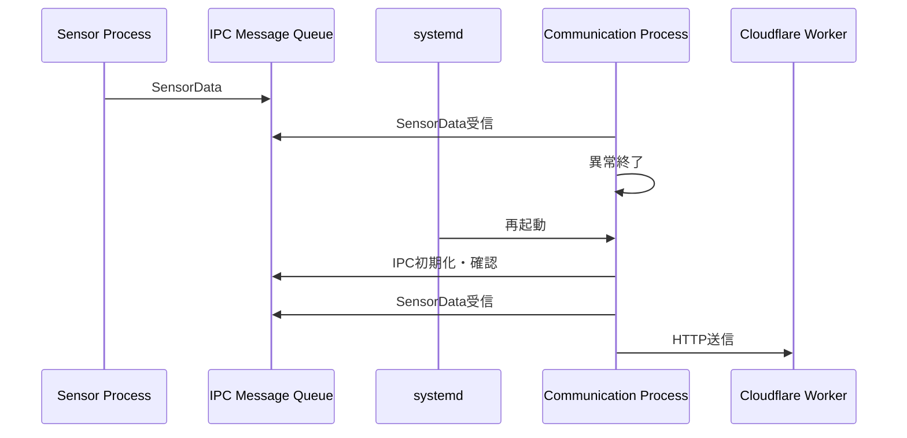

ただし、Process異常終了時にQueue内のデータがどのように扱われるかは、IPCおよび障害復旧の具体設計で定義する。

---

### 19.14 正常停止

Raspberry Piを正常にシャットダウンする場合、systemdが各Processの停止処理を実行する。

基本的な停止方針は以下とする。

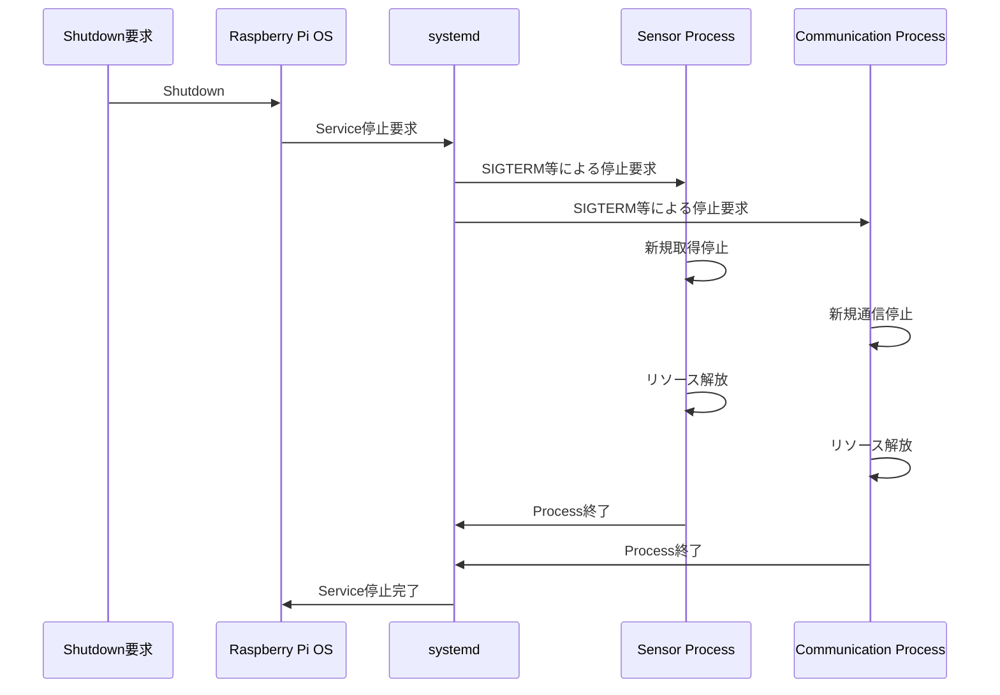

Process側は停止要求を受け取った場合、直ちに強制終了するのではなく、可能な範囲で正常終了処理を実行する。

---

### 19.15 Queue内データの扱い

正常停止時にIPC Message Queue内に未送信のSensorDataが存在する可能性がある。

このデータを、

* 送信してから停止する
* Queue内に残したまま停止する
* 保存して次回起動時に送信する
* 破棄する

のどれにするかは、今後のデータ保持・障害復旧設計で決定する。

本章では、systemdがProcessの停止を管理することのみを定義し、Queue内データの保存保証までは規定しない。

---

### 19.16 systemdとIPCの関係

systemdはIPC Message Queueそのものをアプリケーションデータの受け渡し手段として使用するものではない。

systemdの役割はProcessのライフサイクル管理であり、Process間のデータ交換はIPC Message Queueが担当する。

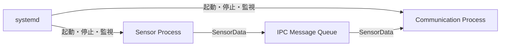

この役割分担を明確にする。

---

### 19.17 ログ管理

systemdで管理するProcessの標準出力および標準エラー出力は、systemd journalへ集約する構成を基本とする。

ログには少なくとも以下を含める。

* Process起動
* Process終了
* 初期化結果
* SensorData取得結果
* IPCエラー
* Queue Full
* HTTP通信結果
* Retry
* Backoff
* 復旧
* 異常終了

systemdによるProcess再起動についても、systemd側のログから追跡可能な構成とする。

---

### 19.18 systemd Unitの概念構成

Sensor ProcessおよびCommunication Processをそれぞれ独立したsystemd Unitとして管理する。

```text
sensor-process.service
communication-process.service
```

各Unitには自動起動、異常終了時のRestart、RestartSec、実行ユーザー、Shutdown Timeout等を定義する。

### 19.19 systemdとセキュリティ

Processをsystemdから起動する際のユーザー権限、ファイルアクセス権、環境変数、通信認証情報などはセキュリティ設計と関連する。

そのため、本章では詳細な認証情報管理方式までは決定しない。

特に以下は20章「セキュリティ設計」で定義する。

* Process実行ユーザー
* ファイルアクセス権
* Worker認証情報
* APIキー等の秘密情報
* 環境変数の利用
* 秘密情報のログ出力防止
* systemdによるProcess権限制御

---

### 19.20 Raspberry Pi再起動時の復旧

Raspberry Piが再起動した場合、OS起動後にsystemdが各Processを自動起動する。

基本的な復旧フローは以下とする。

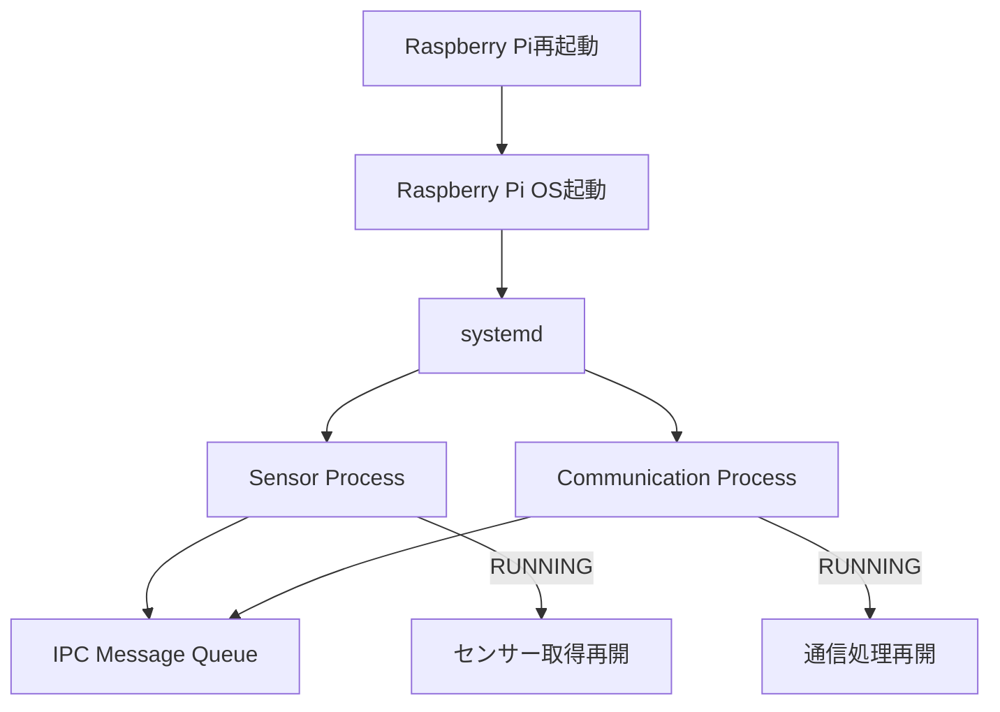

再起動前に存在していた未送信データは永続化せず、再起動後に復元送信しない。

---

### 19.21 systemd設計方針

| 項目 | 決定値 |
|---|---|
| Unit | Sensor / Communicationの2 Unit |
| OS起動時 | 自動起動 |
| 異常終了 | 自動再起動 |
| Restart | `on-failure` |
| RestartSec | 5秒 |
| 正常終了 | 再起動しない |
| 実行ユーザー | 専用非rootユーザー |
| ログ | systemd journal |
| Network | Communication Process UnitはNetwork Onlineを依存条件とする |

### 19.22 設計上の判断

### Decision

Sensor ProcessとCommunication Processを、それぞれ独立したsystemd Unitとして管理する。

### Reason

Processを分離して管理することで、一方のProcessに異常が発生した場合でも、もう一方のProcessへの影響を抑制できる。

また、Raspberry Pi再起動後の自動復旧、およびProcess異常終了時の自動再起動をsystemdに担当させることができる。

### Alternatives

* 1つのProcessとしてまとめる
* Sensor ProcessからCommunication Processを起動する
* 独自のProcess監視プログラムを作る

### Why not

本システムではProcess分離による障害分離を重視する。

また、Process監視のためだけに独自の監視プログラムを追加すると、システム構成が複雑になるため、OS標準のsystemdを利用する。

---

### 19.23 本章で決定した事項

本章では以下を決定した。

1. Sensor ProcessとCommunication Processをsystemdの独立したUnitとして管理する。
2. Raspberry Pi OS起動時に両Processを自動起動する。
3. Process異常終了時はsystemdによる再起動を基本とする。
4. 再起動時には待ち時間を設ける。
5. 連続異常終了時の無限再起動を防止する。
6. Process同士が相手Processを直接起動しない。
7. Communication Processはネットワーク未接続状態で起動する可能性を許容する。
8. Processの正常停止処理をsystemdの停止処理と連携させる。
9. Processログはsystemd journalで確認できる構成を基本とする。
10. Process実行権限および秘密情報管理はセキュリティ設計で定義する。

---

### 20.1 目的

本章では、本システムを構成するRaspberry Pi 4B、Wi-Fi / Internet、Cloudflare Worker、Cloudflare D1、およびBrowser間の通信・アクセスについて、基本的なセキュリティ方針を定義する。

対象とする主なセキュリティ要素は以下とする。

* 通信経路の保護
* Cloudflare Workerへのアクセス制御
* Raspberry Pi上のProcess権限
* 認証情報・秘密情報の保護
* ログへの秘密情報出力防止
* 不正なデータ送信への対策
* Browserからのアクセス制御
* 異常発生時の情報漏えい防止

本章では、Cloudflare WorkerおよびD1の内部実装そのものではなく、Edge Applicationと外部システムとの接続に必要なセキュリティ設計を対象とする。

---

### 20.2 セキュリティ境界

本システムでは、Raspberry Pi側とCloudflare側の間にInternetが存在する。

そのため、Raspberry PiからCloudflare Workerへの通信は、信頼できる閉域ネットワーク内の通信ではなく、外部ネットワークを経由する通信として扱う。

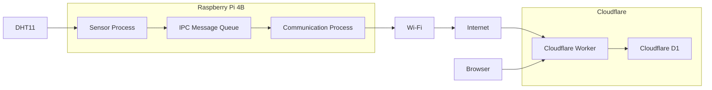

主なセキュリティ境界は以下とする。

1. Raspberry Pi内部とWi-Fiの境界
2. Wi-Fi / InternetとCloudflare Workerの境界
3. BrowserとCloudflare Workerの境界
4. Raspberry Pi上のProcess間の権限境界

---

### 20.3 基本セキュリティ方針

本システムでは、以下を基本方針とする。

* 通信経路は暗号化する
* 外部から受信したデータは無条件に信頼しない
* Cloudflare Workerへのアクセスを必要に応じて認証する
* 認証情報をソースコードへ直接記述しない
* 認証情報をログへ出力しない
* Processには必要最小限の権限を与える
* 異常時に不要な情報を外部へ返さない
* セキュリティ情報を通常ログへ出力しない
* Cloudflare Worker側でも受信データを検証する
* Browserからのアクセスについても必要に応じて制限する

---

### 20.4 通信経路の暗号化

Raspberry PiのCommunication ProcessからCloudflare Workerへの通信にはHTTPSを使用する。


HTTPSを使用することで、Internet上を通過するSensorDataについて通信内容の盗聴や改ざんに対する基本的な保護を行う。

HTTPによる平文通信は使用しない。

---

### 20.5 TLS証明書の検証

Communication ProcessはHTTPS通信時にTLS証明書を検証する。

証明書検証を無効化する構成は採用しない。

```text
HTTPS接続
    ↓
TLS証明書検証
    ↓
正常
    ├─ YES → HTTP通信開始
    └─ NO  → 通信失敗
```

証明書検証に失敗した場合は、Cloudflare Workerへの正常な通信とは扱わない。

---

### 20.6 Cloudflare Workerへのアクセス制御

Cloudflare WorkerはInternetからアクセス可能な外部サービスとして扱う。

そのため、WorkerのURLを知っている第三者からのアクセスを無条件に信頼する構成は避ける。

特にSensorData送信用のAPIについては、正規のCommunication Processからの要求であることを確認できる仕組みを設けることを基本方針とする。

候補として以下を考慮する。

* APIキー
* Bearer Token
* 署名付きリクエスト
* Cloudflare側のアクセス制御機能

本システムでは、実装の複雑性と必要なセキュリティレベルを考慮し、適切な認証方式を決定する。

具体的な認証方式は実装設計時に確定する。

---

### 20.7 SensorData送信APIの認証

SensorData送信APIでは専用HTTP HeaderへShared Secretを設定し、Cloudflare Worker側で認証する。

```text
Communication Process
        ↓
HTTPS Request + Shared Secret
        ↓
Cloudflare Worker
        ↓
認証確認
        ↓
SensorData検証
        ↓
D1保存
```

認証に失敗した要求はD1へ保存しない。

### 20.8 Worker側での入力値検証

Cloudflare Workerは、Raspberry Piから受信したSensorDataをそのままD1へ保存しない。

少なくとも以下を検証する。

* 必須項目の存在
* データ型
* 温度値の妥当性
* 湿度値の妥当性
* timestampの形式
* 不正な追加データ
* リクエストサイズ

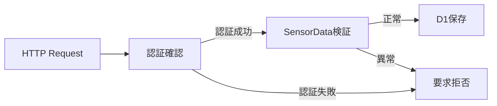

Edge Application側でもデータ検証を行うが、外部境界であるWorker側でも再度検証する。

---

### 20.9 Browserからのアクセス

Browserからのセンサーデータ参照APIは公開アクセスを許可する。

Browser側に認証機構は設けない。Worker側では、参照処理に必要な入力値を検証し、D1へのアクセスはWorker経由に限定する。

### 20.10 D1へのアクセス制御

D1へのアクセスはCloudflare Workerからのみ行う構成を基本とする。

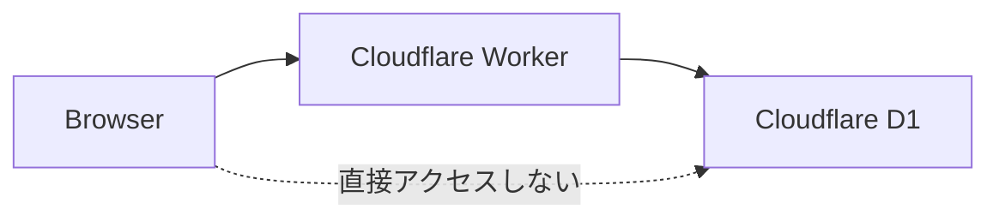

D1へのアクセス権限やBindingはWorker側で管理する。

BrowserやRaspberry PiからD1へ直接アクセスする構成は採用しない。

---

### 20.11 Raspberry Pi上のProcess権限

Sensor ProcessおよびCommunication Processには、必要最小限のOS権限を与える。

基本方針として、不要なroot権限でProcessを常時実行する構成は避ける。

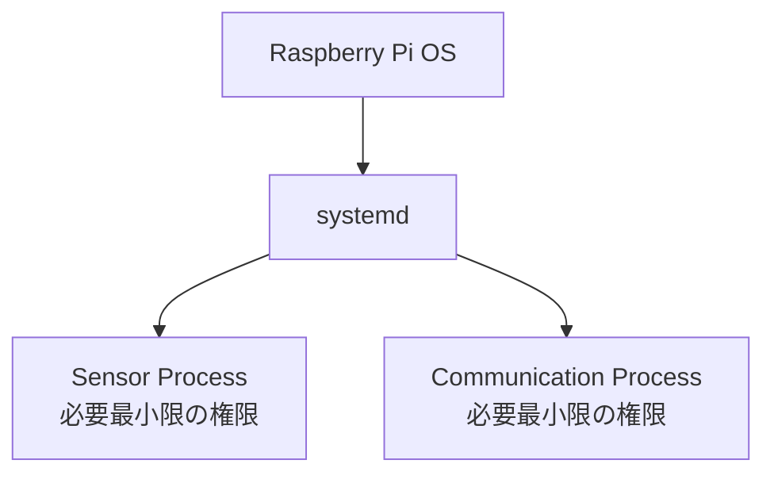

ただし、DHT11へのアクセスなど、ハードウェアアクセスに必要となる権限については、実装方式に応じて決定する。

---

### 20.12 Process間の権限

Sensor ProcessとCommunication Processは、それぞれ独立したProcessとして動作する。

IPC Message Queueを介してデータを交換するため、Process間でメモリを直接共有する構成にはしない。


この構成により、Process間のデータ交換範囲を明確にする。

IPCへのアクセス権限についても、必要なProcessだけがアクセスできるようにする。

---

### 20.13 認証情報・秘密情報

Shared Secretは秘密情報として扱い、以下へ直接記述しない。

- C++ソースコード
- Gitリポジトリ
- 通常ログ
- README
- 設計書へ実値を記載
- 実行ファイルへ直接埋め込む

Raspberry Pi上では、systemdのEnvironmentFile等のOS側設定ファイルへ保管し、専用非rootユーザーから読み取り可能な権限に限定する。

### 20.14 Gitへの秘密情報登録防止

ソースコードをGitで管理する場合、認証情報をリポジトリへ登録しない。

```text
ソースコード
     │
     ├── Git管理
     │
     └── 秘密情報
           ↓
       Git管理対象外
```

設定ファイルを使用する場合も、実際の秘密情報を含むファイルをGit管理対象にしない。

必要に応じて、秘密情報を含まないサンプル設定ファイルを別途用意する。

---

### 20.15 ログへの秘密情報出力防止

ログには以下の情報を出力しない。

* APIキー
* Bearer Token
* パスワード
* 秘密鍵
* Cookie
* Authorizationヘッダーの実値

例えばHTTP通信ログでは、

```text
INFO HTTP POST /sensor-data
INFO HTTP response status=200
```

のように、通信結果を記録する。

一方、

```text
Authorization: Bearer xxxxxxxxxxxxxxxxx
```

のような秘密情報そのものをログへ出力することは禁止する。

---

### 20.16 エラーレスポンス

Cloudflare WorkerからBrowserやCommunication Processへ返すエラーレスポンスには、内部情報を過剰に含めない。

特に以下を外部へ返さない。

* SQL文
* D1内部構造
* Worker内部の例外詳細
* APIキー
* 内部ファイルパス
* サーバー内部構成

外部向けには、必要な範囲のエラー情報のみを返す。

---

### 20.17 HTTPステータスコードとセキュリティ

Communication ProcessはHTTPステータスコードを利用して、要求結果を判定する。

基本方針は以下とする。

| HTTP結果  | 基本方針           |
| ------- | -------------- |
| 2xx     | 成功             |
| 4xx     | 要求側の異常として扱う    |
| 5xx     | Worker側一時障害の候補 |
| Timeout | 通信異常           |
| DNS失敗   | 通信異常           |
| TLS失敗   | 通信異常           |
| 接続失敗    | 通信異常           |

4xxについては、認証失敗や入力値異常などの可能性があるため、無条件にRetryしない。

5xxやTimeoutなどの一時的障害については、Retry / Backoffを行う。

---

### 20.18 リプレイ・重複送信への考慮

同一SensorDataのRetryによる重複保存を防止するため、SensorDataには`data_id`を付与する。

Worker側では`data_id`を重複排除キーとして使用し、同一`data_id`のデータをD1へ重複保存しない。

`data_id`はRetry時にも変更しない。

### 20.19 Wi-Fiのセキュリティ

Raspberry Piから外部ネットワークへ接続するため、Wi-Fi接続自体についても適切な暗号化方式を使用する。

Wi-FiのSSIDやパスワードなどの接続情報は秘密情報として扱う。

これらをソースコードやGitリポジトリへ直接記述しない。

---

### 20.20 Raspberry PiのOSセキュリティ

Raspberry Pi OSについて、以下を基本方針とする。

* OSを適切に更新する
* 不要なサービスを有効化しない
* 不要なポートを開放しない
* Processを必要最小限の権限で実行する
* SSH等を使用する場合は適切にアクセス制御する
* 不要なユーザー・権限を作成しない

本システムのEdge Application以外のOSサービスについても、可能な範囲で不要な攻撃面を減らす。

---

### 20.21 systemdのセキュリティ

systemd Unitについても、Processの権限を必要以上に広げない。

Unit設計では、以下のセキュリティ要件を適用する。

* 実行ユーザー
* 実行グループ
* ファイルアクセス権
* 読み取り専用領域
* 書き込み可能領域
* Processの権限制限
* 必要なCapability

過度なsystemdセキュリティ設定によってセンサーアクセスやIPC利用を妨げないよう、必要な権限だけを付与する。

---

### 20.22 データの機密性

本システムで扱うSensorDataは、一般的な個人情報や認証情報とは異なる。

ただし、SensorDataを誰でも自由に取得できる状態にすると、意図しない第三者からの閲覧が可能になる。

そのため、Browserからの履歴・現在値取得APIについても、必要な公開範囲を明確にする。

```text
SensorData
   ↓
公開してよいデータ
   ↓
Browserへ提供

内部情報
   ↓
Browserへ提供しない
```

公開範囲については、システムの利用形態に応じて決定する。

---

### 20.23 可用性とセキュリティのバランス

セキュリティ対策を強化しすぎることで、システムの運用性を損なわないようにする。

例えば認証情報を変更した場合に、Communication Processが起動できなくなる可能性がある。

そのため、

```text
認証情報変更
    ↓
Communication Process
    ↓
認証失敗
    ↓
ログで原因確認
    ↓
設定修正
    ↓
Process再起動
    ↓
通信復旧
```

のように、異常発生時に原因を確認できる構成とする。

ただし、ログへ秘密情報そのものを出力してはいけない。

---

### 20.24 セキュリティイベントのログ

以下のセキュリティ上重要なイベントはログに記録する。

* 認証失敗
* 認証成功
* TLS接続失敗
* 不正なSensorData
* 不正なHTTP要求
* HTTP 4xx
* HTTP 5xx
* 通信異常
* Process異常終了
* Process再起動

ただし、ログには秘密情報を含めない。

---

### 20.25 セキュリティ設計方針

本システムでは以下を基本方針とする。

| 項目             | 方針             |
| -------------- | -------------- |
| Pi → Worker通信  | HTTPS          |
| TLS証明書         | 検証する           |
| Workerアクセス     | 認証方式を導入する      |
| Worker入力       | 受信側でも検証する      |
| Browser → D1   | 直接アクセスしない      |
| Worker → D1    | Worker経由       |
| Process権限      | 最小権限           |
| IPC            | 必要なProcessのみ利用 |
| APIキー等         | ソースコードへ埋め込まない  |
| Git            | 秘密情報を登録しない     |
| ログ             | 秘密情報を出力しない     |
| Error Response | 内部情報を公開しない     |
| Wi-Fi情報        | 秘密情報として管理      |
| OS             | 適切に更新          |
| 不要サービス         | 無効化を検討         |
| 認証失敗           | 記録・拒否          |
| 不正データ          | Worker側でも拒否    |

---

### 20.26 設計上の判断

### Decision

Raspberry PiからCloudflare Workerへの通信にはHTTPSを使用し、Worker側で認証および受信データの検証を行う。

### Reason

Raspberry PiからWorkerまでの通信はInternetを経由するため、通信経路の暗号化だけでなく、正規の送信元であることを確認する仕組みが必要となる。

また、Raspberry Pi側で検証したSensorDataであっても、外部境界であるWorker側で再検証することで、不正データのD1保存を防止できる。

### Alternatives

* HTTPSのみで認証しない
* Worker URLを知っている端末からのアクセスを許可する
* Raspberry PiのIPアドレスだけで送信元を判断する

### Why not

WorkerはInternetからアクセス可能なため、URLだけを知っている第三者からの要求を正規要求として扱うことは適切ではない。

また、IPアドレスだけによる送信元判定は、安定した認証方式とはならないため採用しない。

---

### 20.27 本章で決定した事項

本章では以下を決定した。

1. Raspberry PiからCloudflare Workerへの通信はHTTPSとする。
2. TLS証明書検証を無効化しない。
3. WorkerへのSensorData送信には認証を導入する方針とする。
4. Worker側でもSensorDataを検証する。
5. D1へはWorker経由でアクセスする。
6. BrowserからD1へ直接アクセスしない。
7. Sensor ProcessおよびCommunication Processには必要最小限の権限を与える。
8. APIキー、Token等の秘密情報をソースコードへ直接記述しない。
9. Gitへ秘密情報を登録しない。
10. ログへ秘密情報を出力しない。
11. Workerのエラーレスポンスに内部情報を含めない。
12. Wi-Fi接続情報も秘密情報として扱う。
13. Raspberry Pi OSおよび不要サービスについてもセキュリティを考慮する。
14. 認証失敗や不正データなどのセキュリティイベントをログへ記録する。
15. HTTP通信の重複送信については、将来的な重複排除を考慮する。

---
