### 21.1 目的

本章では、本システムが要求事項および各設計内容を満たしていることを確認するための、テスト・検証方針を定義する。

対象はRaspberry Pi 4B上のEdge Applicationだけではなく、DHT11からCloudflare Worker、Cloudflare D1、Browserまでを含むシステム全体とする。

テスト・検証では、単純な正常動作だけでなく、通信異常、Process異常、IPC異常、再起動、停止処理などの異常系についても確認する。

---

### 21.2 検証の基本方針

テスト・検証は、設計した機能および非機能要求に対して、実際の動作が設計どおりであることを確認する。

基本的な考え方を以下とする。

```text
要求
 ↓
設計
 ↓
実装
 ↓
テスト
 ↓
要求・設計との照合
 ↓
合否判定
```

テストでは「動いたか」だけではなく、

* 正しいデータが取得できたか
* 正しいデータが送信されたか
* 正しい状態遷移をしたか
* 異常を正しく検出できたか
* 異常から復旧できたか
* Process間の影響が適切に分離されているか
* 再起動後に正常動作へ復帰できるか

を確認する。

---

### 21.3 テスト対象

テスト対象を以下のように分類する。

| ID           | テスト対象                 |
| ------------ | --------------------- |
| TEST-TGT-001 | DHT11データ取得            |
| TEST-TGT-002 | Sensor Process        |
| TEST-TGT-003 | Data Processing       |
| TEST-TGT-004 | IPC Message Queue     |
| TEST-TGT-005 | Communication Process |
| TEST-TGT-006 | HTTPS通信               |
| TEST-TGT-007 | Cloudflare Worker連携   |
| TEST-TGT-008 | Cloudflare D1保存       |
| TEST-TGT-009 | Browser表示             |
| TEST-TGT-010 | Process異常・再起動         |
| TEST-TGT-011 | Raspberry Pi再起動       |
| TEST-TGT-012 | 正常Shutdown            |
| TEST-TGT-013 | ログ・監視                 |
| TEST-TGT-014 | セキュリティ                |

---

### 21.4 テストレベル

テストは、以下のレベルに分けて実施する。

#### 21.4.1 コンポーネントレベル

個々のソフトウェア要素が設計どおり動作することを確認する。

対象例：

* Sensor処理
* Data Processing
* IPC処理
* Communication処理
* Error Handling
* Logging

---

#### 21.4.2 Processレベル

Sensor ProcessおよびCommunication Processが、それぞれ独立して設計どおり動作することを確認する。

特に以下を確認する。

* 起動
* 初期化
* RUNNINGへの遷移
* 正常処理
* 異常処理
* 停止
* 再起動

---

#### 21.4.3 Process間連携レベル

Sensor ProcessとCommunication Processの間でIPC Message Queueを使用してSensorDataが正しく受け渡されることを確認する。

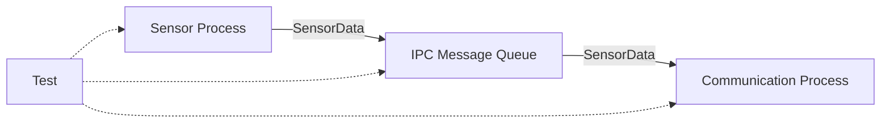

---

#### 21.4.4 システムレベル

DHT11からCloudflare D1までの一連のデータフローが正常に動作することを確認する。

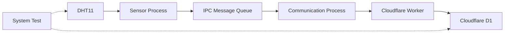

---

#### 21.4.5 外部システム連携レベル

Cloudflare WorkerおよびD1とのインターフェースが設計どおり動作することを確認する。

確認対象は以下とする。

* HTTP Request
* HTTPS
* JSON
* HTTP Status
* Workerへのデータ送信
* D1への保存
* Browserからのデータ取得

---

### 21.5 正常系テスト

正常系では、通常のシステム動作を確認する。

基本的なデータフローは以下とする。

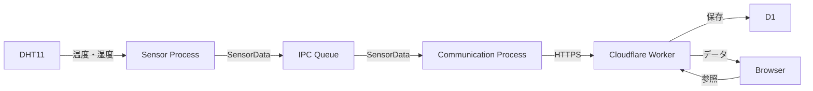

最低限、以下を確認する。

1. DHT11から温度・湿度を取得できる。
2. SensorDataを生成できる。
3. IPC Message QueueへSensorDataを送信できる。
4. Communication ProcessがSensorDataを受信できる。
5. WorkerへHTTPSで送信できる。
6. WorkerがSensorDataを受信できる。
7. D1へSensorDataが保存される。
8. Browserから現在値を参照できる。
9. Browserから履歴を参照できる。
10. Browserでグラフを表示できる。

---

### 21.6 Sensorテスト

Sensor Processについて、以下を確認する。

* Processが起動する
* DHT11を初期化できる
* 温度を取得できる
* 湿度を取得できる
* timestampを付与できる
* SensorDataを生成できる
* 周期的に取得できる
* センサー取得失敗を検出できる
* 異常データを検出できる

特に、取得値が存在するだけでなく、データ形式および値の妥当性についても確認する。

---

### 21.7 Data Processingテスト

Sensor Processで取得したデータが、通信可能なSensorDataへ正しく変換されることを確認する。

確認項目は以下とする。

* 温度値の変換
* 湿度値の変換
* timestampの生成
* データ形式
* 値の妥当性確認
* 異常値の扱い

不正なSensorDataが生成された場合、Communication Processへ送信されないことを確認する。

---

### 21.8 IPCテスト

IPC Message Queueについて、以下を確認する。

### 正常系

* Sensor Processから送信できる
* Communication Processが受信できる
* 送信したSensorDataと受信したSensorDataが一致する
* FIFO順序が維持される
* Queueが空の場合に正常待機する

### 異常系

* Queue Fullを検出できる
* Queueアクセス失敗を検出できる
* Process停止時にIPCを適切に扱える
* Process再起動後にIPCを再初期化できる

Queue Full発生時の具体的なデータ破棄・保存方針については、決定した方式に従って検証する。

---

### 21.9 Communicationテスト

Communication Processについて、以下を確認する。

* 起動できる
* IPCからSensorDataを受信できる
* HTTP Requestを生成できる
* JSONを生成できる
* HTTPS通信できる
* HTTP 2xxを成功として扱える
* HTTP 4xxを適切に処理できる
* HTTP 5xxを適切に処理できる
* Timeoutを検出できる
* DNSエラーを検出できる
* Connection Errorを検出できる
* Retryできる
* Backoffできる
* 通信復旧後に送信を再開できる

---

### 21.10 Cloudflare連携テスト

Cloudflare Workerとのインターフェースについて確認する。

### Request

以下を確認する。

* HTTP Method
* Endpoint
* Content-Type
* JSON形式
* 必須データ
* 認証情報

### Response

以下を確認する。

* HTTP Status
* Response形式
* 正常応答
* 異常応答
* 不正要求への応答

### D1

Workerを経由してD1へSensorDataが保存されることを確認する。

---

### 21.11 Browserテスト

BrowserからCloudflare Workerへアクセスし、SensorDataを正しく表示できることを確認する。

確認項目は以下とする。

* 現在値表示
* 履歴表示
* グラフ表示
* データ件数
* timestamp表示
* データが存在しない場合の表示
* Workerエラー時の表示

また、BrowserからD1へ直接アクセスする構成になっていないことも確認する。

---

### 21.12 周期・タイミングテスト

Sensor Processが設計した周期でセンサー取得を実行することを確認する。

また、Communication ProcessがSensor Processの周期に直接依存していないことを確認する。

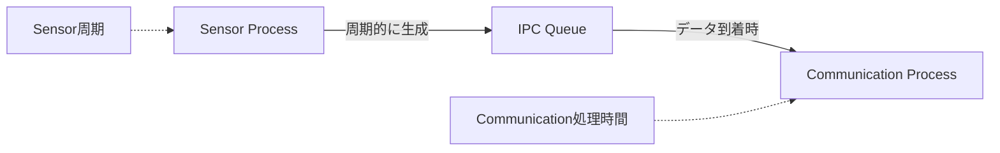

通信遅延が発生した場合でも、Sensor Processが必要以上に停止しないことを確認する。

---

### 21.13 異常系テスト

15章および16章で定義した異常・復旧について、実際に異常を発生させて設計どおり動作することを確認する。

主な対象は以下とする。

| 異常                        | 確認内容         |
| ------------------------- | ------------ |
| DHT11取得失敗                 | Retry・エラー処理  |
| 不正SensorData              | データ破棄        |
| IPC送信失敗                   | エラー検出        |
| Queue Full                | 設計した処理       |
| Wi-Fi切断                   | 通信失敗・復旧      |
| DNS失敗                     | Retry        |
| Worker接続失敗                | Retry        |
| Timeout                   | Retry        |
| HTTP 4xx                  | Retryしない等の処理 |
| HTTP 5xx                  | Retry        |
| Sensor Process異常終了        | systemd再起動   |
| Communication Process異常終了 | systemd再起動   |
| Raspberry Pi再起動           | Process自動起動  |
| 電源断                       | 再起動後の復旧      |

---

### 21.14 Process異常終了テスト

Sensor ProcessおよびCommunication Processを意図的に異常終了させ、systemdによる復旧を確認する。

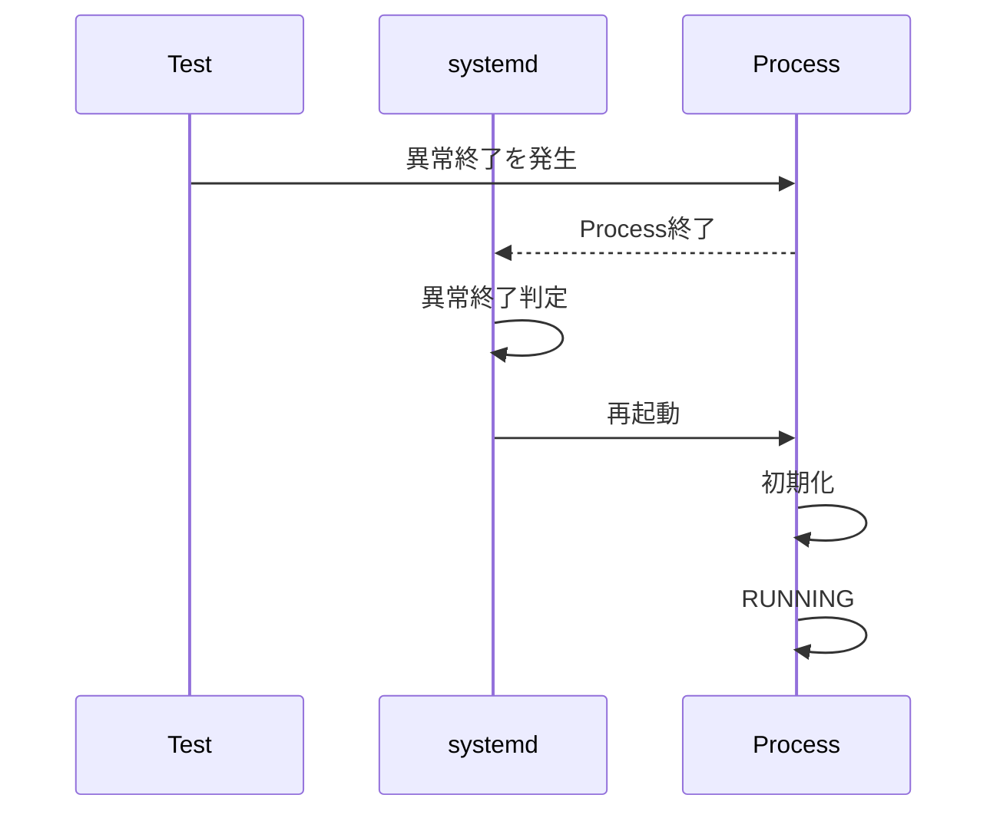

確認項目は以下とする。

* 異常終了を検出できる
* systemdが再起動する
* 再起動後に初期化される
* 正常動作へ復帰する
* ログから異常と復旧を確認できる

---

### 21.15 Raspberry Pi再起動テスト

Raspberry Piを正常に再起動し、OS起動後にSensor ProcessおよびCommunication Processが自動起動することを確認する。

確認項目は以下とする。

1. Raspberry Piを再起動する。
2. OSが正常起動する。
3. systemdがProcessを起動する。
4. Sensor ProcessがRUNNINGになる。
5. Communication ProcessがRUNNINGになる。
6. SensorData取得が再開される。
7. Workerへの送信が再開される。
8. D1への保存が再開される。

---

### 21.16 正常Shutdownテスト

Raspberry Piを正常にShutdownし、Processが設計した順序で停止することを確認する。

確認項目は以下とする。

* Shutdown要求を受け付ける
* 新規SensorData取得を停止する
* 新規通信を停止する
* 必要なQueue処理を実行する
* Processが正常終了する
* リソースを解放する
* systemdがService停止を完了する
* OSがShutdownする

---

### 21.17 ログ・監視テスト

17章で定義したログが、必要なタイミングで出力されることを確認する。

対象は以下とする。

* Process起動
* Process停止
* SensorData取得
* Sensorエラー
* IPCエラー
* Queue Full
* HTTP通信
* Retry
* Backoff
* 復旧
* Process異常終了
* Process再起動

また、ログに以下が含まれていないことを確認する。

* APIキー
* Token
* パスワード
* 秘密鍵
* Authorization情報

---

### 21.18 セキュリティテスト

20章のセキュリティ設計について確認する。

主な確認項目は以下とする。

* HTTPではなくHTTPSを使用している
* TLS証明書を検証している
* 認証なしのSensorData送信が拒否される
* 不正な認証情報が拒否される
* 不正なSensorDataが拒否される
* D1へ直接アクセスできない
* 秘密情報がソースコードに存在しない
* Git管理対象に秘密情報が存在しない
* ログに秘密情報が存在しない
* Workerのエラーレスポンスに内部情報が含まれない

---

### 21.19 長時間動作テスト

本システムを一定期間連続動作させ、長時間運転時の安定性を確認する。

確認項目は以下とする。

* Processが停止しない
* SensorData取得が継続する
* IPC Queueが異常蓄積しない
* 通信が継続する
* Memory使用量が異常増加しない
* CPU使用率が異常増加しない
* ログが異常増加しない
* D1への保存が継続する

特にMemory LeakやQueue滞留など、短時間のテストでは検出しにくい問題を確認する。

---

### 21.20 要求とのトレーサビリティ

テスト結果は、システム要求と対応付けられる構成とする。


例えば、

```text
FR-001
センサーデータを取得する
        ↓
Sensor設計
        ↓
Sensorテスト
        ↓
合格 / 不合格
```

のように、要求からテスト結果まで追跡できるようにする。

---

### 21.21 テスト結果の判定

各テストについて、以下のいずれかで判定する。

* PASS
* FAIL
* BLOCKED
* NOT TESTED

FAILの場合は、原因を調査し、必要に応じて設計または実装を見直す。

設計変更が必要となった場合には、既存の設計判断との整合性を確認する。

---

### 21.22 テスト環境

基本的なシステムテスト環境は以下とする。

| 項目               | 環境                      |
| ---------------- | ----------------------- |
| Edge Device      | Raspberry Pi 4B         |
| OS               | Raspberry Pi OS         |
| Sensor           | DHT11                   |
| Network          | Wi-Fi / Internet        |
| Edge Application | C++                     |
| Cloud            | Cloudflare Worker       |
| Database         | Cloudflare D1           |
| Viewer           | PC / Smartphone Browser |

実際のテスト時には、使用するOSバージョン、C++環境、Worker構成等を記録する。

---

### 21.23 テストで確認する品質特性

本システムでは、機能だけでなく以下の品質特性も確認する。

| 品質特性   | 主な確認内容              |
| ------ | ------------------- |
| 信頼性    | 異常時に適切に処理できる        |
| 可用性    | Process異常後に復旧できる    |
| 保守性    | ログから原因を追跡できる        |
| 拡張性    | Process・IPC構成を拡張できる |
| 回復性    | 再起動後に正常動作へ復帰できる     |
| セキュリティ | 不正アクセス・情報漏えいを防止できる  |

---

### 21.24 テスト・検証の基本フロー

最終的なテストは以下の流れで実施する。

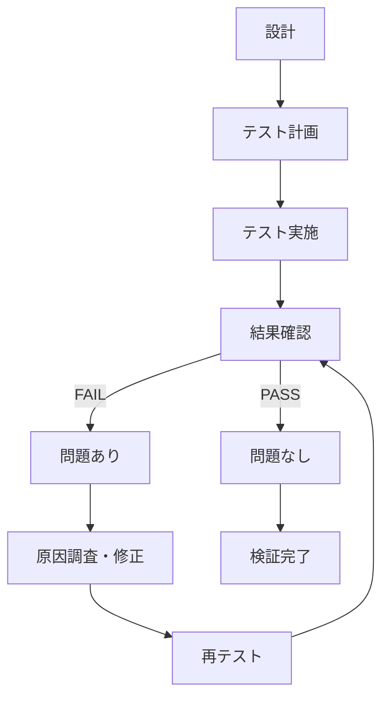

---

### 21.25 設計上の判断

### Decision

テストは、正常系だけでなく、Process異常、IPC異常、通信異常、再起動、Shutdown、セキュリティを含めて実施する。

### Reason

本システムは複数のProcessと外部システムで構成されており、正常時に動作するだけではシステムとしての信頼性を確認できない。

特に、Sensor ProcessとCommunication Processを分離した設計では、Process間の障害分離と復旧が設計上の重要なポイントとなる。

### Alternatives

* 正常系だけを確認する
* システム全体が動作することだけを確認する
* 異常系は実際には発生しないものとして扱う

### Why not

実運用ではWi-Fi切断、Worker障害、Process異常終了などが発生する可能性があるため、異常時の動作も設計どおりであることを確認する必要がある。

---

### 21.26 本章で決定した事項

本章では以下を決定した。

1. テスト対象はシステム全体とする。
2. Component、Process、Process間、System、外部システム連携の各レベルで検証する。
3. 正常系と異常系の両方を検証する。
4. IPC Message Queueについて正常系・異常系を検証する。
5. Communication ProcessのRetry / Backoffを検証する。
6. Process異常終了時のsystemdによる復旧を検証する。
7. Raspberry Pi再起動後の自動復旧を検証する。
8. 正常Shutdownを検証する。
9. ログ・監視機能を検証する。
10. セキュリティ設計を検証する。
11. 長時間動作による安定性を検証する。
12. システム要求とテスト結果を対応付ける。
13. FAILとなった項目は原因調査と再テストを実施する。

---

### 22.1 目的

本章では、本システムの設計において重要な判断を行った事項について、採用した方式、採用理由、代替案、およびトレードオフを記録する。

設計判断を明確に記録することで、後から設計を見直す場合や、機能追加・構成変更を行う場合に、既存設計の意図を確認できるようにする。

---

### 22.2 Raspberry PiをEdge Deviceとする

### Decision

Raspberry Pi 4BをEdge Deviceとして採用する。

### Reason

Raspberry PiはLinux OSを搭載でき、センサー制御、Process管理、IPC、ネットワーク通信、HTTPS、systemdなどを一つの実機上で構築できる。

また、外部ネットワークを介してCloudflare Workerと接続できるため、Edge DeviceからCloudまでのデータフローを実際に確認できる。

### Alternatives

* Arduino等のマイコンを使用する
* PCをEdge Deviceとして使用する
* 専用IoT Gatewayを使用する

### Why not

本システムでは、センサー制御だけでなくLinux上のProcess、IPC、systemd、ネットワーク通信まで含めたシステム構成を対象とするため、Linuxを動作させられるRaspberry Piを採用する。

### Trade-off

Raspberry Piはマイコンよりもシステム構成が複雑になる一方、OS、Process、ネットワークなどを含むシステム設計が可能となる。

---

### 22.3 C++をEdge Applicationに採用する

### Decision

Raspberry Pi上のEdge ApplicationはC++で実装する。

### Reason

C++はセンサー処理、Process、IPC、スレッド、リソース管理、ネットワーク通信などを明示的に扱える。

また、組み込みソフトウェアとの親和性が高く、既存のC/C++による設計知識をLinuxアプリケーションへ展開しやすい。

### Alternatives

* Python
* C
* Rust

### Why not

Pythonは実装量を少なくできる一方、今回のシステムではProcess、IPC、リソース管理などを含めた低レイヤ寄りの構成を明示的に設計することを重視する。

Cは十分な実装能力を持つが、C++ではクラス、RAII、標準ライブラリなどを利用できるため、今回のアプリケーション構造ではC++を採用する。

Rustについては有力な選択肢ではあるが、本システムではC++を採用する。

### Trade-off

C++はPythonより実装やリソース管理が複雑になる可能性がある。

一方で、Process、IPC、メモリ、リソースのライフサイクルを明確に設計できる。

---

### 22.4 Sensor ProcessとCommunication Processを分離する

### Decision

Sensor処理とCloudflare通信処理を別Processとして構成する。

### Reason

センサー取得とネットワーク通信では、処理特性と障害要因が異なる。

```text id="8jzq4v"
Sensor Process
    ↓
センサー取得
    ↓
IPC
    ↓
Communication Process
    ↓
Internet通信
```

通信障害が発生してもSensor Process自体を直接停止させない構成とすることで、障害の影響範囲を抑制できる。

### Alternatives

* 1Process + 複数Thread
* 1Processですべて処理する
* Sensor Processから通信処理を直接呼び出す

### Why not

1Process構成では、通信処理の異常がSensor処理へ影響する可能性がある。

Thread構成でも分離は可能だが、Process分離と比較してメモリ空間を共有するため、障害分離の観点ではProcess分離を採用する。

### Trade-off

Process間通信が必要になるため、IPCという追加の仕組みが必要になる。

---

### 22.5 IPC Message Queueを採用する

### Decision

Sensor ProcessとCommunication Process間のIPCにはMessage Queueを採用する。

### Reason

SensorDataは「一つのデータを一つのメッセージ」として扱うことができる。

```text id="t5w1ah"
Sensor Process
     ↓
 SensorData
     ↓
Message Queue
     ↓
Communication Process
```

また、Sensor ProcessとCommunication Processの処理速度が一時的に異なる場合でも、Queueによって一時的にデータを保持できる。

### Alternatives

* Pipe
* FIFO
* Unix Domain Socket
* Shared Memory

### Why not

PipeやFIFOでもデータ交換は可能だが、今回のSensorDataのような離散的なメッセージを扱う構成ではMessage Queueが理解しやすい。

Shared Memoryは高速なデータ交換に向く一方、同期制御などの設計が複雑になる。

Unix Domain Socketは将来的な拡張性があるが、今回の基本的なProcess間メッセージ交換にはMessage Queueで十分と判断する。

### Trade-off

Queue容量が有限であるため、Communication Processが長時間停止した場合にはQueue Fullが発生する可能性がある。

---

### 22.6 Sensor ProcessとCommunication Processの時間的分離

### Decision

Sensor取得周期とCommunication処理周期を独立させる。

### Reason

Sensor取得は一定周期で実施する必要がある一方、Network通信はInternet状態によって処理時間が変動する。

そのため、Sensor Processが通信処理の完了を待つ構成は避ける。


### Trade-off

通信処理がSensorData生成速度を上回る場合、Queueにデータが蓄積する。

そのため、Queue容量とデータ保持方針を別途設計する必要がある。

---

### 22.7 Cloudflare Workerを外部システムとして利用する

### Decision

Cloudflare WorkerをRaspberry PiからのSensorData送信先として利用する。

### Reason

HTTPSによる通信、HTTP API、データ処理、D1との連携を比較的少ない構成で実現できる。

また、Raspberry Pi側からInternet経由でアクセスできるため、EdgeからCloudまでのデータフローを構築できる。

### Alternatives

* AWS
* Azure
* Google Cloud
* MQTT Broker
* 独自サーバー

### Why not

本システムでは、クラウド側を大規模に構築すること自体を目的とせず、Edge Deviceから外部システムへデータを送信する構成を重視する。

そのため、Worker + D1という比較的シンプルな構成を採用する。

### Trade-off

Cloudflare固有の仕組みに依存するため、将来的に別クラウドへ移行する場合にはインターフェース変更が必要になる。

---

### 22.8 HTTP / HTTPSを採用する

### Decision

Communication ProcessからCloudflare Workerへの通信にはHTTPSを使用する。

### Reason

HTTP APIは構成が理解しやすく、SensorDataをJSONとして送信できる。

HTTPSを使用することでInternet上の通信を暗号化できる。

### Alternatives

* MQTT
* WebSocket
* TCP独自プロトコル

### Why not

MQTTはIoT用途に適しているが、Brokerを含む構成が追加される。

今回のシステムでは、SensorDataをWorkerへ送信する単純な通信経路を構築することを優先し、HTTP / HTTPSを採用する。

### Trade-off

HTTPはMQTTのようなIoT専用プロトコルではないため、大規模なセンサー群を想定した場合には別方式が適する可能性がある。

---

### 22.9 Cloudflare D1をデータ保存先とする

### Decision

SensorDataの保存先としてCloudflare D1を利用する。

### Reason

Workerとの連携が容易であり、SensorDataの履歴を保存できる。

また、SQLによって履歴データを取得できるため、Browserでの履歴表示やグラフ表示につなげやすい。

### Alternatives

* SQLiteをRaspberry Piに保存
* MySQL
* PostgreSQL
* Cloudflare以外のデータベース

### Why not

本システムではEdge DeviceからCloudまでのデータフローを構築するため、Raspberry Pi内だけにデータを保存する構成は採用しない。

### Trade-off

Cloudflareへの依存が発生する。

また、Network障害時にCloudへ保存できないため、Edge側での一時保持方式が必要になる可能性がある。

---

### 22.10 Cloudflareをシステムの中心にしない

### Decision

システム設計の中心はRaspberry Pi側のEdge Applicationとする。

Cloudflare WorkerおよびD1は外部システムとして扱う。

### Reason

本システムでは、Edge Deviceから外部システムへデータを送信する一連の構成を明確にすることを重視する。

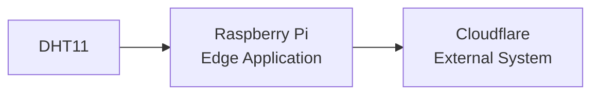

### Trade-off

Cloud側で実施できる処理をEdge側へ配置する必要が生じる場合がある。

一方で、Edge側と外部システム側の責務を明確にできる。

---

### 22.11 systemdをProcess管理に利用する

### Decision

Sensor ProcessおよびCommunication Processのライフサイクル管理にはsystemdを利用する。

### Reason

Raspberry Pi OSに標準的に存在する仕組みを利用でき、Processの自動起動、異常終了時の再起動、ログ管理などを実現できる。

### Alternatives

* 独自監視Process
* Shell Scriptによる監視
* Supervisor等の外部ツール

### Why not

Process監視のために独自の仕組みを追加すると、システム構成が複雑になる。

systemdで必要なProcess管理機能を実現できるため、systemdを採用する。

### Trade-off

systemdのUnit、依存関係、停止処理など、Linux固有の知識が必要になる。

---

### 22.12 DHT11を採用する

### Decision

温湿度センサーとしてDHT11を使用する。

### Reason

温度・湿度という2種類のデータを一つのセンサーから取得でき、システム全体のデータフローを構築するセンサーとして扱いやすい。

### Alternatives

* DHT22
* BME280
* その他のI2Cセンサー

### Why not

今回のシステムでは高精度な温湿度計測を主目的としていないため、DHT11で必要なデータを取得できると判断する。

### Trade-off

DHT11は高精度・高速なセンサーではないため、将来的により高精度な計測が必要になった場合にはセンサー変更を検討する。

---

### 22.13 センサー取得と通信を同期させない

### Decision

Sensor ProcessはCommunication Processの通信完了を待たない。

### Reason

Network通信は外部要因によって処理時間が変動するため、通信待ちによってSensor取得周期が乱れることを避ける。

```text id="m3p4xw"
Sensor Process
    ↓
SensorData生成
    ↓
IPC Queueへ送信
    ↓
次のSensor取得

Communication Process
    ↓
Queueから受信
    ↓
HTTP通信
```

### Trade-off

Communication Processが遅い場合、Queueにデータが蓄積する。

このため、Queue Full時の処理が重要になる。

---

### 22.14 Process障害を局所化する

### Decision

Sensor ProcessとCommunication Processを独立して復旧可能な構成とする。

### Reason

例えばCloudflare Workerへの通信が失敗しても、センサー取得まで停止させる必要はない。

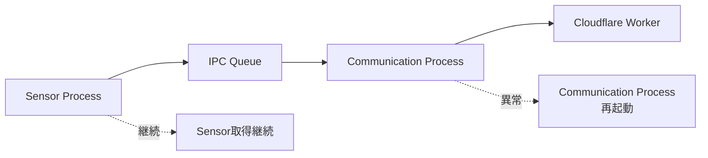

### Trade-off

障害分離を実現する代わりに、Process間の状態やデータ保持を考慮する必要がある。

---

### 22.15 Queueによる一時的なデータ保持

### Decision

通信処理の一時的な遅延をIPC Message Queueで吸収する。

### Reason

通信が一時的に遅くなった場合でも、Sensor Processを直接停止させないため。

### Trade-off

Queueは有限容量であるため、通信障害が長時間継続するとQueue Fullが発生する。

そのため、Queue Full時は新規SensorDataを破棄し、Errorログを出力して次回周期処理へ移行する。

---

### 22.16 Edge側とCloud側の責務分離

### Decision

基本的なデータ取得・処理・送信制御はRaspberry Pi側で行い、Cloudflare側では受信・保存・表示用データ提供を行う。

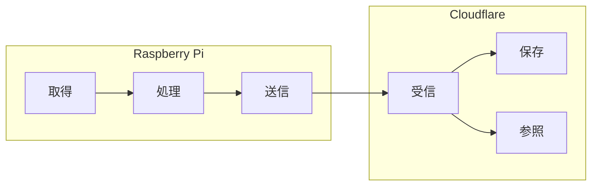

### Reason

Edge DeviceとCloudの責務を明確にすることで、システム全体の構造を理解しやすくする。

---

### 22.17 設計判断のまとめ

本システムにおける主要な設計判断を以下にまとめる。

| 項目               | 採用方式              | 主な理由                          |
| ---------------- | ----------------- | ----------------------------- |
| Edge Device      | Raspberry Pi 4B   | Linux / Network / Processを扱える |
| Edge Application | C++               | Process / IPC / リソース管理        |
| センサー             | DHT11             | 温湿度取得                         |
| Process構成        | 2 Process         | 障害分離                          |
| IPC              | Message Queue     | SensorDataをメッセージとして扱える        |
| 通信               | HTTPS             | 暗号化されたHTTP通信                  |
| データ形式            | JSON              | Workerとの連携が容易                 |
| Cloud            | Cloudflare Worker | シンプルな外部API                    |
| Database         | Cloudflare D1     | Workerと連携しやすい                 |
| Process管理        | systemd           | 自動起動・再起動・監視                   |
| Browser連携        | Worker経由          | D1を直接公開しない                    |

---

### 22.18 トレードオフの基本方針

本システムでは、以下の優先順位で設計判断を行う。

1. システム全体の責務を明確にする
2. 障害の影響範囲を限定する
3. 構成を過度に複雑化しない
4. 実装・保守可能な構成とする
5. セキュリティを確保する
6. 将来的な拡張を妨げない

高性能化や大規模化を目的とした過剰な構成は採用せず、現在のシステム規模に対して必要十分な構成を優先する。

---

### 22.19 本章で決定した事項

本章では、これまでの設計における主要な判断理由を整理した。

主な決定事項は以下のとおり。

1. Raspberry Pi 4BをEdge Deviceとする。
2. Edge ApplicationはC++で実装する。
3. Sensor ProcessとCommunication Processを分離する。
4. Process間IPCにはMessage Queueを使用する。
5. Sensor取得とCommunication処理を時間的に分離する。
6. Communication ProcessからCloudflare WorkerへHTTPSで通信する。
7. データ形式にはJSONを使用する。
8. Cloudflare Workerを外部システムとして扱う。
9. SensorDataをCloudflare D1へ保存する。
10. BrowserはWorker経由でデータを取得する。
11. Process管理にはsystemdを使用する。
12. Process障害を可能な限り局所化する。
13. Queueによって一時的な通信遅延を吸収する。
14. Edge側とCloud側の責務を分離する。
15. シンプルさと障害分離・セキュリティのバランスを重視する。

---

## 23. 設計決定事項

### 23.1 目的

本章では、本設計で確定した設計判断を一覧化する。

### 23.2 設計決定事項の管理方針

設計レビュー完了時点で、実装開始に必要な設計判断はすべて確定している。

### 23.3 設計決定事項一覧

本設計において、実装開始を妨げる未解決の設計事項はない。

| ID | 項目 | 決定内容 |
|---|---|---|
| PND-001 | SensorDataの具体的な型 | temperature/humidity=`double`、timestamp=`int64_t`、data_id=`uint64_t` |
| PND-002 | 温度・湿度の精度 | 小数第1位 |
| PND-003 | timestamp形式 | UTC基準Unix time seconds |
| PND-004 | IPC Message Queue容量 | 100件 |
| PND-005 | Queue Full時の処理 | 新規SensorDataを破棄しErrorログを出力 |
| PND-006 | 未送信データの保持方式 | 永続化しない |
| PND-007 | Retry回数 | 初回送信後、最大3回 |
| PND-008 | Retry間隔 | 1秒 → 2秒 → 4秒 |
| PND-009 | Backoff方式 | Exponential Backoff、最大4秒 |
| PND-010 | HTTP Timeout | 5秒 |
| PND-011 | Worker認証方式 | HTTPS + 専用HTTP HeaderのShared Secret |
| PND-012 | 認証情報の保管方式 | systemd EnvironmentFile等の権限制御されたOS側設定 |
| PND-013 | Browserアクセス制御 | 公開アクセス、Browser認証なし |
| PND-014 | systemd Restart設定 | `Restart=on-failure`、`RestartSec=5s` |
| PND-015 | Process実行ユーザー | 専用非rootユーザー |
| PND-016 | Queue停止時の残存データ処理 | 永続化せず破棄 |
| PND-017 | ログ保持期間 | 7日 |
| PND-018 | 長時間動作テスト時間 | 24時間連続 |
| PND-019 | リソース使用量の判定基準 | CPU平均30%以下、異常なMemory増加なし、Disk/Logの継続的増加なし、Queue恒常滞留なし |
| PND-020 | SensorData重複排除方式 | `data_id`を使用しWorker側で重複保存を防止 |

### 23.4 設計判断の反映先

PND-001～PND-020の決定内容は、10章～20章の関連設計へ反映済みである。

### 23.5 本章の状態

本章に追加の設計判断を残していない。PND-001～PND-020はすべて本決定済みであり、関連設計章への反映も完了している。

### 24.1 目的

本章では、現在のシステム構成を基本として、将来的に追加・変更する可能性のある機能および構成について整理する。

将来拡張を考慮することで、現在の設計を不必要に複雑化することなく、後から機能追加しやすい構成を維持する。

---

### 24.2 将来拡張の基本方針

将来拡張に対しては、以下を基本方針とする。

1. 現在必要な機能を優先する。
2. 将来必要になる可能性だけを理由として、現在の構成を過度に複雑化しない。
3. Process間の責務を明確に分離する。
4. IPCによるProcess間インターフェースを維持する。
5. Cloudflare側とのインターフェースを明確にする。
6. 既存機能への影響を最小限にする。
7. 拡張によって障害影響範囲が不必要に広がらないようにする。

---

### 24.3 将来拡張の全体像

現在の構成を基本として、以下のような拡張が考えられる。

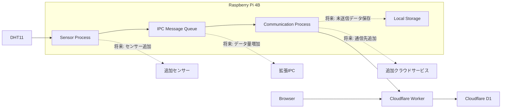

---

### 24.4 センサー追加

現在はDHT11による温度・湿度取得を対象とする。

将来的には、別のセンサーを追加できる構成とする。

例：

* 温度センサー
* 湿度センサー
* 気圧センサー
* 照度センサー
* CO2センサー
* 人感センサー

センサーを追加する場合でも、Sensor Processの責務としてセンサーからデータを取得し、共通のデータ処理・IPCインターフェースへ渡す構成を基本とする。

---

### 24.5 センサーProcessの拡張

センサー数が増加した場合、Sensor Process内部にセンサーごとの処理を追加する方式が考えられる。

センサー数や処理量が増加した場合には、必要に応じてセンサーごとの処理を分離することも検討する。

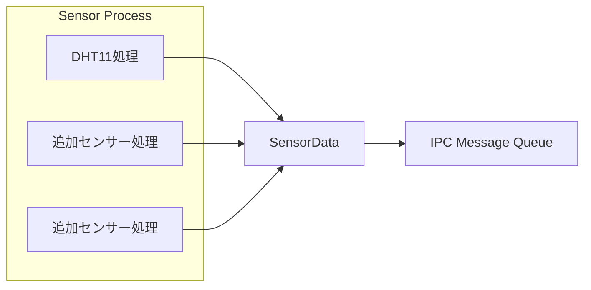

ただし、センサー数が少ない段階では不要なProcess分割を行わない。

---

### 24.6 センサーインターフェースの抽象化

複数種類のセンサーを扱う場合、センサーごとの処理とApplication Control等の上位処理を分離できる構成を検討する。

```text
Application
    ↓
Sensor Interface
    ├── DHT11
    ├── Sensor A
    └── Sensor B
```

これにより、センサー変更時に上位処理への影響を抑えることができる。

---

### 24.7 ローカルデータ保存

現在は、Sensor Processで取得したデータをIPC Message Queue経由でCommunication Processへ渡し、Cloudflare Workerへ送信する。

将来的にNetwork障害やCloud側障害が長時間継続する場合、Raspberry Pi側にデータを一時保存する機能を追加することが考えられる。

候補：

* ファイル
* SQLite
* その他のローカルデータストレージ

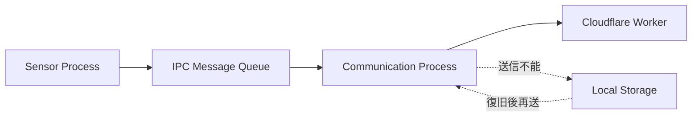

この機能を追加する場合は、データ保持期間、保存容量、再送順序、重複排除などを別途設計する。

---

### 24.8 通信方式の拡張

現在の通信方式はHTTP/HTTPSとする。

将来的にデータ量やシステム要件が変化した場合、以下の通信方式を検討することができる。

* MQTT
* WebSocket
* その他のIoT向け通信方式

ただし、現在のシステムではHTTP/HTTPSで必要な機能を実現できるため、現時点では通信方式を変更しない。

---

### 24.9 通信先の拡張

現在の通信先はCloudflare Workerとする。

将来的に複数のサービスへデータを送信する必要が発生した場合、Communication Processの責務を拡張することが考えられる。

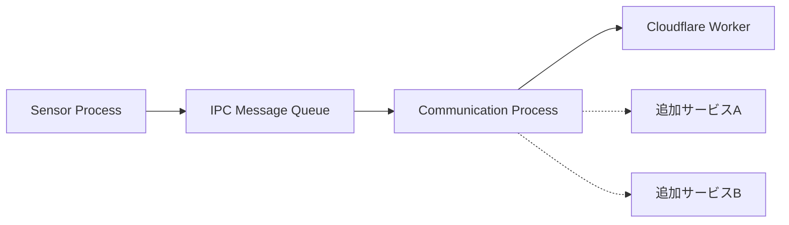

通信先が増加した場合には、通信先ごとの障害が他の通信先へ影響しないよう、必要に応じて通信処理を分離する。

---

### 24.10 Browser機能の拡張

現在のBrowser機能は、

* 現在値表示
* 履歴表示
* グラフ表示

を対象とする。

将来的には以下の機能を追加できる。

* 表示期間の変更
* 温度・湿度ごとの表示切替
* 最大値・最小値表示
* 平均値表示
* 異常値表示
* データ更新状態表示
* データ取得時刻表示
* 複数センサー表示
* センサーごとのグラフ表示

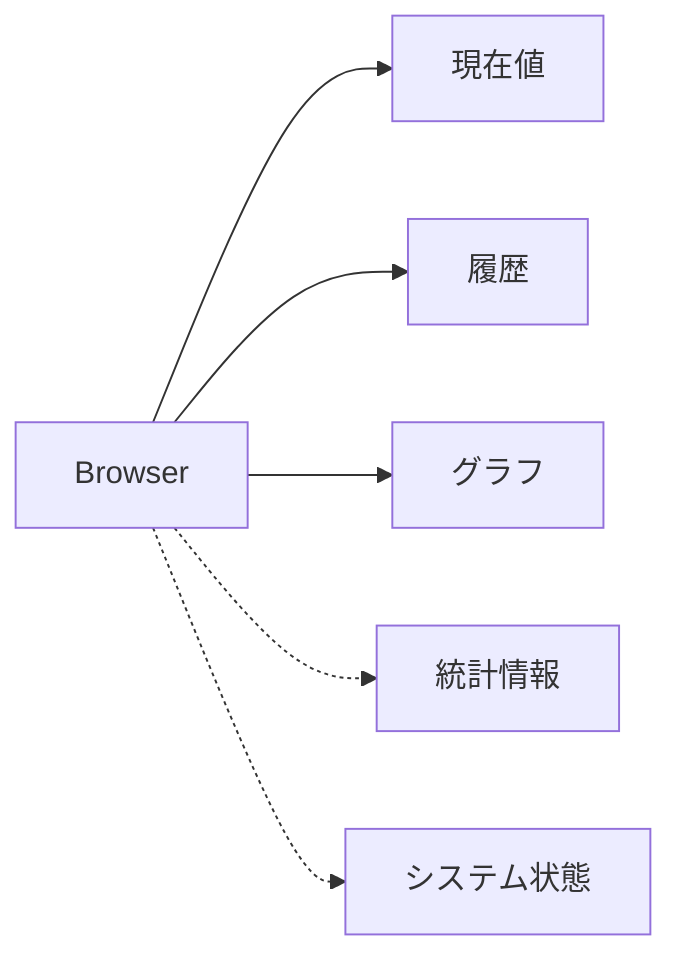

---

### 24.11 アラート機能

将来的に温度・湿度などが設定した範囲を超えた場合、通知する機能を追加することが考えられる。

例：

```text
SensorData
    ↓
判定
    ↓
閾値超過
    ↓
Alert
    ↓
通知
```

通知方法としては、メール、スマートフォン通知、その他の外部サービスなどが候補となる。

ただし、現在のシステムではアラート機能を必須としない。

---

### 24.12 センサー制御への拡張

現在のシステムは「センサーからデータを取得する」ことを中心とする。

将来的に、Raspberry Piから外部機器を制御する機能を追加することも可能である。


この場合、現在のデータ収集システムから、取得したデータに基づいて外部機器を制御するシステムへ拡張できる。

ただし、制御機能では安全性やリアルタイム性などの要求が大きく変化する可能性があるため、追加時には別途要求・設計を行う。

---

### 24.13 Process分割の拡張

現在は、

* Sensor Process
* Communication Process

の2 Process構成とする。

将来的に処理量や責務が増加した場合、以下のような分割を検討できる。


ただし、Process数を増やすとIPC、Lifecycle、systemd管理、障害処理などの複雑性が増加する。

そのため、責務が明確に分離できる場合に限定してProcess分割を行う。

---

### 24.14 IPC方式の拡張

現在はIPC Message Queueを採用する。

将来的にデータ量や通信パターンが大きく変化した場合、以下の方式を検討できる。

* Pipe
* FIFO
* Unix Domain Socket
* Shared Memory
* Message Queueの拡張利用

現在のSensor Process → Communication Processというデータ受け渡しではMessage Queueを基本とする。

---

### 24.15 データモデルの拡張

現在のSensorDataは、

```text
SensorData
├── temperature
├── humidity
└── timestamp
```

を基本とする。

将来的にセンサーを追加した場合、以下のような情報を追加することが考えられる。

```text
SensorData
├── sensor_id
├── sensor_type
├── temperature
├── humidity
├── timestamp
└── data_id
```

この場合、IPC、JSON、Worker、D1、Browserのデータモデルを合わせて変更する必要がある。

---

### 24.16 データ重複排除の拡張

通信Timeoutなどによって同一データが再送される可能性がある。

将来的にデータの一意性が重要になった場合、

* SensorData ID
* UUID
* Worker側での重複チェック
* D1側の一意制約

などを利用した重複排除を導入する。

---

### 24.17 セキュリティ機能の拡張

将来的にシステムを外部公開する範囲が広くなった場合、セキュリティ機能を強化する。

例：

* 認証方式の強化
* Browser側の認証
* アクセス制御
* APIレート制限
* より詳細な監査ログ
* Secret管理の強化
* 通信元制御

セキュリティ要求が変更された場合は、20章のセキュリティ設計を更新する。

---

### 24.18 監視機能の拡張

現在のログ・監視設計を基礎として、将来的にはシステム状態を外部から監視する機能を追加できる。

監視対象例：

* Sensor Process稼働状態
* Communication Process稼働状態
* Queue滞留
* 通信失敗回数
* Retry回数
* センサーエラー
* CPU使用率
* Memory使用量
* Disk使用量

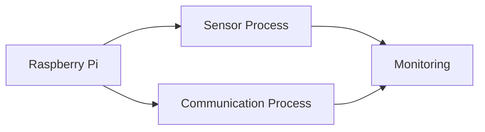

---

### 24.19 複数Edge Deviceへの拡張

将来的にRaspberry Piを複数台使用する場合、各Raspberry Piを独立したEdge Deviceとして扱うことができる。

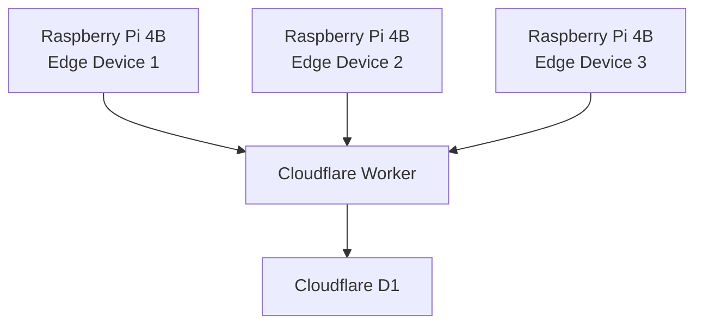

この場合、SensorDataにEdge Deviceを識別する情報を追加する必要がある。

---

### 24.20 将来拡張時の設計原則

将来機能を追加する場合、以下を原則とする。

### 原則1：既存責務を尊重する

新機能を追加する場合でも、既存Processの責務を不必要に混在させない。

### 原則2：インターフェースを明確にする

Process間、Workerとの間、Browserとの間でデータ形式と責務を明確にする。

### 原則3：障害影響範囲を限定する

新しい機能の障害によって、センサー取得など既存機能まで停止しない構成を優先する。

### 原則4：必要になってから複雑化する

将来使うかもしれない機能を、現在のシステムへ先回りして実装しない。

### 原則5：設計変更を記録する

既存設計を変更する場合は、変更理由、影響範囲、代替案を整理する。

---

### 24.21 将来拡張候補一覧

| ID      | 拡張項目          | 概要                | 現時点 |
| ------- | ------------- | ----------------- | --- |
| EXT-001 | センサー追加        | 複数センサー対応          | 将来  |
| EXT-002 | ローカル保存        | 未送信データの永続化        | 将来  |
| EXT-003 | MQTT等         | 通信方式の変更・追加        | 将来  |
| EXT-004 | 通信先追加         | 複数クラウド・サービス対応     | 将来  |
| EXT-005 | Browser機能拡張   | 統計・状態表示等          | 将来  |
| EXT-006 | アラート          | 閾値超過通知            | 将来  |
| EXT-007 | 外部機器制御        | センサー情報による制御       | 将来  |
| EXT-008 | Process追加     | 責務増加時のProcess分割   | 将来  |
| EXT-009 | データモデル拡張      | センサーID等の追加        | 将来  |
| EXT-010 | 重複排除          | SensorDataの一意性確保  | 将来  |
| EXT-011 | セキュリティ強化      | 認証・アクセス制御等        | 将来  |
| EXT-012 | 監視強化          | 外部監視・状態監視         | 将来  |
| EXT-013 | 複数Edge Device | Raspberry Pi複数台対応 | 将来  |

---

### 24.22 本章で決定した事項

本章では、以下の方針を決定した。

1. 現在のシステム構成を基本として将来拡張を検討する。
2. 将来拡張を理由として現在の構成を過度に複雑化しない。
3. Sensor ProcessとCommunication Processの責務分離を維持する。
4. Process間インターフェースを明確にする。
5. センサー追加、ローカル保存、Browser機能、アラート、監視などを将来拡張項目として整理する。
6. Process数の増加は、責務分離が必要になった場合に限定する。
7. 通信方式やクラウド構成の変更は、要求が変化した場合に検討する。
8. 将来拡張による障害影響範囲を可能な限り限定する。
9. 現時点で不要な機能を先行実装しない。

---

### 25.1 目的

本章では、本設計書全体を対象として設計レビューを実施する。

各章の内容だけではなく、要求、システム構成、ソフトウェア構成、Process、IPC、通信、状態、異常、復旧、Lifecycle、systemd、セキュリティ、テストおよび将来拡張の間に矛盾がないことを確認する。

設計レビューでは、以下を重点的に確認する。

* 要求が設計へ反映されているか
* 各設計間に矛盾がないか
* 各コンポーネントの責務が明確か
* 異常発生時の影響範囲が適切か
* 復旧方法が定義されているか
* Process間のインターフェースが明確か
* 外部システムとのインターフェースが明確か
* セキュリティ上の問題がないか
* テストによって設計を検証できるか
* 設計決定事項が関連章へ反映されているか

---

### 25.2 レビュー対象

レビュー対象は以下とする。

```mermaid id="x8p4q2"
flowchart TB
    R["要求"]
    A["システムアーキテクチャ"]
    S["ソフトウェアアーキテクチャ"]
    P["Process / Thread"]
    D["データ / IPC / 通信"]
    O["状態 / 異常 / 復旧"]
    L["Lifecycle / systemd"]
    SEC["セキュリティ"]
    T["テスト"]
    E["将来拡張"]

    R --> A
    A --> S
    S --> P
    P --> D
    D --> O
    O --> L
    L --> SEC
    SEC --> T
    T --> E

    T -.-> R
    T -.-> A
    T -.-> S
    T -.-> D
    T -.-> O
```

---

### 25.3 要求と設計の整合性

システム要求と各設計の対応を確認する。

| 要求                | 対応設計                         |
| ----------------- | ---------------------------- |
| センサーデータ取得         | センサー設計 / Sensor Process      |
| センサーデータ処理         | Data Processing              |
| センサーデータ送信         | Communication Process / 通信設計 |
| Cloudflareへの保存    | Worker / D1インターフェース          |
| 現在値表示             | Browser / Workerインターフェース     |
| 履歴表示              | Browser / Worker / D1        |
| グラフ表示             | Browser                      |
| 周期的な取得            | 周期・タイミング設計                   |
| 通信障害対応            | 異常系 / 障害復旧                   |
| Process異常対応       | systemd / 障害復旧               |
| Raspberry Pi再起動対応 | Lifecycle / systemd          |
| 正常Shutdown        | Lifecycle                    |
| ログ                | ログ・監視設計                      |
| セキュリティ            | セキュリティ設計                     |
| 長時間動作             | テスト・検証方針                     |

要求に対応する設計が存在しない場合は、設計漏れとして扱う。

---

### 25.4 システム構成の整合性

現在のシステム構成は以下を基本とする。

```mermaid id="c9h4pd"
flowchart LR
    Sensor["DHT11"]

    subgraph Pi["Raspberry Pi 4B"]
        SP["Sensor Process"]
        IPC["IPC Message Queue"]
        CP["Communication Process"]
    end

    Network["Wi-Fi / Internet"]

    Worker["Cloudflare Worker"]
    D1["Cloudflare D1"]
    Browser["Browser"]

    Sensor --> SP
    SP --> IPC
    IPC --> CP
    CP --> Network
    Network --> Worker
    Worker --> D1

    Browser --> Worker
    Worker --> Browser
```

レビュー結果として、以下の責務分離を維持する。

* Raspberry PiはEdge Deviceとして動作する。
* Sensor Processはセンサーデータ取得を担当する。
* Communication ProcessはCloudflare Workerとの通信を担当する。
* Process間のデータ受け渡しにはIPC Message Queueを使用する。
* Cloudflare Workerは外部システムとして扱う。
* D1はWorkerから利用するデータ保存先とする。
* BrowserはWorker経由でデータを参照する。
* BrowserからD1へ直接アクセスしない。

---

### 25.5 Process責務の整合性

Process間の責務が重複していないことを確認する。

| Process               | 主な責務                       |
| --------------------- | -------------------------- |
| Sensor Process        | DHT11取得、データ妥当性確認、IPC送信     |
| Communication Process | IPC受信、HTTP通信、Retry、Backoff |
| systemd               | Process起動、停止、異常終了検知、再起動    |

特に、Sensor ProcessがCloudflareとの通信処理を直接担当しないことを確認する。

同様に、Communication ProcessがDHT11の直接制御を担当しないことを確認する。

これにより、センサー取得とNetwork通信の障害影響を分離する。

---

### 25.6 IPC設計の整合性

Sensor ProcessとCommunication Process間のデータ受け渡しはIPC Message Queueを使用する。

```mermaid id="j0z1pr"
flowchart LR
    SP["Sensor Process"]
    Queue["IPC Message Queue"]
    CP["Communication Process"]

    SP -->|SensorData| Queue
    Queue -->|SensorData| CP
```

レビュー項目：

* Producer / Consumerが明確であること
* FIFOを基本とすること
* Queue Empty時にBusy Loopを行わないこと
* Queue Full時に無限待ちしないこと
* Process間で直接メモリを共有しないこと
* IPC障害を異常として検出できること
* Process再起動時にIPCを再初期化できること

---

### 25.7 周期・通信処理の整合性

Sensor ProcessとCommunication Processの周期を独立させる。

```mermaid id="xq2r7m"
flowchart LR
    SP["Sensor Process"]
    Q["IPC Queue"]
    CP["Communication Process"]
    W["Worker"]

    SP -->|周期的に取得| Q
    Q --> CP
    CP -->|必要に応じて送信| W
```

Sensor ProcessはCommunication Processの通信完了を待って次のセンサー取得を行う構成にはしない。

Communication Processの遅延は、まずIPC Queueによって吸収する。

ただし、平均的な通信処理時間がセンサー取得周期を上回る状態が継続するとQueue滞留が発生するため、実装・検証時に確認する。

基本条件：

```text
平均Communication処理時間 < Sensor取得周期
```

を望ましい状態とする。

---

### 25.8 通信設計の整合性

Communication Processは以下の流れで通信する。

```text id="jkj9yw"
IPC受信
  ↓
HTTP Request生成
  ↓
HTTPS通信
  ↓
Worker
  ↓
HTTP Response
  ↓
結果判定
```

HTTPステータスによる基本的な扱いは以下とする。

| 結果                 | 基本方針       |
| ------------------ | ---------- |
| 2xx                | 成功         |
| 4xx                | 原則Retryしない |
| 5xx                | Retry候補    |
| Timeout            | Retry候補    |
| DNS Failure        | Retry候補    |
| Connection Failure | Retry候補    |
| TLS / 通信エラー        | 通信異常として処理  |

RetryおよびBackoffはCommunication Processが担当する。

---

### 25.9 Timeoutと重複データ

HTTP Timeoutが発生した場合、以下のケースが存在する。

```mermaid id="e5u7az"
sequenceDiagram
    participant C as Communication Process
    participant W as Worker
    participant D as D1

    C->>W: POST SensorData
    W->>D: INSERT
    D-->>W: 保存成功
    W-->>C: Response
    Note over C: Response受信前にTimeout
    C->>W: Retry
    W->>D: INSERT
```

この場合、Worker側では同じデータが複数回保存される可能性がある。

したがって、将来的にデータの一意性が重要になった場合はSensorData IDなどによる重複排除を導入する。

この問題を設計上の認識事項として管理する。

---

### 25.10 状態設計の整合性

Process Lifecycleと内部状態を混同しない。

```mermaid id="x0e5zs"
flowchart TB
    Process["Process Lifecycle"]

    INIT["INIT"]
    READY["READY"]
    RUNNING["RUNNING"]
    STOPPING["STOPPING"]
    STOPPED["STOPPED"]
    ERROR["ERROR"]

    Process --> INIT
    INIT --> READY
    READY --> RUNNING
    RUNNING --> STOPPING
    STOPPING --> STOPPED
    INIT --> ERROR
    RUNNING --> ERROR
    ERROR --> STOPPING
```

Sensor Process内部ではセンサー取得状態を管理し、Communication Process内部では通信状態を管理する。

これらはProcess Lifecycleとは別の概念として扱う。

---

### 25.11 異常系設計の整合性

異常は、発生場所に応じて影響範囲を限定する。

```mermaid id="x3m8af"
flowchart LR
    Sensor["Sensor Process"]
    IPC["IPC"]
    Comm["Communication Process"]
    Network["Network"]
    Worker["Worker"]
    Systemd["systemd"]

    Sensor --> IPC
    IPC --> Comm
    Comm --> Network
    Network --> Worker

    Sensor -.->|異常| Systemd
    Comm -.->|異常| Systemd
```

基本方針：

* Sensor異常はSensor Process内で処理する。
* Communication異常はCommunication Process内で処理する。
* Network障害によってSensor Processを不要に停止させない。
* Process異常終了はsystemdによる再起動を利用する。
* Raspberry Pi全体の再起動はProcessレベルで復旧できない場合に限定する。

---

### 25.12 復旧設計の整合性

復旧レベルを以下とする。

```text id="4c5e8x"
Level 1
一時的な処理エラー
        ↓
Retry / 再実行

Level 2
継続的な通信・IPC異常
        ↓
再初期化 / 再接続

Level 3
Process異常
        ↓
Process再起動

Level 4
システム異常
        ↓
Raspberry Pi再起動

Level 5
電源断
        ↓
次回起動時に復旧
```

復旧処理では、単に処理を再実行するだけではなく、復旧後に正常状態へ戻ったことを確認する。

---

### 25.13 Lifecycleとsystemdの整合性

Raspberry Pi起動からシステム停止までの流れを以下とする。

```mermaid id="n6a2wq"
flowchart TB
    Boot["Raspberry Pi Boot"]
    Systemd["systemd"]
    Sensor["Sensor Process"]
    Comm["Communication Process"]
    Run["Normal Operation"]
    Shutdown["Shutdown"]
    Stop["Process Stop"]
    End["System End"]

    Boot --> Systemd
    Systemd --> Sensor
    Systemd --> Comm
    Sensor --> Run
    Comm --> Run
    Run --> Shutdown
    Shutdown --> Stop
    Stop --> End
```

Sensor ProcessとCommunication Processは独立したsystemd Unitとして管理する。

Networkが利用できない状態でCommunication Processが起動する可能性を考慮し、Network利用不可だけを理由としてProcessを終了させる設計にはしない。

Communication ProcessはNetwork復旧後に通信を再開できる構成とする。

---

### 25.14 Shutdown設計の整合性

正常Shutdownでは、以下の順序を基本とする。

```text id="6mbqyo"
Shutdown要求
    ↓
Sensor Process
新規取得停止
    ↓
Queue残存データ処理
    ↓
Communication Process
新規通信停止
    ↓
リソース解放
    ↓
Process終了
    ↓
OS Shutdown
```

Queueに残っているSensorDataは、永続化せずShutdown完了時に破棄する。

---

### 25.15 セキュリティ設計の整合性

以下の基本方針を確認する。

* PiからWorkerへの通信はHTTPSを使用する。
* TLS証明書検証を有効にする。
* Workerへのアクセスには認証を導入する。
* Workerは受信データを検証する。
* D1を直接外部公開しない。
* 秘密情報をソースコードへ埋め込まない。
* Gitへ秘密情報を登録しない。
* ログへ秘密情報を出力しない。
* Processは可能な限り最小権限で実行する。
* Wi-Fi認証情報も秘密情報として扱う。
* Workerのエラー応答に内部情報を含めない。

---

### 25.16 ログ・監視設計の整合性

ログはProcess単位で追跡できることを確認する。

基本ログ情報：

```text id="1n7n3y"
Timestamp
Log Level
Process
Event
Message
```

重要なイベント：

* Process起動
* Process停止
* センサー取得
* センサー異常
* IPC送受信
* Queue Full
* HTTP通信
* HTTPエラー
* Retry
* Backoff
* 復旧
* Process再起動

ログには以下を出力しない。

* API Key
* Bearer Token
* Password
* Wi-Fi Password
* Private Key
* Cookie
* その他の秘密情報

---

### 25.17 テスト設計との整合性

設計された各機能および異常系について、検証方法が存在することを確認する。

```mermaid id="5x0j7k"
flowchart LR
    Requirement["要求"]
    Design["設計"]
    Test["テスト"]
    Result["結果"]

    Requirement --> Design
    Design --> Test
    Test --> Result
    Result -.-> Requirement
```

特に以下を重点的に検証する。

* DHT11取得
* SensorData生成
* IPC送受信
* Queue Full
* Communication Process
* HTTP通信
* Timeout
* DNS Failure
* HTTP 4xx / 5xx
* Retry / Backoff
* Process異常終了
* systemd Restart
* Raspberry Pi再起動
* 正常Shutdown
* Worker保存
* Browser表示
* セキュリティ
* 長時間動作

---

### 25.18 設計決定事項の確認

23章で確認した設計決定事項について、関連する設計章へ反映されていることを確認する。

PND-001～PND-020がすべて本決定済みであり、関連章へ反映されていることを確認する。

---

### 25.19 将来拡張との整合性

将来拡張によって現在の基本構成が不要に複雑化しないことを確認する。

現在の基本構成：

```text id="k8y8m4"
DHT11
 ↓
Sensor Process
 ↓
IPC Message Queue
 ↓
Communication Process
 ↓
HTTPS
 ↓
Cloudflare Worker
 ↓
D1
 ↓
Browser
```

将来、センサー、保存方式、通信方式、Browser機能などを追加する場合でも、既存の責務分離を基本とする。

---

### 25.20 設計上の主要判断

本設計における主要な判断を以下にまとめる。

| 項目               | 採用方式                                   |
| ---------------- | -------------------------------------- |
| Edge Device      | Raspberry Pi 4B                        |
| OS               | Raspberry Pi OS                        |
| Edge Application | C++                                    |
| センサー             | DHT11                                  |
| Process構成        | Sensor Process / Communication Process |
| Process間通信       | IPC Message Queue                      |
| 通信               | HTTPS                                  |
| Cloud側入口         | Cloudflare Worker                      |
| データ保存            | Cloudflare D1                          |
| Browser          | Worker経由で参照                            |
| Process管理        | systemd                                |
| Retry            | Communication Process                  |
| 障害分離             | Process単位                              |
| ログ               | Process / Event単位                      |
| セキュリティ           | HTTPS / 認証 / 最小権限                      |
| 将来拡張             | 現在の責務分離を維持                             |

---

### 25.21 設計レビュー結果

現時点の設計について、以下を確認する。

#### 25.21.1 要求

要求から各設計への対応関係が定義されている。

#### 25.21.2 アーキテクチャ

Raspberry Piを中心としたEdge IoTシステムとして構成されている。

#### 25.21.3 Process

Sensor ProcessとCommunication Processを分離し、障害影響範囲を限定している。

#### 25.21.4 IPC

Process間のデータ受け渡しをIPC Message Queueとして定義している。

#### 25.21.5 通信

Communication ProcessがHTTPSによってWorkerへSensorDataを送信する構成となっている。

#### 25.21.6 異常・復旧

異常検出、Retry、再初期化、Process再起動、システム再起動という復旧レベルを定義している。

#### 25.21.7 Lifecycle

起動、通常動作、Shutdown、Process終了、再起動について設計している。

#### 25.21.8 systemd

Process単位でsystemd管理する方針を定義している。

#### 25.21.9 セキュリティ

HTTPS、認証、秘密情報保護、Workerによる入力検証などの基本方針を定義している。

#### 25.21.10 テスト

正常系、異常系、復旧、再起動、Shutdown、セキュリティ、長時間動作を検証対象としている。

---

### 25.22 最終確認事項

実装開始前に、以下の決定事項が関連章へ反映されていることを確認する。

- SensorDataの型・精度・timestamp・data_id
- Queue容量とQueue Full時の処理
- 未送信データおよびShutdown時データの扱い
- Retry回数・間隔・Backoff
- HTTP Timeout
- Worker認証と秘密情報保管
- Browserアクセス制御
- Process実行ユーザー
- systemd Restart設定
- ログ保持期間
- 長時間動作テスト時間
- リソース使用量の判定基準
- SensorData重複排除

すべて決定済みであり、未解決の設計事項は残さない。

### 25.23 設計完了条件

以下をすべて満たした場合、本設計を実装開始可能な状態と判断する。

* システム要求が定義されている
* システム境界が明確である
* システムアーキテクチャが定義されている
* ソフトウェア責務が定義されている
* Process構成が定義されている
* IPC方式が定義されている
* データ構造が定義されている
* 通信方式が定義されている
* 状態遷移が定義されている
* 異常系が定義されている
* 復旧方針が定義されている
* Lifecycleが定義されている
* systemd設定方針が定義されている
* セキュリティ方針が定義されている
* テスト方針が定義されている
* PND-001～PND-020がすべて本決定済みである
* 決定事項が関連する設計章へ反映されている
* 将来拡張方針が定義されている
* 各設計間の重大な矛盾が解消されている

以上を満たしているため、本設計は実装開始可能な状態とする。

### 25.24 設計レビュー完了後の方針

設計レビュー完了後は、設計書を基準として実装を開始する。

実装中に設計変更が必要となった場合は、実装を優先して設計書を後追いで変更するのではなく、

```mermaid id="f2r6qk"
flowchart LR
    Problem["設計変更が必要"]
    Impact["影響確認"]
    Decision["設計判断"]
    Update["設計書更新"]
    Implement["実装"]

    Problem --> Impact
    Impact --> Decision
    Decision --> Update
    Update --> Implement
```

の順序を基本とする。

設計変更が既存の要求、Process構成、IPC、通信、異常系、Lifecycle、systemd、セキュリティなどへ影響する場合は、関連する章も合わせて更新する。

---

### 25.25 本設計の最終構成

本設計で定義したシステムの基本構成を以下に示す。

```mermaid id="v7x5c1"
flowchart LR
    Sensor["DHT11<br/>温湿度センサー"]

    subgraph Edge["Raspberry Pi 4B"]
        SP["Sensor Process"]
        Q["IPC Message Queue"]
        CP["Communication Process"]
        SD["systemd"]
    end

    Network["Wi-Fi / Internet"]

    subgraph Cloud["Cloudflare"]
        Worker["Cloudflare Worker"]
        D1["Cloudflare D1"]
    end

    Browser["Browser"]

    Sensor -->|温度・湿度| SP
    SP -->|SensorData| Q
    Q -->|SensorData| CP
    CP -->|HTTPS| Network
    Network --> Worker
    Worker -->|保存| D1

    Browser -->|データ参照| Worker
    Worker -->|データ| Browser

    SD -.->|Process管理| SP
    SD -.->|Process管理| CP
```

本設計では、Raspberry Pi上のEdge Applicationを中心として、センサー取得、Process間通信、Cloudflareへのデータ送信、データ保存、Browserからの参照までを一つのシステムとして定義した。

---

### 25.26 設計レビュー総括

本設計では、

```text id="n6c8v2"
要求
 ↓
システム構成
 ↓
ソフトウェア構成
 ↓
Process
 ↓
IPC
 ↓
データ
 ↓
通信
 ↓
状態
 ↓
異常
 ↓
復旧
 ↓
Lifecycle
 ↓
systemd
 ↓
セキュリティ
 ↓
テスト
```

という一連の設計を定義した。

特に、Sensor ProcessとCommunication Processを分離することで、センサー取得とNetwork通信の責務および障害影響を分離した。

また、IPC Message QueueをProcess間のインターフェースとすることで、Processの独立性を維持しながらSensorDataを受け渡す構成とした。

今後の実装では、本設計を基準として各Process、IPC、通信、Lifecycleおよびsystemdを具体化する。
