# プログラム設計書

## 1.文書情報

| 項目 | 内容 |
|---|---|
| 文書名 | プログラム設計書 |
| 対象システム | Raspberry Pi 4B Edge IoT System |
| 対象範囲 | Raspberry Pi 4B上で動作するSensor Process、Communication Process、および関連クラス |
| 作成目的 | ソフトウェア設計をC++のプログラム構造へ具体化する |
| 設計対象 | プロセス、クラス、データ、処理フロー、エラー処理 |

## 2.設計方針

### 2.1 責務分離

各クラスおよび各プロセスは、担当する責務を明確に分離する。

### 2.2 単一責務
1つのクラスに複数の異なる責務を持たせず、各クラスが担当する処理を現艇する。

### 2.3 Processとクラスの分離

Processはシステム全体の処理の流れを制御し、個々の機能はクラスに分離する。

### 2.4. 設計と実装の対応
プラグラム設計で定義したクラス、関数、データ構造および処理フローをC++のヘッダファイルおよびソースファイルへ対応付ける。

### 2.5. エラー処理の責務分離
各クラスは自身が検出したエラーを適切に通知し、再試行などの処理判断はProcess側で行う。

## 3. プログラム全体構成

本システムのRaspberry Pi側プログラムは、Sensor ProcessとCommunication Processの2つのプロセスで構成する。

Sensor ProcessはDHT11から温湿度データを取得し、SensorDataを生成してMessage Queueへ送信する。

Communication ProcessはMessage QueueからSensorDataを受信し、Cloudflare WorkerへHTTPSで送信する。


### 3.1 Process構成

Raspberry Pi側プログラムは、以下の2つのProcessで構成する。

| Process | 主な責務 |
|---|---|
| Sensor Process | DHT11から温湿度データを取得し、SensorDataを生成してMessage Queueへ送信する |
| Communication Process | Message QueueからSensorDataを受信し、Cloudflare WorkerへHTTPSで送信する |

### 3.2 ソースファイル構成

Raspberry Pi側プログラムのソースファイルを、責務ごとに以下の構成とする。

```text
include/
├── common/
│   └── SensorData.h
├── ipc/
│   └── SensorDataMessageQueue.h
├── sensor/
│   └── Dht11Sensor.h
└── communication/
    └── CloudflareClient.h

src/
├── sensor/
│   ├── main.cpp
│   └── Dht11Sensor.cpp
├── communication/
│   ├── main.cpp
│   └── CloudflareClient.cpp
└── ipc/
    └── SensorDataMessageQueue.cpp

```

### 3.3 クラス構成

Raspberry Pi側プログラムでは、以下のクラスを定義する。

| クラス | 配置 | 主な責務 |
|---|---|---|
|Dht11Sensor|sensor|DHT11から温湿度データを取得する|
|SensorDataMessageQueue| ipc| Process間でSensorDataを送受信する|
|CloudflareClient|communication|Cloudflare WorkerへSensorDataをHTTPSで送信する|

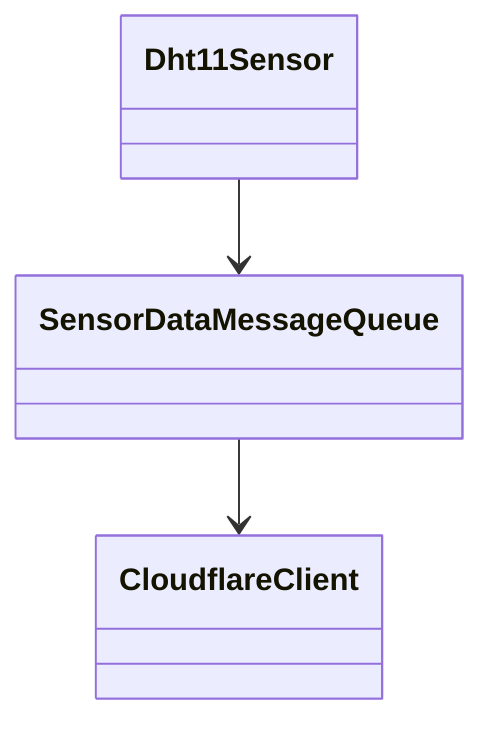


## 4. クラス設計

### 4.1 Dht11Sensor

#### 4.1.1 責務

Dht11Sensorは、DHT11センサおよいGPIOを操作し、温度および湿度を取得する責務を持つ。

以下の処理はDht11Sensorの責務に含めない。

 - 5秒周期の制御
 - SensorDataの生成 
 - data_idの生成
 - timestampの生成
 - Message Queueへの送信
 - 通信リトライ
 - Cloudflare Workerへの通信

#### 4.1.2 メンバ変数

|メンバ変数|型|説明|
|---|---|---|
|m_gpioPin|unsigned int|DHT11に接続するGPIO番号|
|m_gpioHandle| int |GPIOのハンドル|
|m_gpioClaimed|bool|GPIOを確保済みかを示すフラグ|

#### 4.1.3 公開関数

|メンバ変数|型|説明|
|---|---|----|
|Dht11Sensor|-|GPIO番号を受け取り、メンバ変数を初期化する|
|initialize|bool|GPIOを初期化して使用可能な状態にする|
|read|bool|DHT11から温度・湿度を1回取得する|

##### initialize()

|項目|内容|
|---|---|
|目的|GPIOを初期化し、DHT11読み取れる状態にする|
|入力|なし|
|出力|なし|
|戻り値|成功時TRUE、失敗時False|
|エラー時の処理|GPIOの初期化に失敗した場合はfalseを返す|
|呼び出し元|Sensor Process|

##### read()

|項目|内容|
|---|---|
|目的|DHT11から温度および湿度を1回取得する|
|入力|温度および湿度の出力先|
|出力|温度および湿度|
|戻り値|成功時TRUE、失敗時False|
|エラー時の処理|DHT11の読み取りに失敗した場合はfalseを返す|
|呼び出し元|Sensor Process|


### 4.2 SensorDataMessageQueue

#### 4.2.1 責務

SensorDataMessageQueueは、Sensor ProcessとCommunication Processの間でSensorDataを送受信するMessage Queueを管理する

以下の処理はSensorDataMessageQueueの責務に含めない。

- DHT11からのデータ取得
- 5秒周期の制御
- data_idの生成
- timestampの生成
- Cloudflare Workerへの通信
- 通信リトライ

#### 4.2 メンバ変数

|メンバ変数|型|説明|
|---|---|----|
|m_queueName|std::string|POSIX Message Queueの名前|
|m_queueDescriptor|mqd_t| Message Queueのディスクリプタ|

#### 4.2.3 公開関数

| 関数 | 戻り値 | 説明 |
|---|---|---|
| open | bool | Message Queueをオープンする |
| close | void | Message Queueをクローズする |
| send | bool | SensorDataをMessage Queueへ送信する |
| receive | bool | Message QueueからSensorDataを受信する |


#### 4.2.4 関数仕様

##### open()

| 項目 | 内容 |
|---|---|
| 目的 | POSIX Message Queueをオープンし、送受信可能な状態にする |
| 入力 | なし |
| 出力 | なし |
| 戻り値 | 成功時true、失敗時false |
| エラー時の処理 | Message Queueのオープンに失敗した場合はfalseを返す |
| 呼び出し元 | Sensor Process、Communication Process |

##### close()

| 項目 | 内容 |
|---|---|
| 目的 | POSIX Message Queueをクローズする |
| 入力 | なし |
| 出力 | なし |
| 戻り値 | なし |
| エラー時の処理 | クローズに失敗した場合はエラーを記録する |
| 呼び出し元 | Sensor Process、Communication Process |

##### send()

| 項目 | 内容 |
|---|---|
| 目的 | SensorDataをPOSIX Message Queueへ送信する |
| 入力 | SensorData |
| 出力 | なし |
| 戻り値 | 送信成功時true、送信失敗時false |
| 送信方式 | ノンブロッキング |
| キュー満杯時 | 待機せずfalseを返し、送信対象のSensorDataを破棄する |
| 再試行 | 行わない |
| 呼び出し元 | Sensor Process |


##### receive()

| 項目 | 内容 |
|---|---|
| 目的 | POSIX Message QueueからSensorDataを受信する |
| 入力 | SensorDataの格納先 |
| 出力 | 受信したSensorData |
| 戻り値 | 受信成功時true、受信失敗時false |
| 受信方式 | ブロッキング |
| キューが空の場合 | データが到着するまで待機する |
| 再試行 | 行わない |
| 呼び出し元 | Communication Process |


### 4.3 CloudflareClient

#### 4.3.1 責務

CloudflareClientは、SensorDataをCloudflare WorkerへHTTPS POSTで送信する責務を持つ。

以下の処理はCloudflareClientの責務に含めない。

- DHT11からのデータ取得
- 5秒周期の制御
- Message Queueの送受信
- data_idの生成
- timestampの生成
- 通信失敗時の再試行判断
- 再試行間隔の制御


#### 4.3.2 メンバ変数

| メンバ変数 | 型 | 説明 |
|---|---|---|
| m_workerUrl | std::string | Cloudflare WorkerのURL |
| m_sharedSecret | std::string | Workerとの認証に使用する共有シークレット |

#### 4.3.3 公開関数

| 関数 | 戻り値 | 説明 |
|---|---|---|
| CloudflareClient | - | Cloudflare WorkerのURLと共有シークレットを受け取り、メンバ変数を初期化する |
| send | bool | SensorDataをCloudflare WorkerへHTTPS POSTで送信する |

#### 4.3.4 関数仕様

##### send()

| 項目 | 内容 |
|---|---|
| 目的 | SensorDataをJSON形式に変換し、Cloudflare WorkerへHTTPS POSTで送信する |
| 入力 | SensorData |
| 出力 | なし |
| 戻り値 | HTTP送信成功時true、送信失敗時false |
| 認証 | X-Edge-IoT-Shared-Secretヘッダを使用する |
| HTTPS | TLSによる暗号化通信を使用する |
| HTTPタイムアウト | 5秒 |
| 再試行 | 行わない |
| 呼び出し元 | Communication Process |


## 5. データ構造設計

### 5.1 SensorData

#### 5.1.1 役割

SensorDataは、DHT11から取得した温湿度データと、システム内でデータを識別するための情報を保持するデータ構造である。

Sensor Processで生成し、Message Queueを介してCommunication Processへ渡す。


#### 5.1.2 メンバ

| メンバ | 型 | 説明 |
|---|---|---|
| temperature | double | 温度 |
| humidity | double | 湿度 |
| timestamp | std::int64_t | センサデータ取得時刻（UTC Unix秒） |
| data_id | std::uint64_t | センサデータを一意に識別するID |


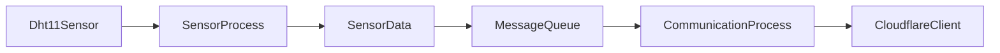

## 6. Sensor Process設計

### 6.1 処理概要

Sensor Processは、Dht11Sensorを使用して5秒周期で温度および湿度を取得し、SensorDataを生成してSensorDataMessageQueueへ送信する。

センサの読み取りに失敗した場合は、その周期の処理を終了し、次の周期で再度読み取りを行う。

Message Queueへの送信に失敗した場合は、対象のSensorDataを破棄し、次の周期の処理を継続する。

### 6.2 処理フロー

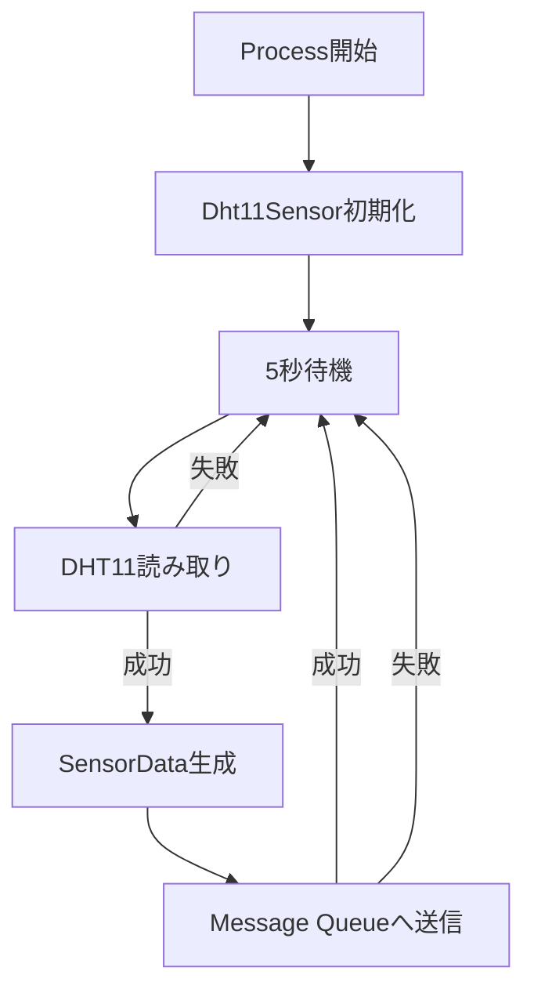


### 6.3 main.cppの責務

Sensor Processのmain.cppは、Sensor Process全体の処理順序を制御する責務を持つ。

main.cppでは、以下の処理を行う。

- Dht11Sensorの生成および初期化
- SensorDataMessageQueueの生成およびオープン
- 5秒周期の制御
- Dht11Sensorによる温湿度データ取得
- SensorDataの生成
- data_idの生成
- timestampの生成
- SensorDataMessageQueueへの送信
- センサ読み取り失敗時の次周期への移行
- Message Queue送信失敗時の次周期への移行
- 終了時のリソース解放

main.cppでは、GPIO操作、Message Queueの内部操作などの詳細処理は行わない。

それぞれの処理は、対応するクラスへ委譲する。


### 6.4 main.cppの処理フロー

Sensor Processのmain.cppは、以下の順序で処理を行う。

1. Dht11Sensorを生成する
2. Dht11Sensorを初期化する
3. SensorDataMessageQueueを生成する
4. Message Queueをオープンする
5. 5秒周期の処理を開始する
6. DHT11から温度および湿度を取得する
7. センサ読み取りに失敗した場合は、その周期の処理を終了して次の周期へ移行する
8. SensorDataを生成する
9. data_idを生成する
10. timestampを設定する
11. SensorDataをMessage Queueへ送信する
12. 送信に失敗した場合は対象データを破棄して次の周期へ移行する
13. Process終了時にMessage Queueをクローズする


### 6.5 main.cppの処理フロー

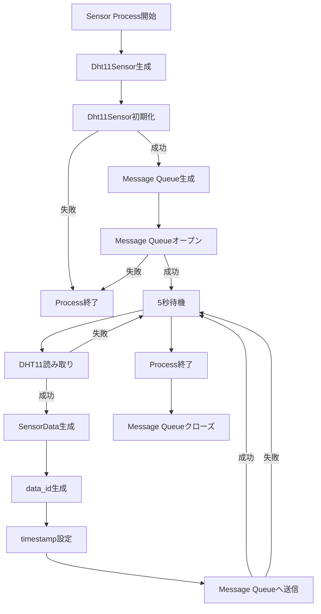


### 6.6 SensorData生成設計

Sensor Processは、DHT11から取得した温度および湿度を使用してSensorDataを生成する。

SensorDataには、以下の情報を設定する。

| メンバ | 設定元 | 設定内容 |
|---|---|---|
| temperature | Dht11Sensor | DHT11から取得した温度 |
| humidity | Dht11Sensor | DHT11から取得した湿度 |
| timestamp | Sensor Process | SensorDataを生成する時点のUTC Unix秒 |
| data_id | Sensor Process | Sensor Process内で生成する一意のID |

SensorDataの生成はSensor Processが担当する。

Dht11Sensorは温度および湿度の取得のみを担当し、timestampおよびdata_idの生成は行わない。

生成したSensorDataは、SensorDataMessageQueueを使用してCommunication Processへ送信する。


### 6.7 data_id生成設計

Sensor Processは、SensorDataを生成する際にdata_idを付与する。

data_idは、Sensor Processが生成したSensorDataを一意に識別するために使用する。

data_idはSensor Processの起動後、1から開始し、SensorDataを生成するたびに1ずつ増加させる。

センサ読み取りに失敗した場合はSensorDataを生成しないため、data_idは増加させない。

Message Queueへの送信に失敗した場合でも、生成済みのSensorDataに割り当てたdata_idは再利用しない。

Communication Processが同じSensorDataを通信リトライする場合は、SensorDataに設定されたdata_idをそのまま使用する。

これにより、通信リトライによって同じSensorDataが複数回送信された場合でも、同一のデータとして識別できる。

### 6.8 timestamp生成設計

Sensor Processは、SensorDataを生成する際にtimestampを設定する。

timestampには、SensorDataを生成する時点のUTC Unix秒を設定する。

timestampの生成はSensor Processが担当する。

Dht11Sensorはtimestampの生成を行わない。

timestampは、SensorDataがMessage Queueへ送信された時刻ではなく、Sensor ProcessがDHT11からデータを取得した時点を基準とする。

Communication Processは、受信したSensorDataのtimestampを変更せず、そのままCloudflare Workerへ送信する。

これにより、通信処理に時間がかかった場合でも、センサデータの取得時刻を保持することができる。

### 6.9 Sensor Processのエラー処理設計

Sensor Processでは、センサ読み取りおよびMessage Queue送信で発生するエラーに対して、Processを停止せずに次の周期の処理を継続する。

#### 6.9.1 DHT11読み取りエラー

Dht11Sensor::read()がfalseを返した場合、Sensor Processはその周期のSensorDataを生成しない。

エラー発生時はエラーを記録し、その周期の処理を終了して5秒後の次回読み取りを行う。

センサ読み取りエラーによる再試行は、次の周期で行う。

#### 6.9.2 Message Queue送信エラー

SensorDataMessageQueue::send()がfalseを返した場合、Sensor Processは対象のSensorDataを破棄する。

送信エラー発生時はエラーを記録し、その周期の処理を終了して次の周期へ移行する。

Message Queue送信エラーに対する即時再送は行わない。

#### 6.9.3 初期化エラー

Dht11Sensorの初期化またはMessage Queueのオープンに失敗した場合、Sensor Processは処理を開始せず終了する。

初期化エラーは、通常の周期処理では復旧できないため、Processを終了してsystemdによる再起動の対象とする。

### 6.10 Sensor Processの終了処理設計

Sensor Processは、Process終了時に使用しているリソースを解放する。

終了処理では、以下を行う。

1. Sensor Processの周期処理を終了する
2. SensorDataMessageQueueをクローズする
3. Dht11Sensorが使用しているGPIOリソースを解放する
4. Processを終了する

通常のProcess終了は、SIGINTやSIGTERMなどの終了要求を受けた場合に行う。

Sensor Processは、終了要求を受けた場合でも現在実行中の処理を安全に終了してからリソースを解放する。

Message QueueおよびGPIOのリソースを適切に解放し、終了後に不要なリソースが残らないようにする。


### 6.11 Sensor Processのクラス呼び出し関係

Sensor Processでは、main.cppが処理全体の流れを制御し、各機能の詳細処理をクラスへ委譲する。

main.cppから各クラスを以下のように呼び出す。

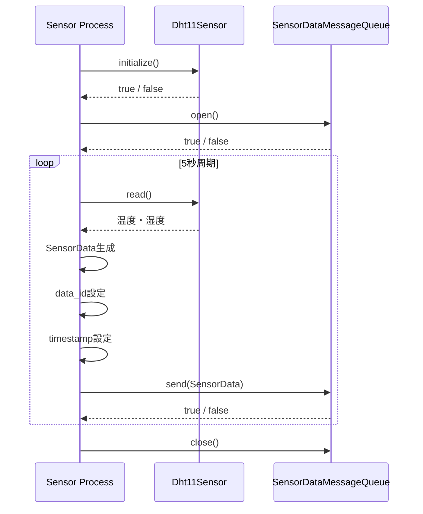

### 6.12 Sensor Processの設計まとめ

Sensor Processは、Dht11Sensorから温湿度データを取得し、SensorDataを生成してSensorDataMessageQueueへ送信する。

Sensor Processの処理は、main.cppが全体の流れを制御し、Dht11SensorおよびSensorDataMessageQueueへ個別の処理を委譲する。

Sensor Processの主な処理は以下のとおりである。

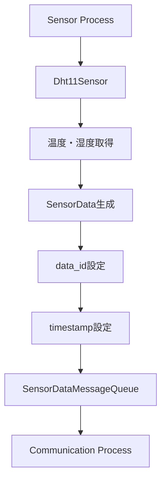

Sensor Processでは、センサ読み取りに失敗した場合はProcessを停止せず、次の周期で再度読み取りを行う。

Message Queueへの送信に失敗した場合は対象データを破棄し、次の周期の処理を継続する。

Dht11SensorまたはMessage Queueの初期化に失敗した場合はProcessを終了し、systemdによる再起動の対象とする。

この設計により、Sensor Processはセンサ取得とデータ送信の流れを制御しながら、GPIOおよびMessage Queueの詳細処理を各クラスへ分離する

## 7. Communication Process設計

### 7.1 処理概要

Communication Processは、SensorDataMessageQueueからSensorDataを受信し、CloudflareClientを使用してCloudflare WorkerへHTTPSで送信する。

Communication Processは、Message QueueからSensorDataを受信するまで待機し、SensorDataを受信した後にCloudflare Workerへの送信処理を開始する。

Cloudflare Workerへの送信に失敗した場合は、通信結果に応じて再試行を行う。

通信リトライはCommunication Processが制御し、CloudflareClientは1回のHTTPS送信処理のみを担当する。

通信に成功したSensorDataは処理を完了し、次のSensorDataの受信を行う。

Communication Processは、SensorDataに設定されたdata_idおよびtimestampを変更せず、そのままCloudflare Workerへ送信する。


### 7.2 処理フロー

Communication Processは、以下の順序で処理を行う。

1. SensorDataMessageQueueを生成する
2. Message Queueをオープンする
3. CloudflareClientを生成する
4. Message QueueからSensorDataを受信する
5. Cloudflare WorkerへのHTTPS送信を行う
6. HTTPS送信に成功した場合は、次のSensorDataの受信を行う
7. HTTPS送信に失敗した場合は、通信結果を確認する
8. 再試行対象のエラーの場合は、規定回数まで送信を再試行する
9. 再試行対象ではないエラーの場合は、対象のSensorDataを処理完了として次の受信へ移行する
10. Process終了時にMessage Queueをクローズする

Message QueueからのSensorData受信はブロッキング方式とし、データが到着するまで待機する。

Cloudflare Workerへの通信リトライはCommunication Processが制御し、CloudflareClientによる1回の送信処理とは分離する。


### 7.3 main.cppの責務

Communication Processのmain.cppは、Communication Process全体の処理順序を制御する責務を持つ。

main.cppでは、以下の処理を行う。

- SensorDataMessageQueueの生成およびオープン
- CloudflareClientの生成および初期化
- Message QueueからのSensorData受信
- Cloudflare WorkerへのSensorData送信
- 通信結果の確認
- 通信リトライの判断
- リトライ待機時間の制御
- 処理完了後の次のSensorData受信
- 終了時のリソース解放

main.cppでは、POSIX Message Queueの内部操作やHTTPS通信の詳細処理は行わない。

Message Queueの操作はSensorDataMessageQueueへ、HTTPS通信の操作はCloudflareClientへ委譲する。

また、通信リトライの判断およびリトライ間隔の制御はCommunication Processのmain.cppが担当する。


### 7.4 main.cppの処理フロー

Communication Processのmain.cppは、以下の順序で処理を行う。

1. SensorDataMessageQueueを生成する
2. Message Queueをオープンする
3. CloudflareClientを生成する
4. Message QueueからSensorDataを受信する
5. 受信したSensorDataをCloudflare Workerへ送信する
6. CloudflareClientの送信結果を確認する
7. 送信に成功した場合は、次のSensorDataを受信する
8. 送信に失敗した場合は、エラー内容を確認する
9. 再試行対象の場合は、規定の待機時間後に再送する
10. 再試行対象外の場合は、対象のSensorDataを処理完了として次の受信へ移行する
11. 規定回数の再試行に失敗した場合は、対象のSensorDataを処理完了として次の受信へ移行する
12. Process終了時にMessage Queueをクローズする


### 7.5 通信リトライ設計

Communication Processは、Cloudflare WorkerへのHTTPS送信に失敗した場合、エラー内容に応じて通信リトライを行う。

1回のSensorDataに対する通信試行回数は最大4回とする。

初回送信を1回目とし、失敗した場合は最大3回まで再試行する。

リトライ間隔は、以下のとおりとする。

| 試行 | 待機時間 |
|---|---:|
| 1回目 → 2回目 | 1秒 |
| 2回目 → 3回目 | 2秒 |
| 3回目 → 4回目 | 4秒 |

再試行対象となるエラーは、主に以下とする。

- DNS名前解決エラー
- TCP接続エラー
- TLS接続エラー
- 接続タイムアウト
- HTTPレスポンスタイムアウト
- HTTP 5xx系のサーバエラー

HTTP 4xx系のエラーは、原則として再試行しない。

最大試行回数まで送信に失敗した場合は、そのSensorDataの処理を終了し、次のSensorDataの受信を行う。

通信リトライを行う場合でも、SensorDataのdata_id、temperature、humidity、timestampは変更しない。

これにより、同一SensorDataに対する通信リトライであることを維持する。

通信リトライの判断および待機時間の制御はCommunication Processが担当し、CloudflareClientは1回のHTTPS送信結果を返す。


### 7.6 通信エラー分類設計

Communication Processは、CloudflareClientから返された通信結果を確認し、再試行の要否を判断する。

通信結果は、以下のように分類する。

| 通信結果 | 処理 |
|---|---|
| HTTP 2xx | 通信成功として処理を完了する |
| HTTP 4xx | 再試行せず、対象データの処理を終了する |
| HTTP 5xx | 再試行する |
| DNS名前解決エラー | 再試行する |
| TCP接続エラー | 再試行する |
| TLS接続エラー | 再試行する |
| 接続タイムアウト | 再試行する |
| HTTPレスポンスタイムアウト | 再試行する |
| その他の通信エラー | エラー内容に応じて再試行の要否を判断する |

HTTP 2xxを受信した場合、Cloudflare WorkerへのSensorData送信が成功したものとして、そのSensorDataの処理を完了する。

HTTP 4xxを受信した場合は、リクエスト内容や認証情報などの問題が想定されるため、同一内容での再試行は行わない。

HTTP 5xxを受信した場合は、Cloudflare Worker側の一時的な障害などが考えられるため、通信リトライを行う。

DNS、TCP、TLSおよびタイムアウトなど、通信経路上で発生する一時的なエラーについても、通信リトライを行う。

通信リトライの回数および待機時間は、7.5 通信リトライ設計に従う。


### 7.7 Communication Processの終了処理設計

Communication Processは、Process終了時に使用しているリソースを解放する。

終了処理では、以下を行う。

1. Communication Processの受信処理および通信処理を終了する
2. SensorDataMessageQueueをクローズする
3. CloudflareClientが使用している通信リソースを解放する
4. Processを終了する

通常のProcess終了は、SIGINTやSIGTERMなどの終了要求を受けた場合に行う。

Communication Processが終了要求を受けた場合は、現在実行中の処理を安全に終了してからリソースを解放する。

Message QueueおよびHTTPS通信で使用するリソースを適切に解放し、終了後に不要なリソースが残らないようにする。


### 7.8 Communication Processのクラス呼び出し関係

Communication Processでは、main.cppが処理全体の流れを制御し、各機能の詳細処理をクラスへ委譲する。

main.cppから各クラスを以下のように呼び出す。

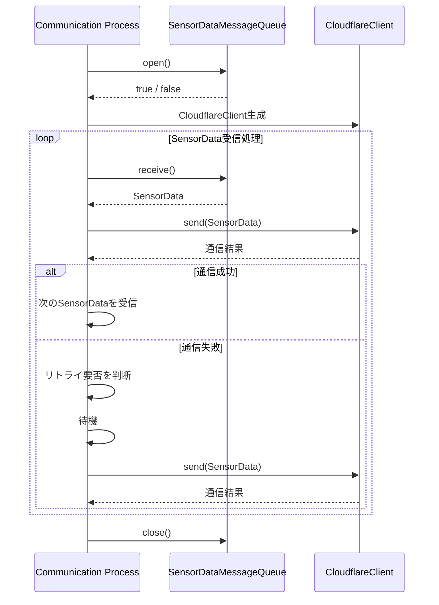

 main.cppは、Message QueueからSensorDataを受信し、CloudflareClientへ送信を依頼する。

CloudflareClientから返された通信結果を確認し、Communication Processが再試行の要否および再試行回数を判断する。

SensorDataMessageQueueはMessage Queueの送受信処理のみを担当し、CloudflareClientはHTTPS通信処理のみを担当する。

Communication Processは、これらのクラスを組み合わせて、SensorDataの受信からCloudflare Workerへの送信までの処理を実現する。


### 7.9 Communication Processの設計まとめ

Communication Processは、SensorDataMessageQueueからSensorDataを受信し、CloudflareClientを使用してCloudflare WorkerへHTTPSで送信する。

Communication Processの処理は、main.cppが全体の流れを制御し、SensorDataMessageQueueおよびCloudflareClientへ個別の処理を委譲する。

Communication Processの主な処理は以下のとおりである。

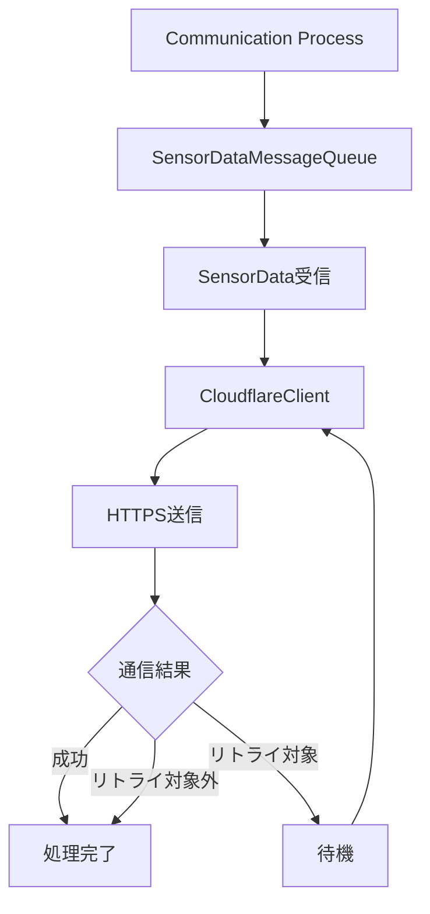


## 8. プロセス間データ受け渡し設計

### 8.1 処理概要

Sensor ProcessとCommunication Processの間では、POSIX Message Queueを使用してSensorDataを受け渡す。

Sensor Processは、DHT11から取得した温湿度データをSensorDataとして生成し、SensorDataMessageQueueを使用してMessage Queueへ送信する。

Communication Processは、SensorDataMessageQueueを使用してMessage QueueからSensorDataを受信する。

Sensor ProcessとCommunication Processは、それぞれ独立したProcessとして動作するため、SensorDataの受け渡しにはProcess間通信機構を使用する。

Message Queueは、Sensor ProcessとCommunication Processの間のデータ受け渡しのみを担当し、SensorDataの内容を変更しない。

SensorDataの生成はSensor Processが担当し、SensorDataの受信後の通信処理はCommunication Processが担当する。


### 8.2 Message Queue構成

Sensor ProcessとCommunication Processの間では、POSIX Message Queueを1つ使用する。

Message Queueの構成は以下のとおりとする。

| 項目 | 内容 |
|---|---|
| Queue名 | `/raspberry_pi_edge_iot_sensor_data` |
| 最大メッセージ数 | 100 |
| 送信方式 | Sensor Process：ノンブロッキング |
| 受信方式 | Communication Process：ブロッキング |
| 送信データ | SensorData |
| 送信元 | Sensor Process |
| 受信先 | Communication Process |

Sensor Processは、Message Queueが満杯の場合でも待機せず、送信処理を終了する。

Communication Processは、Message Queueが空の場合、SensorDataが到着するまで待機する。

Message QueueはSensor ProcessおよびCommunication Processの起動時にオープンし、Process終了時にクローズする。

Message Queue自体の作成および削除は、Process間のデータ受け渡しに必要な範囲で管理する。


### 8.3 SensorDataのMessage Queue送受信設計

Sensor Processは、生成したSensorDataをSensorDataMessageQueueのsend()を使用してMessage Queueへ送信する。

Communication Processは、SensorDataMessageQueueのreceive()を使用してMessage QueueからSensorDataを受信する。

Message Queueを介したSensorDataの受け渡しでは、以下のメンバをそのまま送受信する。

| メンバ | 型 | 内容 |
|---|---|---|
| temperature | double | 温度 |
| humidity | double | 湿度 |
| timestamp | std::int64_t | センサデータ取得時刻 |
| data_id | std::uint64_t | センサデータ識別ID |

Sensor ProcessがMessage Queueへ送信したSensorDataは、Communication Processで同じ値を持つSensorDataとして受信する。

Message Queueによる送受信処理では、temperature、humidity、timestampおよびdata_idの値を変更しない。

SensorDataの内容に対する変換処理は、Message Queueの責務に含めない。


### 8.4 Message Queue送信エラー設計

Sensor ProcessがMessage QueueへのSensorData送信に失敗した場合、Sensor Processは対象のSensorDataを破棄し、次の周期の処理を継続する。

Message Queueが満杯の場合、Sensor Processは送信を待機せず、send()を失敗として扱う。

Message Queue送信失敗に対する即時再試行は行わない。

送信に失敗したSensorDataは、Communication Processへ送信されない。

送信失敗によってSensor Process自体を終了させることはしない。

次の周期では、新たにDHT11から温湿度データを取得し、新しいSensorDataを生成してMessage Queueへの送信を行う。

Message Queue送信エラーの処理はSensor Processが担当し、SensorDataMessageQueueは送信結果を呼び出し元へ通知する。


### 8.5 Message Queue受信エラー設計

Communication ProcessがMessage QueueからSensorDataを受信する際にエラーが発生した場合、Communication Processは受信処理を継続する。

Message Queueが空の場合は、ブロッキング方式によりSensorDataが到着するまで待機する。

Message Queueの受信処理に失敗した場合は、エラーを記録し、受信処理を再度実行する。

Message Queueの受信エラーによってCommunication Process自体を終了させることはしない。

受信したSensorDataの内容が不正である場合は、Cloudflare Workerへの送信を行わず、対象データを破棄して次のSensorDataの受信を行う。

Message Queue受信エラーの処理はCommunication Processが担当し、SensorDataMessageQueueは受信結果を呼び出し元へ通知する。

### 8.6 Message Queueのライフサイクル設計

Message Queueは、Sensor ProcessおよびCommunication Processから使用する。

Sensor ProcessおよびCommunication Processは、Process起動時にMessage Queueをオープンする。

Message Queueが存在しない場合の作成については、Message Queueを使用するProcessの起動時に必要に応じて作成する。

Processの動作中は、オープンしたMessage Queueを使用してSensorDataの送受信を行う。

Process終了時には、使用しているMessage Queueのディスクリプタをクローズする。

Message QueueはProcess間で共有するため、片方のProcessが終了した場合でも、もう一方のProcessの動作に不要な影響を与えないようにする。

Message Queueのオープン、クローズおよび送受信処理は、SensorDataMessageQueueが担当する。


### 8.7 Message Queue設計のまとめ

Sensor ProcessとCommunication Processの間では、POSIX Message Queueを使用してSensorDataを受け渡す。

Sensor Processは、DHT11から取得した温湿度データをSensorDataとして生成し、Message Queueへ送信する。

Communication Processは、Message QueueからSensorDataを受信し、Cloudflare WorkerへのHTTPS送信を行う。

Message Queueは、SensorDataの受け渡しのみを担当し、SensorDataの内容を変更しない。

Message Queueの送信はSensor Processではノンブロッキング方式、受信はCommunication Processではブロッキング方式とする。

Message Queueが満杯の場合、Sensor Processは送信を待機せず、対象のSensorDataを破棄して次の周期へ移行する。

Message Queueが空の場合、Communication ProcessはSensorDataが到着するまで待機する。

Message Queueの送受信に関する詳細処理はSensorDataMessageQueueに分離し、各Processは処理結果に応じて次の処理を判断する。

Message Queueを介して受け渡すSensorDataは、以下の4つのメンバで構成する。

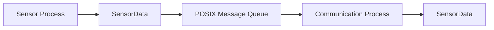

### 8.8 Sensor ProcessとCommunication Processのデータフロー

Sensor ProcessとCommunication Processの間では、SensorDataをPOSIX Message Queueを介して受け渡す。

Sensor Processは、Dht11Sensorから温度および湿度を取得し、data_idおよびtimestampを設定してSensorDataを生成する。

生成したSensorDataをSensorDataMessageQueueへ渡し、Message Queueへ送信する。

Communication Processは、SensorDataMessageQueueからSensorDataを受信し、受信したSensorDataをCloudflareClientへ渡す。

CloudflareClientは、受信したSensorDataをJSON形式へ変換し、Cloudflare WorkerへHTTPS POSTで送信する。

SensorDataの各メンバは、Sensor Processで生成されてからCloudflare Workerへ送信されるまで、以下のように引き継がれる。

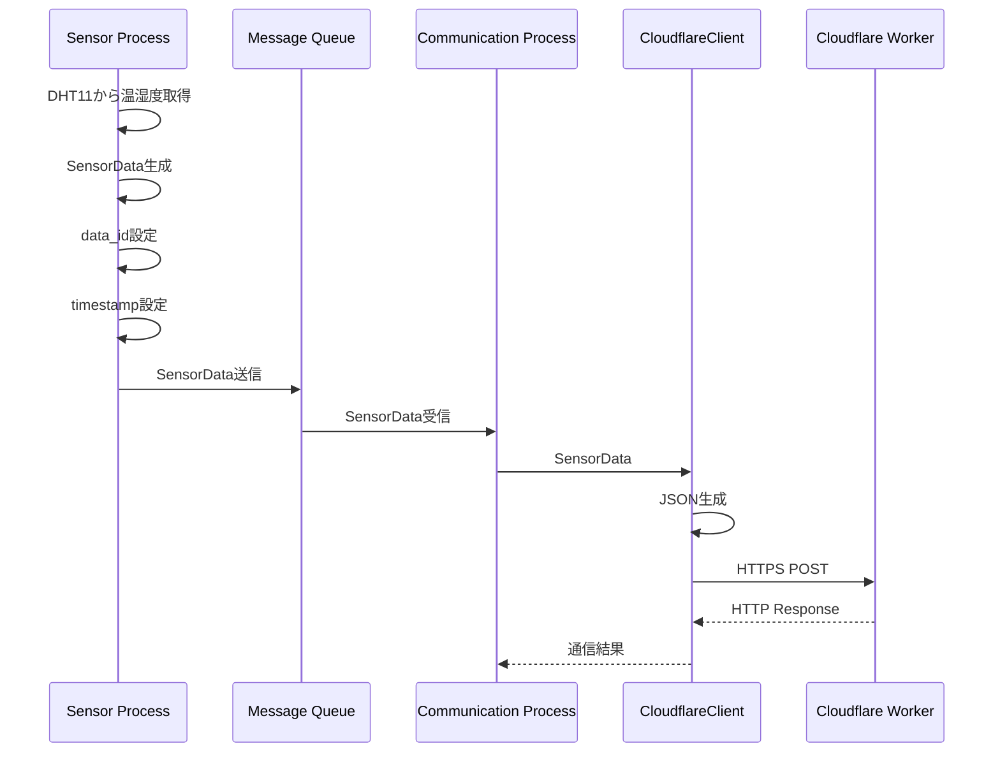


Sensor ProcessとCommunication Processの間では、SensorDataの内容を変更しない。

Communication Processは、受信したSensorDataをそのままCloudflareClientへ渡す。

CloudflareClientは、SensorDataの値を使用してCloudflare Workerへ送信するJSONを生成する。

通信リトライを行う場合でも、同じSensorDataを使用し、data_id、temperature、humidityおよびtimestampは変更しない。


### 8.9 プロセス間データ受け渡し設計のまとめ

Sensor ProcessとCommunication Processの間では、POSIX Message Queueを使用してSensorDataを受け渡す。

Sensor Processは、DHT11から温度および湿度を取得し、data_idおよびtimestampを設定したSensorDataを生成する。

生成したSensorDataは、SensorDataMessageQueueを介してMessage Queueへ送信する。

Communication Processは、Message QueueからSensorDataを受信し、CloudflareClientへ渡す。

CloudflareClientは、受信したSensorDataをJSON形式へ変換し、Cloudflare WorkerへHTTPS POSTで送信する。

SensorDataのtemperature、humidity、timestampおよびdata_idは、Sensor Processで生成されてからCloudflare Workerへ送信されるまで変更しない。

Message Queueが満杯の場合は、Sensor Processが対象のSensorDataを破棄し、次の周期へ移行する。

Message Queueが空の場合は、Communication ProcessがSensorDataの到着まで待機する。

通信に失敗してリトライを行う場合でも、同じSensorDataを使用し、data_idを変更しない。

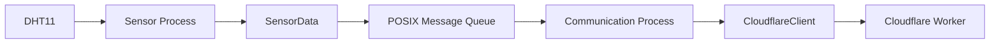

Message QueueはProcess間のデータ受け渡しに専念し、センサ取得処理、通信処理およびリトライ処理を担当しない。

これにより、Sensor Process、Message Queue、Communication ProcessおよびCloudflareClientの責務を分離する


## 9. Cloudflare通信設計

### 9.1 処理概要

Communication Processは、CloudflareClientを使用してSensorDataをCloudflare WorkerへHTTPS POSTで送信する。

CloudflareClientは、SensorDataをJSON形式へ変換し、HTTPリクエストを生成してCloudflare Workerへ送信する。

Cloudflare Workerへの通信にはHTTPSを使用し、TLSによる暗号化通信を行う。

Cloudflare Workerへのリクエストには、認証用の共有シークレットをHTTPヘッダに設定する。

CloudflareClientは、1回のHTTPS送信処理を担当し、通信リトライの判断およびリトライ間隔の制御はCommunication Processが担当する。

CloudflareClientは、HTTP通信の結果をCommunication Processへ返し、Communication Processはその結果に応じて通信成功または再試行の判断を行う。

### 9.2 HTTPリクエスト設計

CloudflareClientは、SensorDataをJSON形式へ変換し、HTTPS POSTリクエストとしてCloudflare Workerへ送信する。

HTTPリクエストの仕様は以下のとおりとする。

| 項目 | 内容 |
|---|---|
| HTTPメソッド | POST |
| 通信方式 | HTTPS |
| Content-Type | application/json |
| 接続先 | Cloudflare Worker URL |
| 認証方式 | HTTPヘッダによるShared Secret認証 |
| タイムアウト | 5秒 |

HTTPリクエストには、以下のヘッダを設定する。

| ヘッダ名 | 内容 |
|---|---|
| Content-Type | application/json |
| X-Edge-IoT-Shared-Secret | Shared Secret |

送信するJSONデータは以下の形式とする。

```json
{
  "data_id": 1,
  "temperature": 25.4,
  "humidity": 60.0,
  "timestamp": 1750000000
}
```

CloudflareClientは、SensorDataの内容をJSON形式へ変換するが、SensorData自身の値は変更しない。

HTTPレスポンスを受信後、CloudflareClientはHTTPステータスコードを確認し、通信結果をCommunication Processへ通知する。

### 9.3 JSON変換設計

CloudflareClientは、Communication Processから受け取ったSensorDataをCloudflare Workerへ送信するため、JSON形式へ変換する。

JSON変換はCloudflareClientの責務とする。

SensorDataの各メンバは、以下のJSONフィールドへ変換する。

| SensorDataメンバ | JSONフィールド | 型 | 内容 |
|---|---|---|---|
| data_id | data_id | number | センサデータ識別ID |
| temperature | temperature | number | 温度 |
| humidity | humidity | number | 湿度 |
| timestamp | timestamp | number | センサ取得時刻（Unix time seconds） |

変換後のJSON形式は以下とする。

```json
{
  "data_id": 1,
  "temperature": 25.4,
  "humidity": 60.0,
  "timestamp": 1750000000
}
```

### 9.4 Shared Secret認証設計

Cloudflare WorkerへのHTTPS通信では、Shared Secretによる認証を行う。

Raspberry Pi側のCommunication Processは、HTTPリクエストヘッダにShared Secretを設定してCloudflare Workerへ送信する。

Cloudflare Workerは、受信したHTTPヘッダのShared Secretを確認し、認証成功したリクエストのみ処理を継続する。

認証情報の設定は以下のとおりとする。

| 項目 | 内容 |
|---|---|
| HTTPヘッダ名 | X-Edge-IoT-Shared-Secret |
| Cloudflare側Secret名 | EDGE_IOT_SHARED_SECRET |
| Raspberry Pi側環境変数名 | CLOUDFLARE_SHARED_SECRET |

Cloudflare側とRaspberry Pi側では環境変数名は異なるが、設定するSecretの値は同一とする。

Raspberry Pi側のShared Secretは、設定ファイルから読み込む。

設定ファイル:

```text
/etc/raspberry-pi-edge-iot/communication.env
```

設定例:
```text
CLOUDFLARE_WORKER_URL=https://xxxxx.workers.dev/
CLOUDFLARE_SHARED_SECRET=xxxxx
```

Shared Secretは以下の場所へ保存しない。

GitHubリポジトリ
ソースコード
ログ出力

CloudflareClientは、送信時にHTTPヘッダへShared Secretを設定するが、Secret値自体をログへ出力しない。

認証失敗時（HTTP 401など）は、通信内容や認証情報の問題である可能性が高いため、原則として通信リトライを行わない。

### 9.5 HTTPレスポンス処理設計

CloudflareClientは、Cloudflare Workerから返却されたHTTPレスポンスを確認し、通信結果をCommunication Processへ通知する。

HTTPレスポンスの処理は以下のとおりとする。

| HTTPステータス | 判定 | 処理 |
|---|---|---|
| 200～299 | 成功 | 通信成功としてtrueを返す |
| 400～499 | クライアントエラー | 通信失敗としてfalseを返す |
| 500～599 | サーバエラー | 通信失敗としてfalseを返す |

HTTPレスポンスの詳細なリトライ判断はCommunication Processが担当する。

CloudflareClientは、HTTPステータスコードおよび通信結果をCommunication Processへ返却する。

CloudflareClientでは、以下の判断を行わない。

- リトライ回数の管理
- リトライ待機時間の制御
- SensorDataの破棄判断
- Process継続判断

Communication Processは、CloudflareClientから受け取った結果をもとに、通信リトライ設計に従って次の処理を決定する。

HTTPレスポンス受信時には、以下の情報をログへ出力する。

| ログ項目 | 内容 |
|---|---|
| HTTPステータスコード | Workerから返却されたステータス |
| data_id | 送信対象データの識別ID |
| 通信結果 | 成功または失敗 |

Shared Secretなどの認証情報はログへ出力しない。

### 9.6 Cloudflare通信エラー処理設計

CloudflareClientは、Cloudflare WorkerへのHTTPS通信中に発生したエラーを検出し、通信結果としてCommunication Processへ通知する。

通信エラーは、以下の種類に分類する。

| エラー種別 | 内容 | 処理 |
|---|---|---|
| DNSエラー | 接続先URLの名前解決失敗 | 通信失敗として返却 |
| TCP接続エラー | サーバへの接続失敗 | 通信失敗として返却 |
| TLSエラー | HTTPS暗号化通信確立失敗 | 通信失敗として返却 |
| Connect Timeout | 接続確立までのタイムアウト | 通信失敗として返却 |
| Response Timeout | レスポンス待ちタイムアウト | 通信失敗として返却 |
| HTTP 4xx | リクエストエラー | 通信失敗として返却 |
| HTTP 5xx | サーバエラー | 通信失敗として返却 |

CloudflareClientは、通信エラー発生時にリトライ処理を行わない。

通信リトライの判断はCommunication Processが担当する。

通信エラー発生時は、以下の情報をログへ出力する。

| ログ項目 | 内容 |
|---|---|
| data_id | 送信対象SensorDataの識別ID |
| エラー種別 | 発生した通信エラー |
| HTTPステータス | 取得できた場合のみ出力 |
| 結果 | 通信失敗 |

認証情報、Shared SecretおよびHTTPリクエスト内容の機密情報はログへ出力しない。

CloudflareClientは、通信処理に失敗した場合でもProcessを終了させず、呼び出し元へ失敗結果を返却する。

### 9.7 Cloudflare通信ログ設計

CloudflareClientおよびCommunication Processは、Cloudflare Workerとの通信状態を確認できるように必要な情報をログへ出力する。

ログ出力は、障害発生時の原因解析および動作確認を目的とする。

ログへ出力する項目は以下とする。

| ログ項目 | 内容 |
|---|---|
| data_id | 送信対象SensorDataの識別ID |
| temperature | 送信対象温度 |
| humidity | 送信対象湿度 |
| timestamp | センサ取得時刻 |
| HTTPステータスコード | Workerからの応答コード |
| 通信結果 | 成功 / 失敗 |
| エラー内容 | 通信失敗時の原因 |

通信成功時のログ例:

```text
Cloudflare POST success
data_id=100
temperature=25.4
humidity=60.2
status=200
```

通信失敗時のログ例:
```text
Cloudflare POST failed
data_id=100
error=connection timeout
retry=1/3
```

以下の情報はログへ出力しない。

Shared Secret
HTTP Authorization情報
環境変数の内容
通信先認証情報

ログ出力は、systemd journalで確認できる形式とする。

Communication Processは、通信成功・通信失敗・リトライ実行を記録し、運用時の状態確認を可能とする。

### 9.8 Cloudflare通信設計まとめ

Communication Processは、CloudflareClientを使用してSensorDataをCloudflare WorkerへHTTPS POSTで送信する。

CloudflareClientは、以下の通信処理を担当する。

- SensorDataのJSON変換
- HTTPリクエスト生成
- HTTPS通信実行
- HTTPレスポンス取得
- 通信結果通知

Communication Processは、以下の制御を担当する。

- SensorData受信制御
- CloudflareClient呼び出し
- 通信結果判定
- リトライ判断
- リトライ待機時間制御

Cloudflare通信のデータフローを以下に示す。

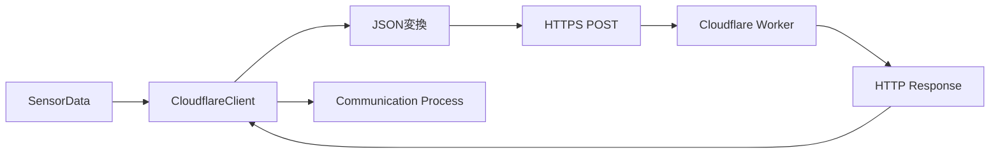

HTTPS通信では、Shared Secretによる認証を行う。

Shared SecretはHTTPヘッダへ設定し、Raspberry Pi側およびCloudflare側で同一のSecret値を使用する。

通信失敗時は、CloudflareClientではリトライを行わず、Communication Processが通信結果を確認してリトライ制御を行う。

SensorDataは、通信リトライ時でも以下の値を変更しない。

data_id
temperature
humidity
timestamp

これにより、同一SensorDataに対する再送であることをCloudflare Worker側で識別できる。

CloudflareClientは通信機能に専念し、Communication Processはシステム制御を担当することで、各モジュールの責務を分離する。


## 10. systemd設計

### 10.1 systemd管理概要

Raspberry Pi上で動作するSensor ProcessおよびCommunication Processは、systemdによってサービス管理を行う。

systemdを使用することで、以下の機能を実現する。

- Raspberry Pi起動時の自動起動
- Process状態監視
- 異常終了時の自動再起動
- 起動順序制御
- ログ管理

systemdで管理するサービスは以下の2つとする。

| サービス名 | 対象Process |
|---|---|
| sensor-process.service | Sensor Process |
| communication-process.service | Communication Process |

サービス構成を以下に示す。

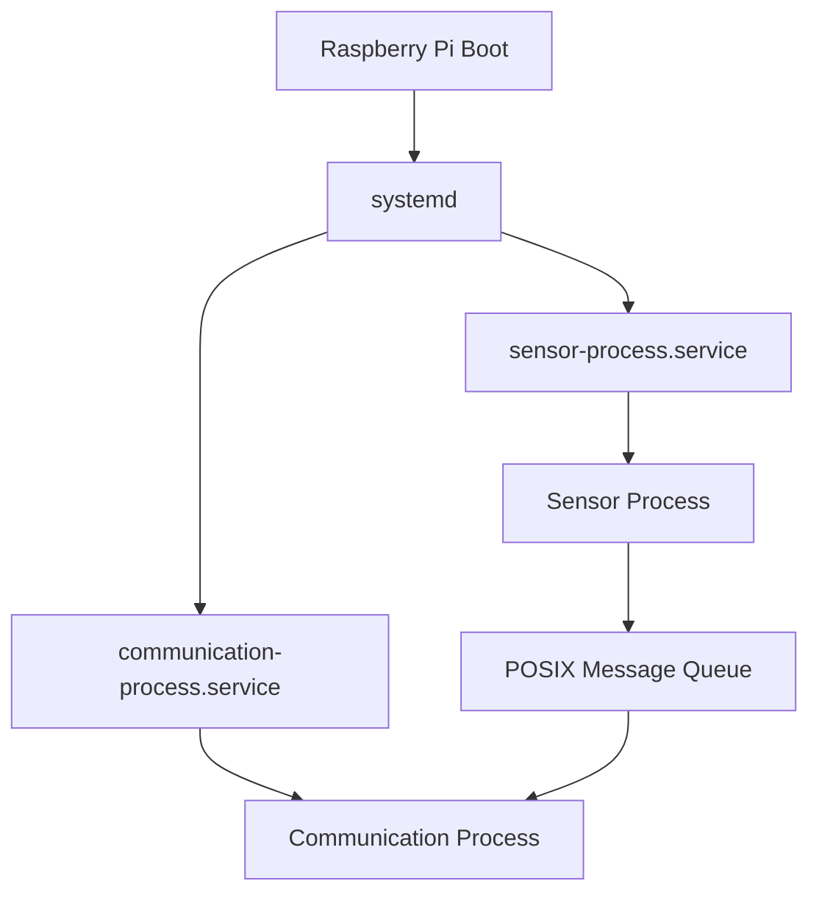

Sensor ProcessおよびCommunication Processは、systemdから起動される常駐Processとして動作する。

各Processは、異常終了した場合のみsystemdによる再起動対象とする。

正常終了した場合は、自動再起動を行わない。

systemdサービスファイルは、以下のディレクトリで管理する。

```text
systemd/
├── sensor-process.service
└── communication-process.service
```

インストール後の配置先:

```text
/etc/systemd/system/
```

とする。

### 10.2 sensor-process.service設計

Sensor Processは、systemdによってsensor-process.serviceとして管理する。

sensor-process.serviceは、DHT11から温湿度データを取得し、SensorDataを生成してPOSIX Message Queueへ送信するSensor Processを起動する。

Sensor Processは、Raspberry Pi起動時にsystemdによって自動起動され、常駐Processとして動作する。


#### 10.2.1 サービスファイル構成

サービスファイル名:

sensor-process.service


配置先:

/etc/systemd/system/sensor-process.service


sensor-process.serviceでは、Sensor Processの起動条件、実行ユーザー、再起動条件を定義する。

| 項目 | 内容 |
|---|---|
| Service名 | sensor-process.service |
| 対象Process | Sensor Process |
| 実行ファイル | /usr/local/bin/sensor-process |
| 実行ユーザー | edgeiot |
| 実行グループ | edgeiot |
| Processタイプ | simple |
| 再起動条件 | on-failure |


#### 10.2.2 サービス設定内容

sensor-process.serviceの設定内容を以下に示す。

```ini
[Unit]
Description=Raspberry Pi Edge IoT Sensor Process
After=network.target

[Service]
Type=simple
User=edgeiot
Group=edgeiot
ExecStart=/usr/local/bin/sensor-process
Restart=on-failure
RestartSec=5

[Install]
WantedBy=multi-user.target

#### 10.2.3 実行ファイル配置

Sensor Processの実行ファイルは、以下の配置先へインストールする。

```text
/usr/local/bin/sensor-process